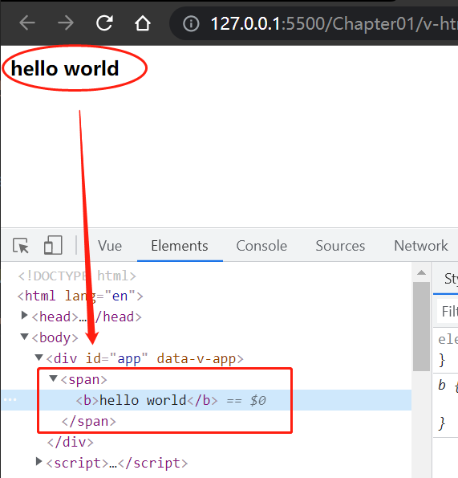
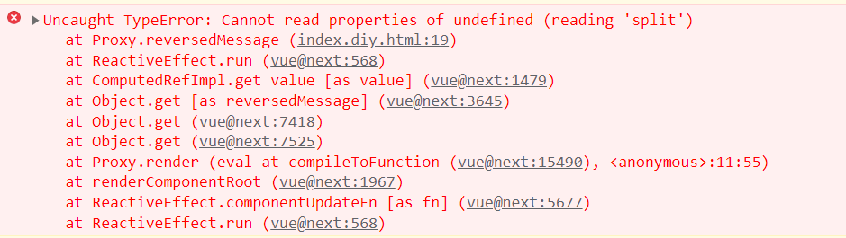

# 第一章 创建第一个 Vue 3 应用

（拆分自 [Ch01.md](./Ch01.md)）

## 3 `Vue 3` 核心特性 – 组件及内置指令

### 3.1 组件（`Components`）

`Vue 3`：一个基于组件的前端框架

组件的结构：

- template 模板
- option 对象
- 样式（`styles`）

如何创建组件？通过方法 `app.component(nameString, optionObj)` 得到。

最简单的模板，其 `optionObj` 对象要包含 `props` 和 `template` 属性。

- **prop** 是一个特殊的属性，用于把 `Vue` 组件的某数据传给子组件；
- 子组件的 **props** 属性则用来定义该组件会接收什么类型的值；

例如下面的 `html`（详见 `diy/ch01/todos/index.html`）：

```html
<div id="app">
    <div>
        <ol>
            <todo-item v-for="todo in todos" :todo="todo"></todo-item>
        </ol>
    </div>
</div>
```

对应的 `JavaScript` 如下：

```js
const App = {
    data: () => ({
        todos: [
            {description: 'eat'},
            {description: 'drink'},
            {description: 'sleep'},
        ]
    })
};
const app = Vue.createApp(App);
app.component('todo-item', {
    props: ['todo'],
    template: `<li>{{todo.description}}</li>`
});
app.mount('#app');
```

> 注意：

1. 冒号 `:` 是 `v-bind` 的简写，`v-bind` 是 `Vue` 的内置指令，用途是以一个 `prop` 属性的形式，将数据传给一个子组件；

2. `Vue 3` 会自动将一个 `prop` 值由驼峰式命名（`camelCase`）转换为短横线命名（`kebab-case`）；例如，将 `JS` 中第 12 至 13 行改为：

   ```javascript
   props: ['todoDemo'],
   template: `<li>{{todoDemo.description}}</li>`
   ```

   则 `html` 中第 4 行的 `:todo` 必须改为 `:todo-demo` 才能正常渲染。

3. `v-for` 指令：为了正确追踪被循环的项，需要指定一个 `key` 属性，其值为一个表示唯一性的 ID（详见 `diy/ch01/v-for/index.html`）：

   ```html
   <todo-item v-for="todo in todos" :todo="todo" :key="todo.id"></todo-item>
   <script>
       const App = {
           data: () => ({
               todos: [
                   { id: 1, description: 'eat' },
                   { id: 2, description: 'drink' },
                   { id: 3, description: 'sleep' },
               ]
           })
       };
       const app = Vue.createApp(App);
       app.component('todo-item', {
           props: ['todo'],
           template: `<li>{{todo.description}}</li>`
       });
       app.mount('#app');
   </script>
   ```

4. `Vue` 组件有点类似 H5 的自定义元素（`custom elements`），但不可划等号。

---


#### 3.1.1. 组件的生命周期钩子（Component life cycle）


`Vue` 组件有自己的生命周期，不同的生命周期阶段对应不同的钩子方法。如果到达某一阶段并定义了该阶段的钩子方法，则执行相应的方法。

> **注意**
>
> 所有生命周期钩子的 `this` 上下文将**自动绑定至实例**中，因此你可以访问 `data`、`computed` 和 `methods`。这意味着 **不应该使用箭头函数来定义一个生命周期方法**（例如 `created: () => this.fetchTodos()`）。由于箭头函数绑定了 **父级上下文**，此时 `this` 不会指向预期的组件实例，并且 `this.fetchTodos` 将会是 `undefined`。

这些钩子方法按时间先后触发顺序依次为：

- `beforeCreate`：在应用实例 `app` 通过 `app.mount()` 方法挂载之后触发。`app.mount()` 方法会初始化各 `event` 事件及生命周期。`beforeCreated` 钩子执行后，`Vue` 会用响应式属性（`reactive properties`）来初始化组件；
- `created`：响应式属性（`reactive properties`）将在该方法内完成初始化并可被访问到。`created` 执行完毕后，组件的模板（或渲染函数）将被执行；
- `beforeMount`：一旦内容加载完毕，即触发该方法。运行 `beforeMount` 完毕后，应用实例 `app` 会被挂载到页面 `DOM` 元素（`div#app`）；
- `mounted`：应用实例 `app` 被挂载到 `DOM` 元素后，触发该生命周期钩子：
  - `beforeUpdate`：只要任一响应式属性有变动，就会触发该生命周期钩子。然后虚拟 `DOM` 会根据最新的响应式属性值被重新渲染。这里也是第三方库代码被初始化的理想场所。
  - `updated`：虚拟 `DOM` 被重新渲染结束后触发。
- `beforeDestroy`：在组件被解除挂载之前触发。这里也是组件销毁前运行一些清理工作的良好场所。
- `destroyed`：在组件被销毁后触发。此时响应式属性均不可用。


#### 3.1.2. 响应式属性（Reactive properties）

示例如下（用 `count++` 的方式递增，详见 `diy/ch01/reactive-properties/index1.html`）：

```html
<div id="app">
    <button @click="count++">increment</button>
    count: {{count}}
</div>
<script>
    const App = {
        data: () => ({count: 0})
    };
    Vue.createApp(App).mount('#app');
</script>
```

上例中的 `@click="count++"` 表达式用于侦听按钮单击事件，`@click` 是指令 `v-on:click` 的缩写形式。还可以通过在 `methods` 中定义事件 `handler` 来递增响应式属性 `count`（详见 `diy/ch01/reactive-properties/index2.html`）：

```html
<div id="app">
    <button @click="increment">increment</button>
    count: {{count}}
</div>
<script>
    const App = {
        data: () => ({ count: 0 }),
        methods: {
            increment(e){
                this.count++;
            }
        }
    };
    Vue.createApp(App).mount('#app');
</script>
```

注意：`Vue` 实例对象中的 `this.count` 与模板中的 `count` 是同一个响应式属性。这里的关键词 `this` 指向 **组件实例**（**component instance**）。

`methods` 属性用于放置一些方法定义，以便 `Vue` 实例的其他位置或模板中可以直接通过 `this.<methodName>` 的方式调用指定的方法。这里的 `this` 同样是指 `Vue` 的 **组件实例**（在模板中可以省略 `this`）。


#### 3.1.3. 用户输入的处理（Handling user input）

示例如下（详见 `diy/ch01/user-input/index.html`）：

```html
<div id="app">
    <p>{{message}}</p>
    <input type="text" v-model="message"/>
</div>
<script>
    const App = {
        data: () => ({ message: 'hello world.' })
    };
    Vue.createApp(App).mount('#app');
</script>
```

> **填坑提示**
>
> 这里的 `v-model` 指令的值，应该是响应式属性的名称 `message`，无需添加双大括号（第一次实测写成了 `v-model="{{message}}"`，导致页面出错）

`v-model` 指令实现了表单输入和应用状态（响应式属性 `message`）之间的双向绑定。


#### 3.1.4. 条件与循环（Conditionals and loops）

- `v-if`：切换元素的存在性
- `v-show`：切换元素的可见性（元素是一直存在的）

示例如下（详见 `diy/ch01/v-if/index.html`）：

```html
<div id="app">
    <span v-if="show">hello world</span>
</div>
<script>
    const App = {
        data: () => ({ 
            show: true  // false to have no span tag 
        })
    };
    Vue.createApp(App).mount('#app');
</script>
```

本小节一开始便演示了在组件中 `v-for` 指令的用法：

```vue
<todo-item v-for="todo in todos" :todo="todo" :key="todo.id"></todo-item>
```

还可以不通过组件，直接在 `DOM` 元素上使用 `v-for`（详见 `diy/ch01/v-for/index.withoutcomponent.html`）：

```html
<div id="app">
    <div>
        <ol>
            <li v-for="todo in todos" :key="todo.id">
                {{todo.description}}
            </li>
        </ol>
    </div>
</div>
<script>
    const App = {
        data: () => ({
            todos: [
                {id: 1, description: 'eat'},
                {id: 2, description: 'drink'},
                {id: 3, description: 'sleep'}
            ],
        })
    };
    Vue.createApp(App).mount('#app');
</script>
```

这里的 `v-for` 接收一个特殊的 `JavaScript` 表达式，可以将 `todos` 中的元素遍历出来，放到变量 `todo` 中。

这里出现一出笔误：代码第 4 行：`:key` 写成了 `:keu`


#### 3.1.5. 模板语法（Template syntax）

`Vue` 采用的是声明式模板语法，示例如下（详见 `diy/ch01/v-html/index.html`）：

```html
<div id="app">
    <span v-html="rawHtml"></span>
</div>
<script>
    const App = {
        data: () => ({ rawHtml: '<b>hello world</b>' })
    };
    Vue.createApp(App).mount('#app');
</script>
```

`v-html` 指令可以直接渲染 `HTML`，而不是普通文本：




#### 3.1.6. `JavaScript` 表达式与模板

双大括号中的内容只能是 `JavaScript` **表达式**，而不是其他 `JavaScript` **语句**：

```vue
{{ number + 1 }} 
{{ areYouSure ? 'YES' : 'NO' }}
{{ message.split('').reverse().join('') }}
```

错误写法如下（均为语句）：

```vue
{{ var foo = 1 }}
{{ if (yes) { return message } }}
```


#### 3.1.7. 计算属性（Computed properties）

**计算属性（Computed properties）**是通过从其他响应式属性计算得出的特殊的响应式属性，且只能是一个同步函数（synchronous functions）。

示例如下（详见 `diy/ch01/computed-properties/index.html`）：

```html
<div id="app">
    <p>{{message}}</p>
    <p>{{reversedMessage}}</p>
</div>
<script>
    const App = {
        data: () => ({ message: 'hello world' }),
        computed: {
            reversedMessage() {
                return this.message.split('').reverse().join('')
            }
        }
    };
    Vue.createApp(App).mount('#app');
</script>
```

注意：这里的 `reversedMessage` 函数如果写成箭头函数形式将报错（`this.message` 为 `undefined`，因为 `this` 不是指向组件实例）：




### 3.2 指令（Directives）

**指令** 是一组以 `-v` 为前缀的特殊属性；

指令的值为一个单一的 **`JavaScript` 表达式**

除了接收值，指令还可以接收参数，例如：`<a v-on:click="doSomething"> ... </a>`。其中 ——

- `v-on`：指令的 **名称**（name）；
- `click`：即冒号（`:`）与等号（`=`）之间的部分，为指令的 **参数** 部分（argument）；
- `doSomething`：指令的 **值**（value）；

指令的参数也可以是动态的：

```vue
<a v-bind:[attributeName]="url"> ... </a>
```

`Vue` 可以对给定的事件名（如 `eventName`）进行监听。`eventName` 必须是一个字符串。


#### 指令的修饰符（Directive modifiers）

指令修饰符用于改变指令的行为，是一组用句点 `.` 开头的特殊后缀。

例如，要禁用默认的表单提交行为，就可以在 `submit` 事件上使用 `prevent` 修饰符达到效果：

```vue
<form v-on:submit.prevent="onSubmit"> ... </form>
```

