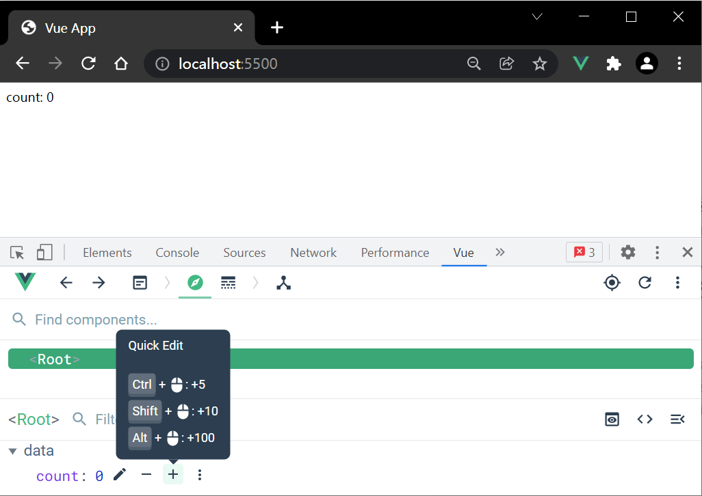
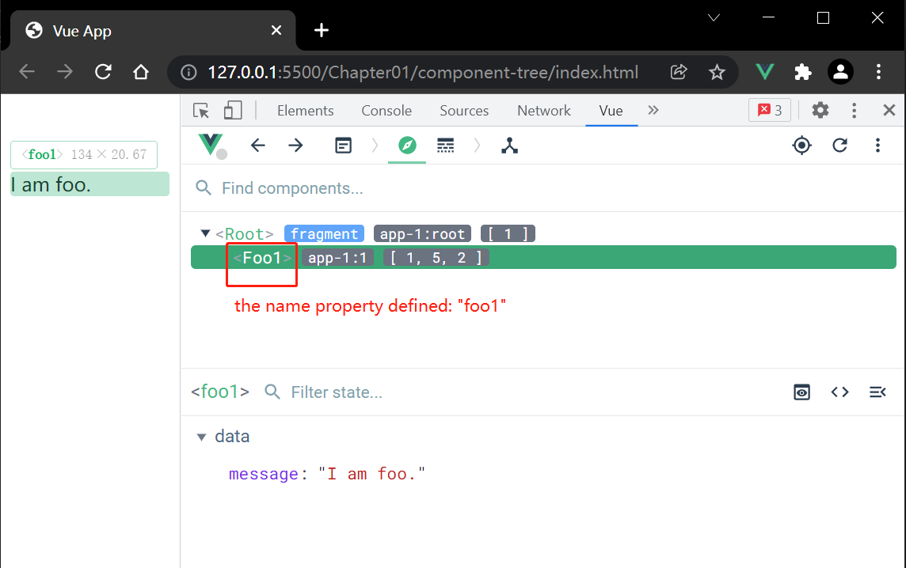
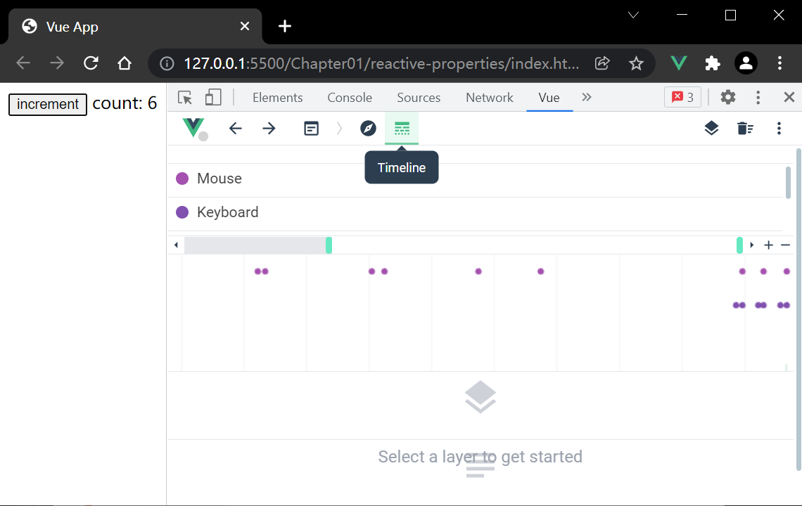
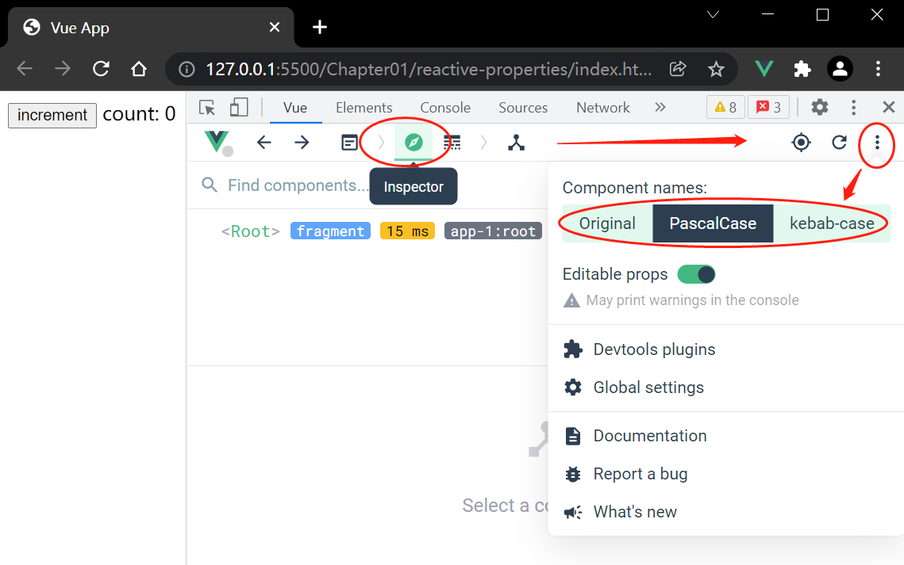

# Chapter1 Creating Your First Application in Vue 3


>  ***Learning from tutorials is only a start; creating projects on your own will make you proficient.***
>  依照教程学习只是个开始，自己动手创建项目才能融会贯通。
>
>  <div style="float: right;">——Preface</div>


> **反馈链接**:

- 一般问题反馈：customercare@packtpub.com
- 勘误：www.packtpub.com/support/errata
- 版权问题：copyright@packt.com


`Vue 3` 是一个基于组件的（`component-based`）前端框架。

相关主题：

- 理解 `Vue` 框架
- 建立 `Vue` 项目
- `Vue 3` 核心特性 —— 组件与内置指令
- 用 `Vue.js` 的 `Devtools` 工具进行调试

---


## 1 理解 Vue 框架

`Vue` 通用概念：

- **Directives**：指令，类似 `Angular` 操作 `DOM`
- **Templates**：模板，类似 `Angular` 渲染数据
- **props**：属性，类似 `Angular` 与 `React`，在组件之间传递数据
- **plugin**：插件，用于扩展特性，类似 `Angular`


`Vue` 专属概念：

- **计算属性（`computed properties`）**：从其它属性计算得到的组件属性
- **监视器（`watcher`）**：监视响应式数据的变化
- **响应式数据**：响应式数据改变时，`Vue` 的被观察数据或操作会自动执行更新
- **`script` 标签支持**：`Vue 3` 新特性，对前端历史代码友好
- **无需构建工具**：其他框架则需要
- **Vue Router** 库：兼容 `Vue 3` 的路由工具
- **Vuex** 库：兼容 `Vue 3` 的状态管理工具


## 2 用 Vue CLI 和 script 标签建立 Vue 项目

### 2.1 通过 script 标签引入

引入最新版（整理笔记时为 `v3.2.29`）：

```html
<script src="https://unpkg.com/vue@next"></script>
```

正式环境下，需要将 `next` 替换为具体版本：

```html
<script src="https://unpkg.com/vue@3.2.29"></script>
```


### 2.2 安装 Node.js 包

```bash
$ npm install vue@next
```


### 2.3 通过 Vue CLI 安装

`Vue 3` 需要的版本为 `Vue CLI v4.5` 及以上：（整理笔记时为 `@vue/cli@5.0.0-rc.2`）

```bash
$ yarn global add @vue/cli@next
# or
$ npm install -g @vue/cli@next
```

升级到 `Vue 3` 项目：

```bash
$ vue upgrade --next
```


### 2.4 通过构建工具 `Vite`

在新项目使用 `Vite` 可以原生支持模块（`modules`），比使用 `Vue CLI` 的反应速度更快。

从零创建 `Vue` 项目操作如下：

`NPM` 环境：

```bash
$ npm init vite-app <project-name>
$ cd <project-name>
$ npm install
$ npm run dev
```

`yarn` 环境：

```bash
$ yarn create vite-app <project-name>
$ cd <project-name>
$ yarn
$ yarn dev
```


### 2.5 Vue 不同构建版本的选择

`Vue` 的 `CDN` 版本不带 `bundle` 包。其命名格式通常为 `vue(.runtime).global(.prod).js`，可直接放入 `script` 标签：

- `vue.global.js`：同时包含编译器（`compiler`）与运行时（`runtime`）的完整版；
- `vue.runtime.global.js`：只包含运行时 `runtime` 的版本；

后缀为 `.prod.js` 的版本为 **正式环境版**（已压缩）；该版本不是 `UMD`（**Universal Module Definition**）规范下构建的，因此不包含可用于常规 `script` 标签的 `IIFE` 结构。

若借助像 `Webpack`、`Rollup` 或 `Parcel` 这样的打包工具，则可以使用形如 `vue(.runtime).esm-bundler.js` 的文件，同样也分完整版（`full version`）和运行时版（`runtime version`）。

切换开发环境与生产环境，可以使用 `process.env.NODE_ENV`。


### 2.6 创建 Vue 项目实例

`index.html`：（完整路径：`diy/ch01/simple-counter/index.html`）

```html
<!DOCTYPE html>
<html lang="en">
<head>
    <title>Vue App</title>
    <script src="https://unpkg.com/vue@next"></script>
</head>
<body>
    <div id="app">
        count: {{count}}
    </div>
    <script>
        const Counter = {
            data: () => ({
                count: 0
            })
        };
        Vue.createApp(Counter).mount('#app');
    </script>
</body>
</html>
```

运行效果：



>  **注意**

-  通过 `script` 标签引入最新版（`v3.2.29`）；
-  `div#app`：放置模板的容器
-  `body` 中的 `script` 标签 ——
   -  `Counter`：用于创建 `Vue` 实例；
   -  `data`：返回当前状态的初始值，这些状态参数都天然是响应式的（`reactive automatically`）；
   -  `count`：一个待更新的响应式状态，和模板中的 `count` 是同一个对象；

-  `Vue.createApp(obj)`：对 `Counter` 对象作如下处理 ——
  -  编译模板；
  -  关联响应式属性（`count`）；
  -  渲染 `{{}}` 内的表达式的值；

-  `mount(selector)`：接收一个 `CSS` 选择器，表示渲染该 `APP` 的容器，其中包括 ——
  -  渲染大括号内的表达式（`expressions`）
  -  属性被 `Vue` 转换成 `props` 参数或 `directives` 指令


> **注意：`{{}}` 中的值只能是：**
>
> - **包含*响应式属性* 的表达式**
> - **其他 `JavaScript` *表达式***


## 3 Vue 3 的主要特性

（详见该小节笔记 [Ch01.S3-Vue-3-core-features.md](./Ch01.S3-Vue-3-core-features.md)）


## 4 使用 Devtools 进行调试

`Vue.js` 的调试工具 `Devtools` 可以作为 `Chrome` 或 `Firefox` 的浏览器插件进行安装。


### 4.1 工具安装

- **Chrome** 插件：https://chrome.google.com/webstore/detail/vuejs-devtools/nhdogjmejiglipccpnnnanhbledajbpd
- **Firefox** 插件：https://addons.mozilla.org/en-CA/firefox/addon/vue-js-devtools/?utm_source=addons.mozilla.org&utm_medium=referral&utm_content=search
- **源码编译安装**：https://github.com/vuejs/devtools
  - **手动安装教程**：[Chome 最新版 vue-devtools 六步快速安装教程](https://blog.csdn.net/frgod/article/details/115602294)

安装成功后，浏览器按 <kbd>F12</kbd> 键查看 `Vue` 标签。


### 4.2 示例1：显示 component 组件树形结构

如果组件设置了 `name` 属性，该名称则会显示到组件树中。例如：

`index.html`（详见 `diy/ch01/component-tree/index.html`）：

```html
<!DOCTYPE html>
<html lang="en">

<head>
    <title>Vue App</title>
    <script src="https://unpkg.com/vue@next"></script>
</head>

<body>
    <div id="app">
        <foo></foo>
    </div>
    <script>
        const App = {
            data() {
                return {};
            }
        };
        const app = Vue.createApp(App);
        app.component("foo", {
            data() {
                return {
                    message: "I am foo."
                };
            },
            name: "foo1",
            template: `<p>{{message}}</p>`
        });
        app.mount("#app");
    </script>
</body>

</html>
```

启动 `live server`，查看 `Devtools` 如下：



注意，这里有意更新了组件的 `name` 值（`foo1`）


### 4.3 示例2：查看时序图菜单（Timeline）

Devtools 还可以通过时序图（`Timeline menu item`）查看事件触发情况，用 `live server` 启动示例页面（详见 `diy/ch01/reactive-properties/` 文件夹，两个 `html` 文件均可）。打开 `Devtools` 后，单击 `Timeline` 图标，再单击页面上的 <kbd>increment</kbd> 按钮，看看时序图的变化情况：



可以看到，单击页面按钮的单击事件、以及事件的触发时间都如实记录在了时序图界面上。

组件名称的显示方式可以在 `Global settings` 中设置。先切换到 `Inspector` 图标，从右上角的隐藏菜单中设置组件名称的显示模式：原始模式（`Original`）、大驼峰式（`PascalCase`）、横杠式（`kebab-case`）：




## 小结

- 响应式属性
- 模板
  - 计算属性
- `v-model` 指令
- `Devtools` 调试工具


