# 第二章 构建 `Vue 3` 版渐进式 Web 应用


相关主题：

- 组件及渐进式 Web 应用（`PWA`）基础知识
- 引入基于 `GitHub` 的示例应用
- 创建 `PWA`
- 发布 `PWA`

---


## 1 组件及 `PWA` 基础知识

通过 **嵌套**，多个组件构成一个大型应用

通过 **传参**，多个部分组合在一起

通过 **引入库** 或 **手动创建**，生成组件


组件的构成：

- `template` 模板：
  - `HTML` 元素
    - `props`（父传子）
    - `listeners` 侦听器（子传父，携带数据）
  - 组件（`components`）
    - `props`（父传子）
    - `listeners` 侦听器（子传父，携带数据）
  - 指令（`directives`）
- `script` 脚本
- `style` 样式


`PWA` 主要特性：

- 支持安装到 PC 端（可选）
- 通过浏览器管理已安装应用
- 支持部分原生硬件访问（摄像头、麦克风等）
- 可从应用商店获取
- 像其他 `Web` 应用一样部署服务器
- 能为每个用户提供服务
- 响应式设计
- 快速初始化加载（缓存技术）
- 无需联网（借助 `service workers`）
- 想普通 `APP` 一样的交互与导航
- 利用 `service worker` 更新内容
- 仅支持 `HTTPS` 协议
- 支持推送通知
- 可通过 `URL` 进行关联
- 安装后，可从浏览器 home 主页图标启动 `PWA`


本节示例所需插件：`@vue/cli-plugin-pwa`

---


## 2 引入基于 GitHub 接口的示例应用

本章示例为一个展示 `GitHub` 帐号基础信息的 `PWA` 应用

使用工具 `Vite`（默认按 `Vue 3` 创建应用）：

```bash
# install vue cli globally
$ npm install -g @vue/cli@next
# create app by vue cli
$ cd ~/Desktop
$ vue create vue-example-ch2-github-app
$ cd vue-example-ch2-github-app
$ npm run serve
```

> **勘误1**
>
> 执行命令 `npm vue create ...` 报错，应该为 `vue create ...`

或通过 `YARN`（`Y`et `A`nother `R`esource `N`egotiator）工具安装：

```powershell
> yarn global add @vue/cli@next
> yarn create vue-example-ch2-github-app
yarn create v1.22.10
[1/4] Resolving packages...
error An unexpected error occurred: "https://registry.npmjs.org/create-vue-example-ch2-github-app: Not found".
info If you think this is a bug, please open a bug report with the information provided in "C:\\Users\\ad\\AppData\\Local\\Yarn\\Data\\global\\yarn-error.log".
info Visit https://yarnpkg.com/en/docs/cli/create for documentation about this command.
> yarn serve
```

> **勘误2**
>
> 执行命令 `yarn create vue-example-ch2-github-app` 报错，正确命令应该是：
>
> ```bash
> $ yarn create vue-app vue-example-ch2-github-app
> ```
>
> 本章演示使用 `Vite` 方式。

---


## 3 创建 PWA 项目

本例会用到由 `Octokit` 开发的开源 `JavaScript` 客户端来访问 `GitHub REST API`。通过该客户端 `GitHub` 支持通过 `token` 令牌免登陆访问帐号及仓库信息（如用户名、仓库列表、`issue` 列表等等）。

`Vue` 的 `CLI` 命令行工具使用 `SFC` （`S`ingle-`F`ile `C`omponents，即单文件组件）与 `ES6` 模块来：

1. 构建和打包项目
2. 发布 Web 服务
3. 在浏览器运行


命令行初始化项目结束后，注意两个文件：

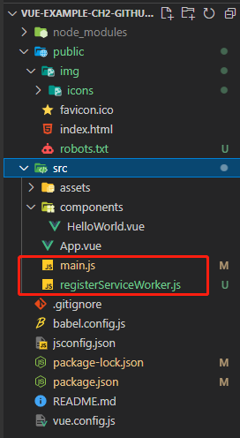

- `main.js`：`Vue` 应用的入口文件；

- `registerServiceWorker.js`：通过命令 `vue add pwa` 创建，用于在生产环境注册 `service worker` 的脚本文件（利用缓存技术）


接下来对创建好的默认 `Vue` 项目作如下修改：

1. 删除 `index.css`（无该文件）
2. `index.html` 的 `title` 修改为 `GitHub App`
3. 添加 `service worker`：运行命令 `vue add pwa`
4. 删除 `HelloWorld.vue` 组件及其在 `App.vue` 中的引用
5. （接下来的修改都在 `src` 目录下进行）：
6. 添加 `issue` 组件：路径为 `components/repo/Issues.vue`
7. 添加 `comment` 组件：路径为 `components/repo/issue/Comments.vue`
8. 添加 `token` 组件：用于免登陆访问 `GitHub`，路径为 `components/GitHubTokenForm.vue`
9. 添加 `repo` 组件：路径为 `components/Repos.vue`
10. 添加 `user` 组件：路径为 `components/User.vue`
11. 添加混入脚本：`mixins/octokitMixin.js`

修改完毕的项目结构：

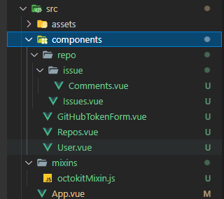

接下来，需要逐一对创建的文件填充代码——


### 3.1 创建 GitHub 客户端

弃用原书通过添加 `script` 标签引入 `octokit` 的方案，替之以官方推荐的 `Node.js` 环境引入：

```bash
$ npm install @octokit/rest
```

#### 第 1 步：`src/mixins/octokitMixin.js` 代码如下：

```js
const { Octokit } = require('@octokit/rest');
export const octokitMixin = {
  methods: {
    createOctokitClient() {
      return new Octokit({
        auth: localStorage.getItem('github-token'),
      });
    },
  },
};
```

> **勘误3、勘误4**
>
> 原书示例代码第 1 行的 `import` 语句在打包时报错，应注释掉：
>
> ```js
> import { Octokit } from "https://cdn.skypack.dev/@octokit/rest";
> ```
>
> 注释后，原书第 4 行示例代码的 `Octokit` 不可直接调用；而需要按照随书源码的版本，更正为 `new window.Octokit` 来初始化一个客户端实例。
>
> 或者使用 `Node.js` 方式，先本地安装 `octokit` 模块，再通过上述代码引入项目，更加方便快捷。


#### 第 2 步：在 `index.html` 文件中插入 `script` 标签，引入 `octokit-rest.min.js` 文件：

```html
<script src="<%= BASE_URL %>octokit-rest.min.js"></script>
```

> **勘误5**
>
> 无法按原书所述，找到线上的 `octokit-rest` 的 `JS` 脚本。替代方案，从原书附带源码中直接复制到 `public` 文件夹下（详见 `demos/Chapter02/public/octokit-rest.min.js`）
>
> 该方式已弃用。根据最新方案，用 `npm` 安装后无需改动 `index.html`（推荐）。


#### 第 3 步：补充 `issues` 和 `comments` 的内容

1. 复制 `Comments.vue`（详见 `demos/Chapter02/src/components/repo/issue/Comments.vue`）到 `src/components/repo/issue/`；
2. 复制 `Issues.vue`（详见 `demos/Chapter02/src/components/Issues.vue`）到 `src/components/`；

> **勘误6**
>
> 随书源码是书中示例代码不同：
>
> ```vue
> <!-- the method is only in the book -->
> created () {
>     this.getRepoIssues(this.owner, this.repo);
> }
> ```


`Comments.vue` 与 `Issues.vue` 的代码有相似的地方，且后者依赖前者。各自的组件配置对象有类似的键：

- `name`：组件名称
- `props`：是另一组配置对象，定义了组件属性（`prop`）的类型、是否为非空属性；
- `data`：定义初始状态
- `mixins`：为混入函数，用于初始化 `octokit` 客户端（用法详见开源项目：https://github.com/octokit/rest.js）；
- `methods`：使用 `octokit` 提供的 `API` 接口获取 `GitHub` 帐号数据；
- `watch`：每一个 `key` 都对应要监视的响应式属性名，其值为两个配置项：其一为 `immediate` 属性，控制是否立即监视，若为 `true`，则在组件加载时开始监视；另一个属性为 `handler`，用于绑定一个执行函数，在监视到某响应式数据发生变动时触发该函数执行。该函数接收一个 val 作参数，表示该响应式属性的最新值。示例代码对各个 `prop` 都进行了监视，以确保它们的值更新后，得到的结果（无论是 `comments` 还是 `issues`）都是最新的。


> **小技巧梳理** <a id="recipe"></a>
>
> 小技巧1：`VSCode` 快速创建 `vue3` 单组件文件的快捷方式：页面输入 `vue`，选择 `<vue> with default.vue...` 快速生成空白组件模板：
>
> 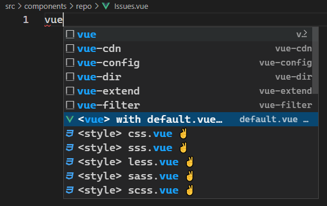
>
> 小技巧2：组合键【<kbd>Ctrl</kbd> + <kbd>Shift</kbd> + <kbd>P</kbd>】搜 `Open User Settings` 打开 `VSCode` 设置页面；
>
> 小技巧3：设置保存文件时按指定工具（`prettier`）格式化代码：在设置页面搜 `format`，选择格式化工具、以及自动格式化选项如下：
>
> 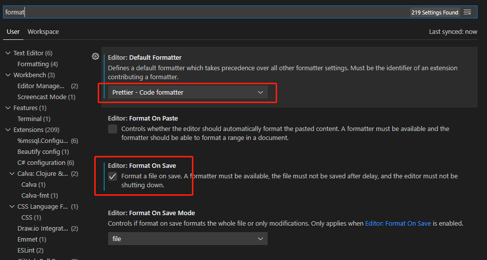
>
> 小技巧4：自动统一字符串引号类型（单引号、双引号）：
>
> 设置页搜 `prettier`，下翻找到 `Prettier: Single Quote` 选项，勾选则统一按单引号处理字符串，取消则按双引号：
>
> 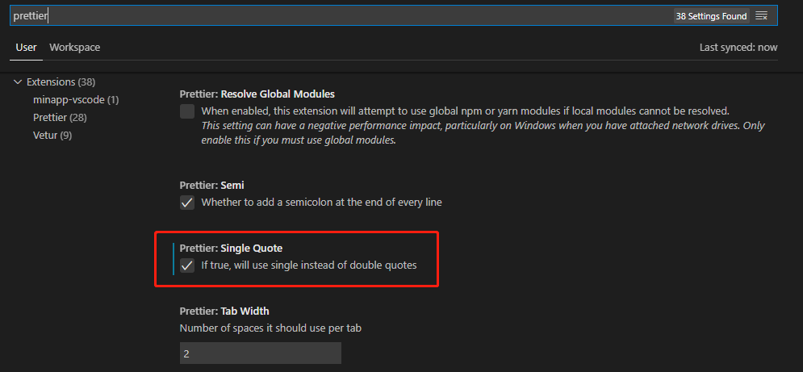


### 3.2 通过 GitHub token 访问用户数据

#### 第 4 步：复制 `GitHubTokenForm.vue` 到 `src/components/`

（详见 `demos/Chapter02/src/components/GitHubTokenForm.vue`）

> **勘误7**
>
> 生命周期方法钩子不一致：`PDF` 版用的 `created()`，而源码用的 `beforeMount()`

**GitHubTokenForm** 的作用是提供一个表单，把 `GitHub` 的访问令牌填入文本框，然后存入 `localStorage` 或从 `localStorage` 清除；这个令牌是在 `GitHub` 上手动生成的，位于 `Settings -- Developer settings -- Personal access tokens`。


#### 第 5 步：复制 `Repos.vue` 到 `src/components/Repos.vue`

（详见 `demos/Chapter02/src/components/Repos.vue`）

这一步是将 `Issues` 组件嵌入 `Repos` 组件。`Vue` 会自动渲染 `Issues` 并把对应的评论注释 `Comments` 在 `Issues` 中渲染，做到了代码隔离与单一职责。

> **勘误8**
>
> 组件名称编译报错：Component name "Repos" should always be multi-word.

实测发现组件名称为 `Repos` 时 `ESlint` 会编译不通过，进而导致后期构建打包被中断：

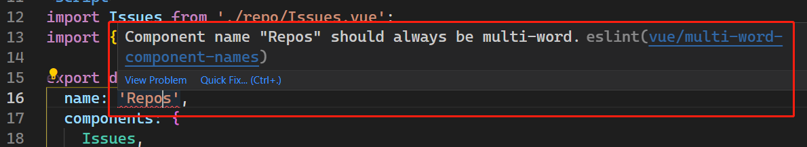

根据 `ESLint` 的官方文档解释：除了根组件 `App`、以及像 `<transition>`、`<component>` 这样的 `Vue` 内置组件，其余自定义组件的名称必须由多个单词组成，以防与 `HTML` 元素标签冲突（`HTML` 的所有元素均为一个单词命名）。

因此这里有两种解决方案：

- 重新命名组件名称，如 `DemoRepos`；
- 改造 `ESLint` 这一规则，设置 **白名单** 放行本例中用到的单一单词组件（`Repos`、`User`）。

这里尝试第二个方案。根据 `ESLint` [官方文档](https://eslint.vuejs.org/rules/multi-word-component-names.html) 的思路，需要手动添加校验规则。规则加到哪儿呢？需要加到 `package.json` 的 `rules` 这个 `key` 中：

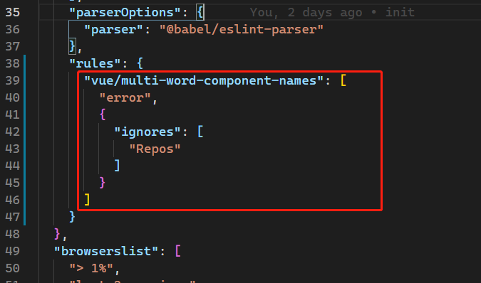

保存 `package.json`，该规则立即生效，报错解除。


#### 第 6 步：复制 `User.vue` 到 `src/components/User.vue`

（详见 `demos/Chapter02/src/components/User.vue`）

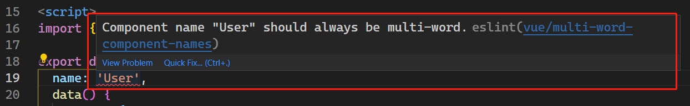

> **勘误9**
>
> 组件名称编译报错：Component name "User" should always be multi-word.
>
> 解决方案同上。
>
> **勘误10**
>
> `<li>plan: {{userData.pla && userData.plan.name}}</li>` 应为 `<li>plan: {{userData.plan && userData.plan.name}}</li>`


受影响组件:

- `App.vue`（引入并引用）
- `Repos.vue`（声明）
- `User.vue`（声明）


#### 第 7 步：复制 `App.vue` 到 `src/App.vue`

（详见  `demos/Chapter02/src/App.vue` ）：

```vue
<template>
  <div>
    <h1>Github App</h1>
    <git-hub-token-form />
    <repos />
    <user />
  </div>
</template>

<script>
import GitHubTokenForm from './components/GitHubTokenForm.vue';
import Repos from './components/Repos.vue';
import User from './components/User.vue';

export default {
  name: 'App',
  components: {
    GitHubTokenForm,
    Repos,
    User,
  },
};
</script>
```


## 4 发布 PWA 服务

#### 第 8 步：构建项目

```bash
$ npm run build
```


#### 第 9 步：全局安装 `browser-sync` 并启动本地服务

```bash
$ npm install -g browser-sync
$ cd dist
$ browser-sync
```


#### 第 10 步：在线生成 `GitHub token` 令牌，并填入浏览器的 **GitHub Token** 文本框内

在线生成 `token`：https://github.com/settings/tokens


#### 第 11 步：注意地址栏右边的下载图标，尝试安装 PWA 应用

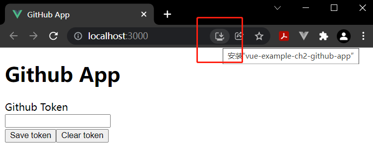


#### 第 12 步：单击安装 `PWA`，在 `chrome://apps` 页面查看安装情况

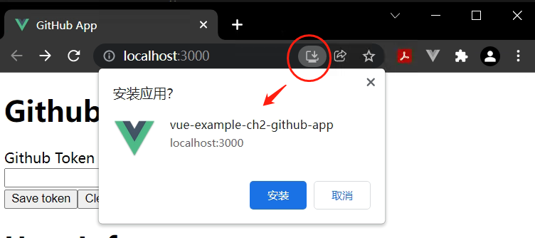

访问 `chrome://apps`：

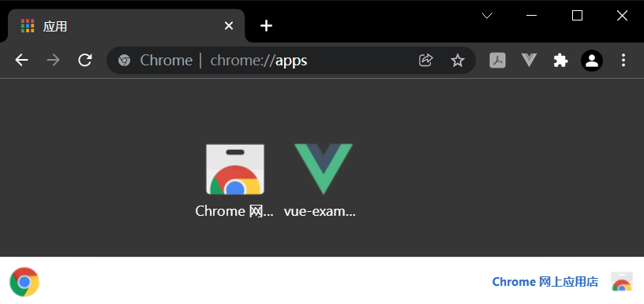


#### 第 13 步：查看开发者模式下的 `Application` 标签页，单击左边的 `Service Workers`：

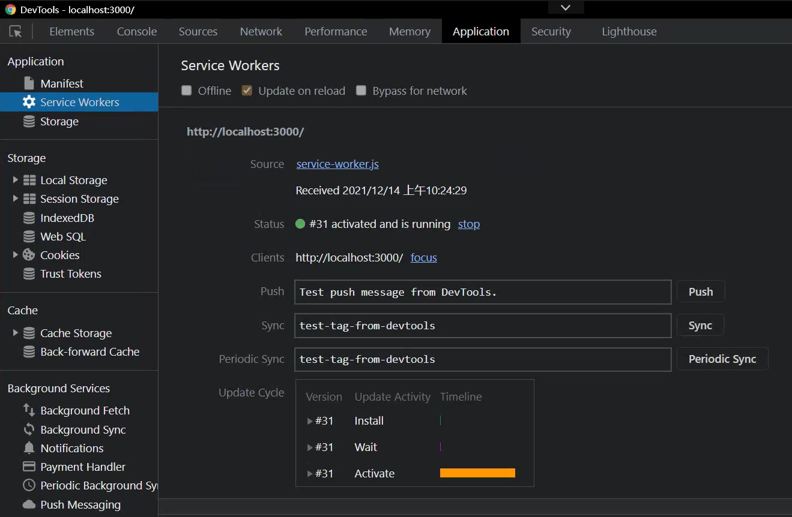

---


## 小结

- 创建可重用的组件
- 利用 `props` 实现父组件到子组件的通信
- 校验 `props` 的类型
- `watchers` 的用法（支持异步方法，而计算属性只能用同步方法）
- 生命周期方法钩子在项目中的应用
- 利用插件 `@vue/cli-plugin-pwa` 完成 `Vue` 应用到 `PWA` 应用的转换
- 自定义 `ESLint` 规则来手动取消组件名称必须为多个单词的限制
- [小技巧](#recipe)
  - 快速创建 `Vue` 组件
  - 快速打开 `VSCode` 设置页
  - 保存代码自动格式化（按 `Prettier` 工具）
  - 统一字符串引号类型


## 示例要点复盘

本例通过 `Vite` 命令行工具初始化一个默认的 `Vue` 项目，并安装基于 `Vue` 的 `PWA` 插件来模拟一个 `PWA` 应用。该应用可以免登陆访问 `GitHub` 数据接口，查询出指定帐号的仓库列表、`Issue` 列表及各 `Issue` 的评论列表；支持将 `PWA` 应用安装到本地桌面；安装成功后，可以在 `Chrome` 浏览器中的 `Home` 页进行统一管理。

远程数据的获取是通过开源项目 `octokit` 客户端调用 `GitHub REST API` 实现的。引入 `octokit` 时做了优化，使用 `npm` 安装到本地：

```bash
$ npm install @octokit/rest
```

然后在混入模块 `octokitMixin.js` 通过 `require` 语法引入：

```js
const { Octokit } = require('@octokit/rest');
```

而不是在 `index.html` 引入 `script` 标签（原书提供的 `min.js` 文件出处不详）

代码逻辑方面，在根组件 `App` 中引入了三个组件：

- `GitHubTokenForm`：用于输入访问令牌；
- `Repos`：用于展示仓库信息（仓库列表、`Issue` 列表、评论列表），其中组件 `Repos` 又依赖了 `Issues` 组件：
  - `Issues`：用于展示仓库下的所有 `Issues`，而 `Issues` 又依赖了 `IssueComments` 组件：
    - `IssueComments`：用于展示各 `Issue` 下的所有讨论情况（评论列表）。

- `User`：用户基本信息（头像、粉丝数、计划等）


## 相关示例代码

### Comments.vue

```vue
<template>
  <div>
    <div v-if="comments.length > 0">
      <h4>Comments</h4>
      <div v-for="c of comments" :key="c.id">{{c.user && c.user.login}} - {{c.body}}</div>
    </div>
  </div>
</template>

<script>
import { octokitMixin } from "../../../mixins/octokitMixin";

export default {
  name: "IssueComments",
  props: {
    owner: {
      type: String,
      required: true,
    },
    repo: {
      type: String,
      required: true,
    },
    issueNumber: {
      type: Number,
      required: true,
    },
  },
  data() {
    return {
      comments: [],
    };
  },
  mixins: [octokitMixin],
  methods: {
    async getIssueComments(owner, repo, issueNumber) {
      if (
        typeof owner !== "string" ||
        typeof repo !== "string" ||
        typeof issueNumber !== "number"
      ) {
        return;
      }
      const octokit = this.createOctokitClient();
      const { data: comments } = await octokit.issues.listComments({
        owner,
        repo,
        issue_number: issueNumber,
      });
      this.comments = comments;
    },
  },
  watch: {
    owner: {
      immediate: true,
      handler(val) {
        this.getIssueComments(val, this.repo, this.issueNumber);
      },
    },
    repo: {
      immediate: true,
      handler(val) {
        this.getIssueComments(this.owner, val, this.issueNumber);
      },
    },
    issueNumber: {
      immediate: true,
      handler(val) {
        this.getIssueComments(this.owner, this.repo, val);
      },
    },
  },
};
</script>
```


### Issues.vue

```vue
<template>
  <div v-if="issues.length > 0">
    <button @click="showIssues = !showIssues">{{showIssues ? 'Hide' : 'Show'}} issues</button>
    <div v-if="showIssues">
      <div v-for="i of issues" :key="i.id">
        <h3>{{i.title}}</h3>
        <a :href="i.url">Go to issue</a>
        <IssueComments :owner="owner" :repo="repo" :issueNumber="i.number" />
      </div>
    </div>
  </div>
</template>

<script>
import { octokitMixin } from "../../mixins/octokitMixin";
import IssueComments from "./issue/Comments.vue";

export default {
  name: "RepoIssues",
  components: {
    IssueComments,
  },
  props: {
    owner: {
      type: String,
      required: true,
    },
    repo: {
      type: String,
      required: true,
    },
  },
  mixins: [octokitMixin],
  data() {
    return {
      issues: [],
      showIssues: false,
    };
  },
  methods: {
    async getRepoIssues(owner, repo) {
      if (typeof owner !== "string" || typeof repo !== "string") {
        return;
      }
      const octokit = this.createOctokitClient();
      const { data: issues } = await octokit.issues.listForRepo({
        owner,
        repo,
      });
      this.issues = issues;
    },
  },
  watch: {
    owner: {
      immediate: true,
      handler(val) {
        this.getRepoIssues(val, this.repo);
      },
    },
    repo: {
      immediate: true,
      handler(val) {
        this.getRepoIssues(this.issues, val);
      },
    },
  },
};
</script>
```


### GitHubTokenForm.vue

```vue
<template>
  <form @submit.prevent="saveToken">
    <div>
      <label for="githubToken">Github Token</label>
      <br />
      <input id="githubToken" v-model="githubToken" />
    </div>
    <div>
      <input type="submit" value="Save token" />
      <button type="button" @click="clearToken">Clear token</button>
    </div>
  </form>
</template>

<script>
export default {
  name: "GitHubTokenForm",
  data() {
    return {
      githubToken: "",
    };
  },
  beforeMount() {
    this.githubToken = localStorage.getItem("github-token");
  },
  methods: {
    saveToken() {
      localStorage.setItem("github-token", this.githubToken);
    },
    clearToken() {
      localStorage.clear();
    },
  },
};
</script>
```


### Repos.vue

```vue
<template>
  <div>
    <h1>Repos</h1>
    <div v-for="r of repos" :key="r.id">
      <h2>{{r.owner.login}}/{{r.name}}</h2>
      <Issues :owner="r.owner.login" :repo="r.name" />
    </div>
  </div>
</template>

<script>
import Issues from "./repo/Issues.vue";
import { octokitMixin } from "../mixins/octokitMixin";

export default {
  name: "Repos",
  components: {
    Issues,
  },
  data() {
    return {
      repos: [],
    };
  },
  mixins: [octokitMixin],
  async mounted() {
    const octokit = this.createOctokitClient();
    const { data: repos } = await octokit.request("/user/repos");
    this.repos = repos;
  },
};
</script>
```


### User.vue

```vue
<template>
  <div>
    <h1>User Info</h1>
    <ul>
      <li>
        
      </li>
      <li>username: {{userData.login}}</li>
      <li>followers: {{userData.followers}}</li>
      <li>plan: {{userData.plan && userData.plan.name}}</li>
    </ul>
  </div>
</template>

<script>
import { octokitMixin } from "../mixins/octokitMixin";

export default {
  name: "User",
  data() {
    return {
      userData: {},
    };
  },
  mixins: [octokitMixin],
  async mounted() {
    const octokit = this.createOctokitClient();
    const { data: userData } = await octokit.request("/user");
    this.userData = userData;
  },
  methods: {
    saveToken() {},
  },
};
</script>


<style scoped>
#avatar {
  width: 50px;
  height: 50px;
}
</style>
```

