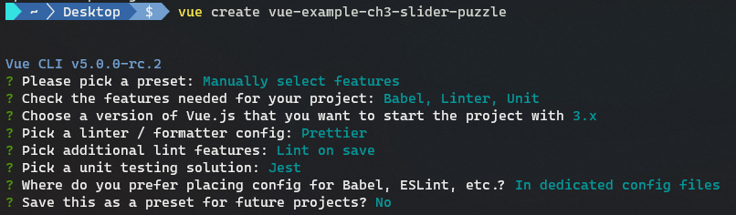
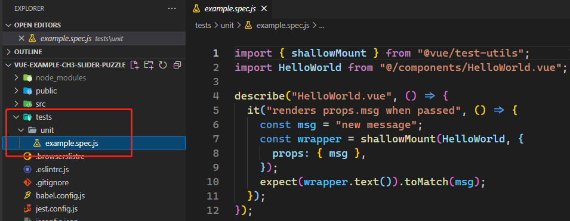
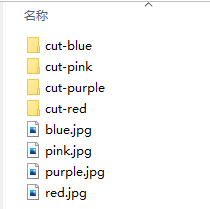
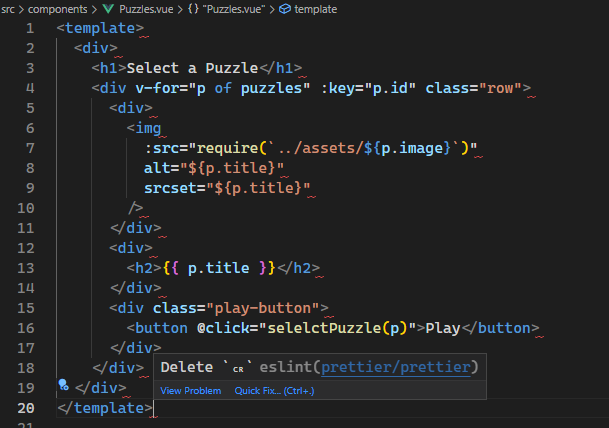

# 第三章 创建带测试用例的拼图益智游戏

第二章用 `Vue` 创建了一个简单的基于 `PWA` 的 `GitHub` 应用，并在上面加入了一些组件（`components`）。本章我们将创建一个简易的拼图游戏。游戏最终目标是将一堆打乱顺序的图片碎片重新还原成一张完整的图片。一旦还原成功，则提示 **大功告成**（**You Win**）。本地缓存（`local storage`）将记录用时最短的前 10 名的成绩。此外，该游戏还应该允许玩家选择不同的图片，以增加游戏的趣味性。

开发注意事项：

1. 要创建组件来控制 **本地缓存** 的读写：
   1. 读取数据后就要展示到页面上；
   2. 写入的数据仅为成绩最好的前 10 名。考虑到本地缓存 **只能存字符串**，前 10 名的数据还需要序列化后才能存入。
2. 要使用 **计时器** 来计算玩家完成拼图游戏的总用时。
3. 判定玩家是否获胜，还需要用到 **计算属性**。
4. 要为每个模块添加 **单元测试**，以自动测试每个组件。

本章涉及主题如下：

- 理解组件与混入的基本原理
- 建立 `Vue` 项目
- 创建组件以打乱图片顺序
- 由玩家来重新排列拼图
- 根据最终用时计算得分
- 使用 `Jest` 进行单元测试

---

本章示例文件：https://github.com/PacktPublishing/-Vue.js-3-By-Example/tree/master/Chapter03（详见 `demos/Chapter03`）

## 1 理解组件（`components`）及混入（`mixins`）的基本原理

`components` 组件的特性远不止第二章 `PWA` 演示项目中涉及的点（只是演示了 `components` 组件获取并展示数据的方法）。本章将在组件中使用计时器（`timers`），并演示 **计算属性**（`computed properties`） 的适用场景及具体用法，以便从其他响应式属性衍生出新的响应式属性，避免创建冗余方法，减少不必要的指令调用。

计算属性本质上是一个方法，该方法返回一个基于其他响应式数据的新值，其自身也是一个响应式数据。只要关联的响应式数据发生改变，计算属性也会同步更新加入缓存的值。利用这个特性，计算属性可用于替换复杂的模板表达式或方法，以提高效率。

组件的另一强大功能是触发自定义事件，并可携带一个或多个数据载荷（`payload`）。自定义事件的侦听通过 `v-on` 指令实现，事件携带数据的获取，可通过 `$event` 变量或事件处理函数中的参数来实现。

`Vue 3` 还有一个重要组成部分——测试。测试分多种类型，可以有效捕获各类 `bug`。测试常用于捕获回归阶段的 `bug`，即由于改动已有应用上的代码引入的 `bug`。在各类检测回归阶段的测试方法中，最常用的是单元测试（`unit test`）——通过将 **组件及其组成部分** 挂载到一个独立的测试环境来进行测试。由于各个测试模块相互独立，在任何环境、以任何顺序执行这些测试都是可行的——确保测试的便携性（`portable`）非常重要。另外，像 `API` 接口数据和 `timer` 计时器等这类涉及异步调用的外部资源，由于数据非常不稳定（`very volatile`）而难以测试。因此要确保测试中没有这类数据，测试结果才能始终保持一致。

`Vue` 支持 `Jest` 和 `Mocha` 两个 `JavaScript` 测试框架——这也是通过 `CLI` 命令行工具创建 `Vue` 项目的一大优势，不必从零开始创建测试所需的脚手架。

另一种测试是端到端测试（`end-to-end tests`）。 这些测试模拟用户如何使用应用程序，并从头开始创建测试环境来运行这些测试；每次测试要求使用的都是新数据，并且能以一种连贯的、一致的方式来运行，就需要首先提供一致的数据。

本章示例将考察单元测试在前端应用中的使用，像进行端到端测试那样完成一些简单的 `DOM` 交互。由于不必创建全新的测试环境，供演示的测试用例的执行速度都很快。通常情况下，测试环境搭建和用户交互的测试总是比单元测试要慢，因此可以采取“较多的单元测试并配合少量端到端测试”的策略，来实现示例核心功能的测试。


## 2 创建 `Vue` 项目

同样使用 `Vite` 创建项目：

```bash
$ npm install -g @vue/cli@next
$ vue create vue-example-ch3-slider-puzzle
```

根据命令行提示，`Vue` 版本为 `Vue 3`，测试工具选择 `Jest`，格式化工具使用 `Prettier`，最终的配置项如下：



初始化完毕后，可以在 `tests/unit/` 文件夹下看到示例测试脚本 `example.spec.js`：




由于本章示例是一个拼图小游戏，需要提前准备三张完整图片及其 `3 × 3` 的九宫格碎片。图片均为网上免费鲜花图片，其切分可以 [在线完成](https://www.imgonline.com.ua/eng/cut-photo-into-pieces.php)。这些图片需要统一命名方式：

1. 完整图片的文件名以花色进行区分：`red.jpg`、`pink.jpg`、`purple.jpg`；
2. 切分出的碎片图片统一按网站默认文件名命名：`image_part_001.jpg`、`image_part_002.jpg`……`image_part_009.jpg`；
3. 碎片图片统一放到一个专门的文件夹，并按照【cut-花色】进行命名：`cut-red`、`cut-pink`、`cut-purple`；
4. 将完整图片及其碎片文件夹统一放入项目 `src/assets/` 文件夹下。

最终效果如下：




接下来是添加各组件。

设计思路如下——根组件 `App.vue` 需引入三个子组件：

- `Puzzles.vue`：用于展示所有可选的图片，选好后以该图片进行游戏；包含一个图片数组和一个自定义事件（用于发送选中图片到父组件 `App.vue`，开始一个新游戏）；
- `Records.vue`：用于记录用时最短的前十名成绩；
- `SliderPuzzle.vue`：拼图组件（核心逻辑）。


具体步骤：

### 第 1 步：删除默认的 `HelloWorld.vue` 组件，以及在根组件 `App.vue` 中的所有引用；

`App.vue` 代码暂定如下（详见 `diy/ch03/src/App.vue`）：

```vue
<template>
  <div>
    <puzzles />
    <records />
    <slide-puzzle />
  </div>
</template>

<script>
import Puzzles from './components/Puzzles.vue';
import Records from './components/Records.vue';
import SlidePuzzle from './components/SlidePuzzle.vue';

export default {
  name: 'App',
  components: { Puzzles, Records, SlidePuzzle },
};
</script>

<style></style>
```

此时编辑器出现错误提示：


要求字符串的引号必须为双引号。这是 `Prettier` 格式化工具默认的设置，根据 `Prettier` 的 [文档](https://github.com/prettier/eslint-plugin-prettier#options)，禁用该警告需要在 `.eslintrc.js` 文件的 `rules` 关键词下添加以下规则：

```json
rules: {
    'prettier/prettier': [
        'error',
        {
            singleQuote: true,
        },
    ],
},
```


### 第 2 步：新增组件 `Puzzles.vue`

完整代码如下（详见 `diy/ch03/src/components/Puzzles.vue`）：

```vue
<template>
  <div>
    <h1>Select a Puzzle</h1>
    <div v-for="p of puzzles" :key="p.id" class="row">
      <div>
        
      </div>
      <div>
        <h2>{{ p.title }}</h2>
      </div>
      <div class="play-button">
        <button @click="selelctPuzzle(p)">Play</button>
      </div>
    </div>
  </div>
</template>

<script>
export default {
  data() {
    return {
      puzzles: [
        { id: 'cut-pink', image: 'pink.jpg', title: 'Pink Flower' },
        { id: 'cut-purple', image: 'purple.jpg', title: 'Purple Flower' },
        { id: 'cut-red', image: 'red.jpg', title: 'Red Flower' },
        { id: 'cut-blue', image: 'blue.jpg', title: 'Blue Flower' },
      ],
    };
  },
  methods: {
    selectPuzzle(puzzle) {
      this.$emit('puzzle-changed', puzzle.id);
    },
  },
};
</script>

<style>
.row {
  display: flex;
  flex-wrap: wrap;
  max-width: 90vw;
  justify-content: space-between;
}

.row img {
  width: 100px;
}
.row .play-button {
  padding-top: 25px;
}
</style>
```

实测发现，VSCode 在每行末尾提示要删除 `CR` 标识：



这也是 `Prettier` 的默认设置导致的：由于操作系统的原因，表示一行的结尾，通常有两种方式：

- `\n`（或 `LF`，`Line Feed` 的缩写，表示换行符），常用于 `Linux` 系统、`macOS` 系统；
- `\r\n`（或 `CRLF`，*Carriage Return + Line Feed* 的缩写，表示 *回车 + 换行*），常用于 `Windows` 系统；

当人们在不同的操作系统上对同一项目进行协作时，行的结尾符号很可能两种情况都存在。例如 `Windows` 的用户可能不小心将原版本中的 `LF` 替换为 `CRLF`，从而导致 `git diff` 命令（对比代码差异）输出大量无效对比，使得逐行审核代码时常用的 `git blame` 命令失效（真正要考察的差异都被每行末尾的换行符的变动覆盖了）。

根据文档，`2.0` 版以上的 `Prettier` 默认以 `LF` 作为行的结束（即默认在 `Linux` 环境下），而演示项目运行在 `Windows` 下，初始化项目时的 `Prettier` 版本为 `2.4.1`，因此报错。找到了报错原因，修改起来就简单多了。根据文档，控制换行符的 `key` 为 `endOfLine`，有下列取值：

- `"lf"`：适用于 `Linux` 系统；
- `"crlf"`：适用于 `Windows` 系统；
- `"cr"`：仅用 `\r` 换行（少见）；
- `"auto"`：沿用现有换行符（若同一个文件出现不一致的换行符，则统一以第一行的换行符为准）

显然，这里可以设置为 `auto`。找到项目根目录下的 `.eslintrc.js` 文件，在刚才设置自定义规则的项扩充如下：

```json
'prettier/prettier': [
    'error',
    {
        singleQuote: true,
        endOfLine: 'auto'
    },
],
```

保存该设置，`Prettier` 报错解除。:smile:

继续分析组件 `Puzzles.vue` 的代码。这里要特别注意两个地方：

1. 组件的 `methods` 方法中定义了一个 `selectPuzzle(puzzle)` 方法，这是页面按钮单击绑定的事件 `handler`，用于触发一个自定义事件 `puzzle-changed` 给 `App.vue`。该事件携带一个参数（`puzzle.id`），表示将选中图片的 `id` 传给父级组件 `App.vue`。`this.$emit` 接收两个参数，第一个为事件名，第二个为携带的业务数据（图片 `id`）。父组件通过在引用 `Puzzles.vue` 组件的标签上侦听该事件（`puzzle-changed`），就能拿到对应的传参，执行相应的业务逻辑。修改 `App.vue` 如下：

```vue
<puzzles @puzzle-changed="selectedPuzzleId = $event" />
```

这里的 `$event` 就是子组件传来的参数，`@` 就是 `v-on` 的简写，用于事件绑定。

2. 遍历图片时，`img` 标签的 `src` 属性使用了 `require` 语法，以便 `Vue 3` 直接解析图片路径，`Vue CLI` 内置了 `Webpack` 打包工具，因此可以将图片资源按模块（`module`）进行加载。这里要放入的是完整图片而非碎片图片的路径。


> **勘误1**
>
> 这里出现了原文和示例代码不一致的情况，书中用的是 `select` 标签，而示例代码直接用 `div` 逐行展示图片列表，直接在 `img` 标签上设置宽度，故书中这句话是无效的：
>
> ```markdown
> .row img select has its width set to 100px to display a thumbnail of the whole image. 
> ```
>
> 应更正为：
>
> ```markdown
> .row img has its width set to 100px to display a thumbnail of the whole image. 
> ```


### 第 3 步：新增组件 `Records.vue`

完整代码如下（详见 `diy/ch03/src/components/Records.vue`）：

```vue
<template>
  <div>
    <h1>Records</h1>
    <button @click="getRecords">Refresh</button>
    <div v-for="(r, index) of records" :key="index">
      {{ index + 1 }} - {{ r.elapsedTime }}
    </div>
  </div>
</template>

<script>
export default {
  data() {
    return {
      records: [],
    };
  },
  beforeMount() {
    this.getRecords();
  },
  methods: {
    getRecords() {
      this.records = JSON.stringify(localStorage.getItem('records')) || [];
    },
  },
};
</script>

<style></style>
```

> **勘误2**
>
> 书中描述使用的生命周期方法钩子为 `beforeMount`，但给出的代码片段却用的 `created`。应该统一为 `beforeMount`。

该组件比较简单，用于展示用时最短的前 10 名的成绩，从 `localStorage` 读取并转换成 `JSON` 对象，写入则反之。注意 `v-for` 指令中的多个循环变量要使用括号，第一个表示当前元素，第二个表示当前下标。

之所以使用 `beforeMount` 这个生命周期方法钩子，是为了在组件挂载前就准备好相应的前十名数据。


## 3 为打乱顺序的拼图创建组件

完整代码如下（详见 `diy/ch03/src/components/SliderPuzzle.vue`）：

```vue
<template>
  <div>
    <h1>Click to Swap the Images to Win</h1>
    <button @click="start" id="start-button">Start Game</button>
    <button @click="stop" id="quit-button">Quit</button>
    <p>Elapsed Time: {{ elapsedTime }}</p>
    <p v-if="isWinning" class="win">you win</p>

    <div class="row">
      <div
        class="column"
        v-for="(s, index) of shuffledPuzzleArray"
        :key="s"
        @click="swap(index)"
      >
        
      </div>
    </div>
  </div>
</template>

<script>
import moment from "moment";
const correctPuzzleArray = Array.from(
  { length: 9 },
  (v, i) => `image_part_00${i + 1}.jpg`
);

export default {
  name: "SliderPuzzle",
  props: {
    puzzleId: {
      type: String,
      default: "cut-blue",
    },
  },
  data() {
    const now = new Date();
    return {
      correctPuzzleArray,
      shuffledPuzzleArray: this.getPuzzleArray(false),
      timer: undefined,
      indexesToSwap: [],
      startDateTime: now,
      currentDateTime: now,
    };
  },
  computed: {
    isWinning() {
      const shuffle = this.shuffledPuzzleArray;
      return correctPuzzleArray.every((p, i) => p === shuffle[i]);
    },
    elapsedDiff() {
      return moment(this.currentDateTime).diff(moment(this.startDateTime));
    },
    elapsedTime() {
      return moment.utc(this.elapsedDiff).format("HH:mm:ss");
    },
  },
  methods: {
    start() {
      this.resetTime();
      this.indexesToSwap = [];
      this.shuffledPuzzleArray = this.getPuzzleArray();
      this.timer = setInterval(() => {
        this.currentDateTime = new Date();
        if (this.isWinning) {
          this.recordSpeedRecords();
          this.stop();
        }
      }, 1000);
    },
    stop() {
      this.resetTime();
      clearInterval(this.timer);
    },
    swap(index) {
      if (!this.timer) return;
      if (this.indexesToSwap.length < 2) {
        this.indexesToSwap.push(index);
      }
      if (this.indexesToSwap.length === 2) {
        const [idx1, idx2] = this.indexesToSwap;
        const { shuffledPuzzleArray: arr } = this;
        [arr[idx1], arr[idx2]] = [arr[idx2], arr[idx1]];
        this.indexesToSwap = [];
      }
    },
    resetTime() {
      this.startDateTime = this.currentDateTime = new Date();
    },
    recordSpeedRecords() {
      const records = JSON.parse(localStorage.getItem("records")) || [];
      const { elapsedDiff, elapsedTime } = this;
      const sortedRecords = records
        .concat({ elapsedDiff, elapsedTime })
        .sort((a, b) => a.elapsedDiff - b.elapsedDiff)
        .slice(0, 10);
      localStorage.setItem("records", JSON.stringify(sortedRecords));
    },
    getPuzzleArray(shuffle = true) {
      return shuffle
        ? [...correctPuzzleArray].sort(() => Math.random() - 0.5)
        : [...correctPuzzleArray];
    },
  },
};
</script>

<style scoped>
.row {
  display: flex;
  flex-wrap: wrap;
  max-width: 90vw;
}
.column {
  flex-grow: 1;
  width: 33%;
}
.column img {
  width: 100%;
}
.win {
  color: red;
  font-weight: bolder;
  font-style: italic;
  text-transform: capitalize;
}
</style>
```


