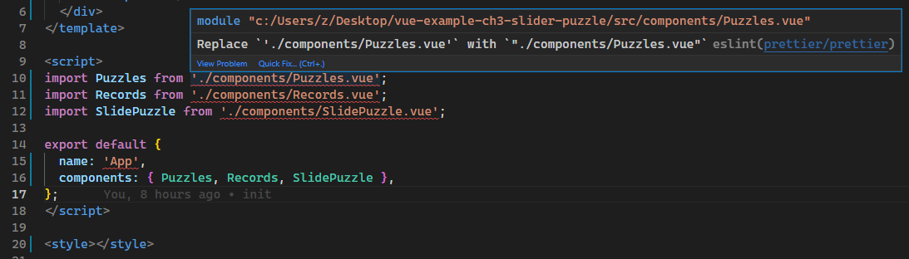
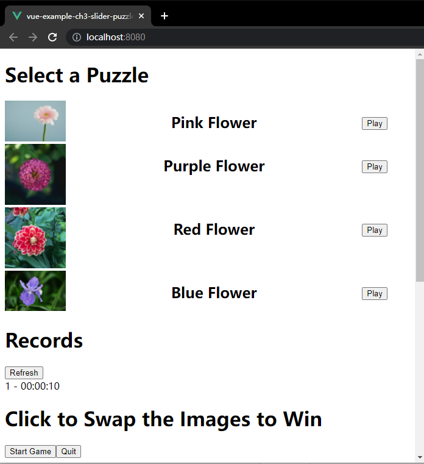

# 第三章 创建带测试用例的拼图益智游戏

第二章用 `Vue` 创建了一个简单的基于 `PWA` 的 `GitHub` 应用，并在上面加入了一些组件（`components`）。本章我们将创建一个简易的拼图游戏。游戏最终目标是将一堆打乱顺序的图片碎片重新还原成一张完整的图片。一旦还原成功，则提示 **大功告成**（**You Win**）。本地缓存（`local storage`）将记录用时最短的前 10 名的成绩。此外，该游戏还应该允许玩家选择不同的图片，以增加游戏的趣味性。

开发注意事项：

1. 要创建组件来控制 **本地缓存** 的读写：
   1. 读取数据后就要展示到页面上；
   2. 写入的数据仅为成绩最好的前 10 名。考虑到本地缓存 **只能存字符串**，前 10 名的数据还需要序列化后才能存入。
2. 要使用 **计时器** 来计算玩家完成拼图游戏的总用时。
3. 判定玩家是否获胜，还需要用到 **计算属性**。
4. 要为每个模块添加 **单元测试**，以自动测试每个组件。

本章涉及主题如下：

- 理解组件与混入的基本原理
- 建立 `Vue` 项目
- 创建组件以打乱图片顺序
- 由玩家来重新排列拼图
- 根据最终用时计算得分
- 使用 `Jest` 进行单元测试

---

本章示例文件：https://github.com/PacktPublishing/-Vue.js-3-By-Example/tree/master/Chapter03（详见 `demos/Chapter03`）

## 1 理解组件（`components`）及混入（`mixins`）的基本原理

`components` 组件的特性远不止第二章 `PWA` 演示项目中涉及的点（只是演示了 `components` 组件获取并展示数据的方法）。本章将在组件中使用计时器（`timers`），并演示 **计算属性**（`computed properties`） 的适用场景及具体用法，以便从其他响应式属性衍生出新的响应式属性，避免创建冗余方法，减少不必要的指令调用。

计算属性本质上是一个方法，该方法返回一个基于其他响应式数据的新值，其自身也是一个响应式数据。只要关联的响应式数据发生改变，计算属性也会同步更新加入缓存的值。利用这个特性，计算属性可用于替换复杂的模板表达式或方法，以提高效率。

组件的另一强大功能是触发自定义事件，并可携带一个或多个数据载荷（`payload`）。自定义事件的侦听通过 `v-on` 指令实现，事件携带数据的获取，可通过 `$event` 变量或事件处理函数中的参数来实现。

`Vue 3` 还有一个重要组成部分——测试。测试分多种类型，可以有效捕获各类 `bug`。测试常用于捕获回归阶段的 `bug`，即由于改动已有应用上的代码引入的 `bug`。在各类检测回归阶段的测试方法中，最常用的是单元测试（`unit test`）——通过将 **组件及其组成部分** 挂载到一个独立的测试环境来进行测试。由于各个测试模块相互独立，在任何环境、以任何顺序执行这些测试都是可行的——确保测试的便携性（`portable`）非常重要。另外，像 `API` 接口数据和 `timer` 计时器等这类涉及异步调用的外部资源，由于数据非常不稳定（`very volatile`）而难以测试。因此要确保测试中没有这类数据，测试结果才能始终保持一致。

`Vue` 支持 `Jest` 和 `Mocha` 两个 `JavaScript` 测试框架——这也是通过 `CLI` 命令行工具创建 `Vue` 项目的一大优势，不必从零开始创建测试所需的脚手架。

另一种测试是端到端测试（`end-to-end tests`）。 这些测试模拟用户如何使用应用程序，并从头开始创建测试环境来运行这些测试；每次测试要求使用的都是新数据，并且能以一种连贯的、一致的方式来运行，就需要首先提供一致的数据。

本章示例将考察单元测试在前端应用中的使用，像进行端到端测试那样完成一些简单的 `DOM` 交互。由于不必创建全新的测试环境，供演示的测试用例的执行速度都很快。通常情况下，测试环境搭建和用户交互的测试总是比单元测试要慢，因此可以采取“较多的单元测试并配合少量端到端测试”的策略，来实现示例核心功能的测试。


## 2 创建 `Vue` 项目

同样使用 `Vite` 创建项目：

```bash
$ npm install -g @vue/cli@next
$ vue create vue-example-ch3-slider-puzzle
```

根据命令行提示，`Vue` 版本为 `Vue 3`，测试工具选择 `Jest`，格式化工具使用 `Prettier`，最终的配置项如下：


初始化完毕后，可以在 `tests/unit/` 文件夹下看到示例测试脚本 `example.spec.js`（详见[第 6 节](#testing)）：<a id="testingBack"></a>


由于本章示例是一个拼图小游戏，需要提前准备三张完整图片及其 `3 × 3` 的九宫格碎片。图片均为网上免费鲜花图片，其切分可以 [在线完成](https://www.imgonline.com.ua/eng/cut-photo-into-pieces.php)。这些图片需要统一命名方式：

1. 完整图片的文件名以花色进行区分：`red.jpg`、`pink.jpg`、`purple.jpg`；
2. 切分出的碎片图片统一按网站默认文件名命名：`image_part_001.jpg`、`image_part_002.jpg`……`image_part_009.jpg`；
3. 碎片图片统一放到一个专门的文件夹，并按照【cut-花色】进行命名：`cut-red`、`cut-pink`、`cut-purple`；
4. 将完整图片及其碎片文件夹统一放入项目 `src/assets/` 文件夹下。

最终效果如下：


接下来是添加各组件。

设计思路如下——根组件 `App.vue` 需引入三个子组件：

- `Puzzles.vue`：用于展示所有可选的图片，选好后以该图片进行游戏；包含一个图片数组和一个自定义事件（用于发送选中图片到父组件 `App.vue`，开始一个新游戏）；
- `Records.vue`：用于记录用时最短的前十名成绩；
- `SliderPuzzle.vue`：拼图组件（核心逻辑）。


具体步骤：

### 第 1 步：删除默认的 `HelloWorld.vue` 组件，以及在根组件 `App.vue` 中的所有引用；

`App.vue` 代码暂定如下（详见 `diy/ch03/src/App.vue`）：

```vue
<template>
  <div>
    <puzzles />
    <records />
    <slide-puzzle />
  </div>
</template>

<script>
import Puzzles from './components/Puzzles.vue';
import Records from './components/Records.vue';
import SlidePuzzle from './components/SlidePuzzle.vue';

export default {
  name: 'App',
  components: { Puzzles, Records, SlidePuzzle },
};
</script>

<style></style>
```

此时编辑器出现错误提示：



要求字符串的引号必须为双引号。这是 `Prettier` 格式化工具默认的设置，根据 `Prettier` 的 [文档](https://github.com/prettier/eslint-plugin-prettier#options)，禁用该警告需要在 `.eslintrc.js` 文件的 `rules` 关键词下添加以下规则：

```json
rules: {
    'prettier/prettier': [
        'error',
        {
            singleQuote: true,
        },
    ],
},
```


### 第 2 步：新增组件 `Puzzles.vue`

完整代码如下（详见 `diy/ch03/src/components/Puzzles.vue`）：

```vue
<template>
  <div>
    <h1>Select a Puzzle</h1>
    <div v-for="p of puzzles" :key="p.id" class="row">
      <div>
        
      </div>
      <div>
        <h2>{{ p.title }}</h2>
      </div>
      <div class="play-button">
        <button @click="selelctPuzzle(p)">Play</button>
      </div>
    </div>
  </div>
</template>

<script>
export default {
  data() {
    return {
      puzzles: [
        { id: 'cut-pink', image: 'pink.jpg', title: 'Pink Flower' },
        { id: 'cut-purple', image: 'purple.jpg', title: 'Purple Flower' },
        { id: 'cut-red', image: 'red.jpg', title: 'Red Flower' },
        { id: 'cut-blue', image: 'blue.jpg', title: 'Blue Flower' },
      ],
    };
  },
  methods: {
    selectPuzzle(puzzle) {
      this.$emit('puzzle-changed', puzzle.id);
    },
  },
};
</script>

<style>
.row {
  display: flex;
  flex-wrap: wrap;
  max-width: 90vw;
  justify-content: space-between;
}

.row img {
  width: 100px;
}
.row .play-button {
  padding-top: 25px;
}
</style>
```

实测发现，VSCode 在每行末尾提示要删除 `CR` 标识：


这也是 `Prettier` 的默认设置导致的：由于操作系统的原因，表示一行的结尾，通常有两种方式：

- `\n`（或 `LF`，`Line Feed` 的缩写，表示换行符），常用于 `Linux` 系统、`macOS` 系统；
- `\r\n`（或 `CRLF`，*Carriage Return + Line Feed* 的缩写，表示 *回车 + 换行*），常用于 `Windows` 系统；

当人们在不同的操作系统上对同一项目进行协作时，行的结尾符号很可能两种情况都存在。例如 `Windows` 的用户可能不小心将原版本中的 `LF` 替换为 `CRLF`，从而导致 `git diff` 命令（对比代码差异）输出大量无效对比，使得逐行审核代码时常用的 `git blame` 命令失效（真正要考察的差异都被每行末尾的换行符的变动覆盖了）。

根据文档，`2.0` 版以上的 `Prettier` 默认以 `LF` 作为行的结束（即默认在 `Linux` 环境下），而演示项目运行在 `Windows` 下，初始化项目时的 `Prettier` 版本为 `2.4.1`，因此报错。找到了报错原因，修改起来就简单多了。根据文档，控制换行符的 `key` 为 `endOfLine`，有下列取值：

- `"lf"`：适用于 `Linux` 系统；
- `"crlf"`：适用于 `Windows` 系统；
- `"cr"`：仅用 `\r` 换行（少见）；
- `"auto"`：沿用现有换行符（若同一个文件出现不一致的换行符，则统一以第一行的换行符为准）

显然，这里可以设置为 `auto`。找到项目根目录下的 `.eslintrc.js` 文件，在刚才设置自定义规则的项扩充如下：

```json
'prettier/prettier': [
    'error',
    {
        singleQuote: true,
        endOfLine: 'auto'
    },
],
```

保存该设置，`Prettier` 报错解除。:smile:

继续分析组件 `Puzzles.vue` 的代码。这里要特别注意两个地方：

1. 组件的 `methods` 方法中定义了一个 `selectPuzzle(puzzle)` 方法，这是页面按钮单击绑定的事件 `handler`，用于触发一个自定义事件 `puzzle-changed` 给 `App.vue`。该事件携带一个参数（`puzzle.id`），表示将选中图片的 `id` 传给父级组件 `App.vue`。`this.$emit` 接收两个参数，第一个为事件名，第二个为携带的业务数据（图片 `id`）。父组件通过在引用 `Puzzles.vue` 组件的标签上侦听该事件（`puzzle-changed`），就能拿到对应的传参，执行相应的业务逻辑。修改 `App.vue` 如下：

```vue
<puzzles @puzzle-changed="selectedPuzzleId = $event" />
```

这里的 `$event` 就是子组件传来的参数，`@` 就是 `v-on` 的简写，用于事件绑定。

2. 遍历图片时，`img` 标签的 `src` 属性使用了 `require` 语法，以便 `Vue 3` 直接解析图片路径，`Vue CLI` 内置了 `Webpack` 打包工具，因此可以将图片资源按模块（`module`）进行加载。这里要放入的是完整图片而非碎片图片的路径。


> **勘误1**
>
> 这里出现了原文和示例代码不一致的情况，书中用的是 `select` 标签，而示例代码直接用 `div` 逐行展示图片列表，直接在 `img` 标签上设置宽度，故书中这句话是无效的：
>
> ```markdown
> .row img select has its width set to 100px to display a thumbnail of the whole image. 
> ```
>
> 应更正为：
>
> ```markdown
> .row img has its width set to 100px to display a thumbnail of the whole image. 
> ```


### 第 3 步：新增组件 `Records.vue`

完整代码如下（详见 `diy/ch03/src/components/Records.vue`）：

```vue
<template>
  <div>
    <h1>Records</h1>
    <button @click="getRecords">Refresh</button>
    <div v-for="(r, index) of records" :key="index">
      {{ index + 1 }} - {{ r.elapsedTime }}
    </div>
  </div>
</template>

<script>
export default {
  data() {
    return {
      records: [],
    };
  },
  beforeMount() {
    this.getRecords();
  },
  methods: {
    getRecords() {
      this.records = JSON.parse(localStorage.getItem('records')) || [];
    },
  },
};
</script>

<style></style>
```

> **勘误2**
>
> 书中描述使用的生命周期方法钩子为 `beforeMount`，但给出的代码片段却用的 `created`。应该统一为 `beforeMount`。

该组件比较简单，用于展示用时最短的前 10 名的成绩，从 `localStorage` 读取并转换成 `JSON` 对象（`JSON.parse`），写入则反之（`JSON.stringify`）。注意 `v-for` 指令中的多个循环变量要使用括号，第一个表示当前元素，第二个表示当前下标。

之所以使用 `beforeMount` 这个生命周期方法钩子，是为了在组件挂载前就准备好相应的前十名数据。


## 3 为打乱顺序的拼图创建组件

先来看看最终的效果图：


可以看到，该组件包括：

- 一个标题
- 两个按钮
- 本轮用时展示（Elapsed Time）
- 是否赢得游戏的提示（You Win）
- 九宫格拼图区

其中，两个按钮分别绑定 `start` 和 `stop` 方法，本轮用时由组件的两个时间变量相减得到（计算属性），判定游戏是否结束，就是看最终的拼图和原始排列是否完全一致。而拼图区用到了 `CSS` 的 `flex` 弹性盒模型，遍历时在每个碎片上绑定一个 `swap` 方法（接收当前碎片下标作参数）来交换先后单击的两个碎片。因此得到如下 HTML 代码：

```vue
<template>
  <div>
    <h1>Click to Swap the Images to Win</h1>
    <button @click="start" id="start-button">Start Game</button>
    <button @click="stop" id="quit-button">Quit</button>
    <p>Elapsed Time: {{ elapsedTime }}</p>
    <p v-if="isWinning" class="win">You win</p>

    <div class="row">
      <div
        class="column"
        v-for="(s, index) of shuffledPuzzleArray"
        :key="s"
        @click="swap(index)"
      >
        
      </div>
    </div>
  </div>
</template>
```

注意碎片区的图片 `URL` 的写法，仍然用到 `require` 语法，以便 `Vue` 集成的 `Webpack` 直接解析图片为独立的模块。

再来看 `flex` 样式：

```vue
<style scoped>
.row {
  display: flex;
  flex-wrap: wrap;
  max-width: 90vw;
}
.column {
  flex-grow: 1;
  width: 33%;
}
.column img {
  width: 100%;
}
.win {
  color: red;
  font-weight: bolder;
  font-style: italic;
  text-transform: capitalize;
}
</style>
```

通过在 `style` 标签加注 `scoped` 字样，可以避免组件样式与其他组件冲突。

再来看拼图组件的核心逻辑。

首先定义名称 `SlidePuzzle`；

然后确定 `props` 属性：`puzzleId`。该属性从父组件 `App.vue` 传入，表示当前的图片类型，默认值为 `cut-blue`，类型为字符串，必填项。

接下来是组件的初始状态参数：

- `correctPuzzleArray`：正确顺序碎片数组；
- `shuffledPuzzleArray`：打乱顺序碎片数组；
- `startDateTime`：本轮游戏开始时间；
- `currentDateTime`：当前时间；
- `timer`：计时器，每秒触发一次及时，并更新 `currentDateTime`；
- `indexesToSwap`：**【核心逻辑】**用于交换两个碎片的中间数组。数组元素为每次单击过的碎片下标，单击一次添加一次，当总数达到两个时进行碎片下标交换，然后清空数组以备下一次交换；

再来看组件要用到的 **计算属性**：

- `isWinning`：判定是否结束游戏，由原始和当前的碎片序列比较确定；
- `elapsedDiff`：本轮用时时间戳，需要当前时间和本轮开始时间相减得到；
- `elapsedTime`：本轮用时实际展示文本，格式为 `HH:mm:ss`，需要结合 `elapsedDiff`，再通过 `moment` 进行格式化处理；

最后来看组件的方法定义部分。该部分包括两个按钮事件回调 `start` 和 `stop`，其中分别用到重置时间戳方法 `resetTime`、写入前十名成绩方法 `recordSpeedRecords`、碎片洗牌方法 `getPuzzleArray`。最后是绑定碎片单击事件的碎片交换方法 `swap`

### 3.1 start

启用游戏需要重置时间、重置下标交换数组、重新洗牌，然后对计时器重新赋值：

```js
start() {
  this.resetTime();
  this.indexesToSwap = [];
  this.shuffledPuzzleArray = this.getPuzzleArray();

  this.timer = setInterval(() => {
    this.currentDateTime = new Date();
    if (this.isWinning) {
      this.recordSpeedRecords();
      this.stop();
    }
  }, 1000);
},
```

注意计时器赋值的写法，回调中需要更新当前时间变量 `currentDateTime`，相应的计算属性会自动更新。当判定为游戏结束，则写入当前用时，然后结束游戏。


### 3.2 stop

这部分比较简单，就是负责一些状态清理工作，包括重置两个时间状态、清空计时器：

```js
stop() {
  this.resetTime();
  clearInterval(this.timer);
},
```


### 3.3 resetTime

即将游戏开始时间和当前时间重新赋值为一个新的时间。之所以单列出来，是因为 `start` 中也用到了一模一样的逻辑：

```js
resetTime() {
  this.startDateTime = this.currentDateTime = new Date();
},
```


### 3.4 recordSpeedRecords

负责往 `localStorage` 写入最新的前十名成绩：

```js
recordSpeedRecords() {
  const records = JSON.parse(localStorage.getItem('records')) || [];
  const { elapsedDiff, elapsedTime } = this;
  const sortedRecords = records
    .concat({ elapsedDiff, elapsedTime })
    .sort((a, b) => a.elapsedDiff - b.elapsedDiff)
    .slice(0, 10);
  localStorage.setItem('records', JSON.stringify(sortedRecords));
},
```

需要特别注意的是，写入 `localStorage` 的内容只能是字符串，所以表征前十名的 `JSON` 数组对象必须作序列化处理。


### 3.5 getPuzzleArray

该方法负责打乱原始碎片的排序序列。利用数组中的 `sort` 方法和随机函数 `Math.random` 实现：

```js
getPuzzleArray(shuffle = true) {
  return shuffle
    ? [...correctPuzzleArray].sort(() => Math.random() - 0.5)
    : [...correctPuzzleArray];
},
```

注意，该方法是实操过程中新增的方法，因为除了 `start` 方法会用到洗牌算法，组件初始化加载时，确定初始状态也需要用到。因此类比 `resetTime` 方法单列出来。只是该方法需要一个布尔型控制参数 `shuffle`，即是否需要洗牌处理，默认为是（`true`），否则直接输出原始序列。


### 3.6 swap

这是实现拼图碎片交换的核心方法，可利用 `ES6` 的解构赋值特性轻松实现：

```js
swap(index) {
  if (!this.timer) return;
  if (this.indexesToSwap.length < 2) {
    this.indexesToSwap.push(index);
  }
  if (this.indexesToSwap.length === 2) {
    const [idx1, idx2] = this.indexesToSwap;
    const arr = this.shuffledPuzzleArray;
    [arr[idx1], arr[idx2]] = [arr[idx2], arr[idx1]];
    this.indexesToSwap = [];
  }
},
```


### SliderPuzzle 完整代码

`SliderPuzzle` 组件完整代码如下（详见 `diy/ch03/src/components/SliderPuzzle.vue`）：

```vue
<template>
  <div>
    <h1>Click to Swap the Images to Win</h1>
    <button @click="start" id="start-button">Start Game</button>
    <button @click="stop" id="quit-button">Quit</button>
    <p>Elapsed Time: {{ elapsedTime }}</p>
    <p v-if="isWinning" class="win">You win</p>

    <div class="row">
      <div
        class="column"
        v-for="(s, index) of shuffledPuzzleArray"
        :key="s"
        @click="swap(index)"
      >
        
      </div>
    </div>
  </div>
</template>

<script>
import moment from "moment";
const correctPuzzleArray = Array.from(
  { length: 9 },
  (v, i) => `image_part_00${i + 1}.jpg`
);

export default {
  name: "SliderPuzzle",
  props: {
    puzzleId: {
      type: String,
      default: "cut-blue",
    },
  },
  data() {
    const now = new Date();
    return {
      correctPuzzleArray,
      shuffledPuzzleArray: this.getPuzzleArray(false),
      timer: undefined,
      indexesToSwap: [],
      startDateTime: now,
      currentDateTime: now,
    };
  },
  computed: {
    isWinning() {
      const shuffle = this.shuffledPuzzleArray;
      return correctPuzzleArray.every((p, i) => p === shuffle[i]);
    },
    elapsedDiff() {
      return moment(this.currentDateTime).diff(moment(this.startDateTime));
    },
    elapsedTime() {
      return moment.utc(this.elapsedDiff).format("HH:mm:ss");
    },
  },
  methods: {
    start() {
      this.resetTime();
      this.indexesToSwap = [];
      this.shuffledPuzzleArray = this.getPuzzleArray();

      this.timer = setInterval(() => {
        this.currentDateTime = new Date();
        if (this.isWinning) {
          this.recordSpeedRecords();
          this.stop();
        }
      }, 1000);
    },
    stop() {
      this.resetTime();
      clearInterval(this.timer);
    },
    swap(index) {
      if (!this.timer) return;
      if (this.indexesToSwap.length < 2) {
        this.indexesToSwap.push(index);
      }
      if (this.indexesToSwap.length === 2) {
        const [idx1, idx2] = this.indexesToSwap;
        const { shuffledPuzzleArray: arr } = this;
        [arr[idx1], arr[idx2]] = [arr[idx2], arr[idx1]];
        this.indexesToSwap = [];
      }
    },
    resetTime() {
      this.startDateTime = this.currentDateTime = new Date();
    },
    recordSpeedRecords() {
      const records = JSON.parse(localStorage.getItem("records")) || [];
      const { elapsedDiff, elapsedTime } = this;
      const sortedRecords = records
        .concat({ elapsedDiff, elapsedTime })
        .sort((a, b) => a.elapsedDiff - b.elapsedDiff)
        .slice(0, 10);
      localStorage.setItem("records", JSON.stringify(sortedRecords));
    },
    getPuzzleArray(shuffle = true) {
      return shuffle
        ? [...correctPuzzleArray].sort(() => Math.random() - 0.5)
        : [...correctPuzzleArray];
    },
  },
};
</script>

<style scoped>
.row {
  display: flex;
  flex-wrap: wrap;
  max-width: 90vw;
}
.column {
  flex-grow: 1;
  width: 33%;
}
.column img {
  width: 100%;
}
.win {
  color: red;
  font-weight: bolder;
  font-style: italic;
  text-transform: capitalize;
}
</style>
```


## 4 重新组装各组件

完成各组件的编码后，父组件、顶部容器 `App.vue` 需要重新检查各组件的引用情况，包括各自属性的引用和侦听事件的绑定等。例如 SliderPuzzle 组件就需要绑定 puzzleId 的值，这个值是从 `Puzzles` 组件的 `Play` 按钮通过 `App.vue` 组件中转的，因此还需要一个响应式的初始状态作桥梁：

```vue
<template>
  <div>
    <puzzles @puzzle-changed="selectedPuzzleId = $event" />
    <records />
    <slide-puzzle :puzzleId="selectedPuzzleId" />
  </div>
</template>

<script>
import Puzzles from './components/Puzzles.vue';
import Records from './components/Records.vue';
import SlidePuzzle from './components/SlidePuzzle.vue';

export default {
  name: 'App',
  components: { Puzzles, Records, SlidePuzzle },
  data() {
    return { selectedPuzzleId: 'cut-blue' };
  },
};
</script>

<style></style>
```

同时，由于 `Puzzles` 组件和 `Records` 组件都不满足“组件名称必须为多个单词”的要求，还需要在 `ESLint` 规则将这两个组件名称列入白名单。

找到 `.eslintrc.js` 文件，在 `rules` 位置加入下列内容（第 4 行至第 9 行）：

```js
rules: {
  'no-console': process.env.NODE_ENV === 'production' ? 'warn' : 'off',
  'no-debugger': process.env.NODE_ENV === 'production' ? 'warn' : 'off',
  'vue/multi-word-component-names': [
    'error',
    {
      ignores: ['Puzzles', 'Records'],
    },
  ],
  'prettier/prettier': [
    'error',
    {
      singleQuote: true,
      endOfLine: 'auto',
    },
  ],
},
```


## 5 项目构建

```bash
# for development build
$ npm run serve
# for production build
$ npm run build
```

实测发现，编译项目时提示 `index.js` 报错，因为其默认的字符串使用的双引号，需要改成单引号（重新保存即可自动更正）：

```js
import { createApp } from 'vue';
import App from './App.vue';

createApp(App).mount('#app');
```

实测效果如下：




与原书中不同，实操过程中初始默认不洗牌，展示全图效果（仍存在 Bug：需隐藏此时的 `You Win` 提示）


## 6 用 `Jest` 进行单元测试<a id="testing"></a> <sub>（[↑↑ 返回 ↑↑](#testingBack)）</sub>

手动测试的缺陷：

- 流程枯燥
- 易出错
- 效率低下

单元测试为自动化测试，可以快速、重复运行测试用例，以检验代码是否按照既定效果运行。

本例已经搭好了 Jest 测试框架，只需要将测试用例写到 `tests/unit/` 文件夹下即可。

**Jest** 是一个可运行单元测试的 `JavaScript` 的测试框架，其强大的 `API` 接口可对测试分组，也可以对外部依赖进行模拟，如计时器 `timer`、本地缓存 `localStorage`、状态管理等等。这里用到 `localStorage` 的模拟，需要用到 `jest-localstorage-mock` 这个包（`package`）。安装命令如下：

```bash
$ npm install jest-localstorage-mock –-save-dev
```

末尾的 `--save-dev` 表示作为开发阶段的依赖。

> **勘误3**
>
> （Page 72 in PDF version）
>
> We can install it by running `npm install jest-localstorage-mock –save-dev`. The `–save-dev` flag lets us save the package as a development dependency so that it is only installed in the development environment and nowhere else.
>
> 安装为开发依赖的标识是 `--save-dev` 或 `-D` 而不是 `-save-dev`。更正为：
>
> We can install it by running `npm install jest-localstorage-mock –-save-dev`. The `–-save-dev` flag lets us save the package as a development dependency so that it is only installed in the development environment and nowhere else.
>
> 或：
>
> We can install it by running `npm install jest-localstorage-mock –D`. The `–D` flag lets us save the package as a development dependency so that it is only installed in the development environment and nowhere else.

然后在 `package.json` 文件中加入以下内容：

```json
"jest": {
  "setupFiles": [
    "jest-localstorage-mock"
  ]
}
```

最终的 `package.json` 如下（节选）：


实测时，由于在一开始选择了生成各自独立的配置文件，因此直接运行 `npm run test:unit` 会有下面的警告信息（需完成下一节添加的测试用例文件 `tests/unit/puzzles.spec.js`）：


根据 `Jest` 文档，`Jest` 的配置项除了写在 `package.json` 文件（需要显式指定 `jest` 这个 `key`）外，还可以直接配置到 `Jest` 配置文件 `jest.config.js`：

```json
module.exports = {
  preset: '@vue/cli-plugin-unit-jest',
  setupFiles: ['jest-localstorage-mock'],
};
```

再次测试，警告消失：


接下来对不同组件进行单元测试。


### 6.1 测试 Puzzles.vue 组件

创建测试用例 `tests/unit/puzzles.spec.js`，完整代码如下：

```js
import { mount } from '@vue/test-utils';
import Puzzles from '@/components/Puzzles.vue';

describe('Testing component Puzzles.vue', () => {
  it('should emit puzzle-changed event when play button is clicked.', () => {
    const wrapper = mount(Puzzles);
    wrapper.find('.play-button button').trigger('click');
    expect(wrapper.emitted()).toHaveProperty('puzzle-changed');
  });

  it('should emit puzzle-changed event with the puzzle ID when play button is clicked', () => {
    const wrapper = mount(Puzzles);
    wrapper.find('.play-button button').trigger('click');
    const puzzleChanged = wrapper.emitted('puzzle-changed');
    expect(puzzleChanged[0]).toEqual([wrapper.vm.puzzles[0].id]);
  });
});
```

上例中 `describe` 函数用于对单元测试分组，它接收两个参数，第一个是描述文本，第二个是包含测试用例的回调函数。

每个单元测试由 `it` 函数构成，它可以接收三个参数：

1. `name`：即描述文本；
2. `fn`：即单元测试内容；
3. `timeout`：超时设置，单位毫秒，默认值五秒。防止测试卡死。

`it` 也可用 `test` 取代，并且可以不放到 `describe` 方法中（即 `standalone` 独立模式）。加入 `describe` 旨在将不同的单元测试分组放置，并提高测试结果的可读性。

如果 `it` 或 `test` 返回一个 `Promise`，`Jest` 会等待该 `Promise` 有结果后才会结束。假如有一个异步函数 `fetchData(callback)`，执行并异步地获取到结果 `data` 后，会自动调用 `callback(data)`。如果需要测试拿到的 `data` 是否为字符串 `"peanut butter"`，像下面这样写测试用例是无效的：

```js
// Don't do this!
test('the data is peanut butter', () => {
  function callback(data) {
    expect(data).toBe('peanut butter');
  }

  fetchData(callback);
});
```

原因是第 3 行的 `callback` 执行以前，该测试用例已经执行完毕。针对这个问题，`Jest` 给出的正确版本如下：

```js
test('the data is peanut butter', done => {
  function callback(data) {
    try {
      expect(data).toBe('peanut butter');
      done();
    } catch (error) {
      done(error);
    }
  }

  fetchData(callback);
});
```

注意，如果代码中的 `done()` 没有被调用，则测试失败（报超时错误）——这是我们希望测试看到的效果。比如，第 4 行的 `expect()` 运行失败，则会抛出错误，导致 `done()` 不被调用。此时若想在测试日志中查看具体的报错原因，应该像第 4 行那样把 `expect` 语句放入 try 代码块、并像第 7 行那样，将报错后 `catch` 代码块中的 `error` 传入 `done` 函数；否则将无从了解 `expect` 语句 `data` 的具体取值。

以上介绍的仅仅是 `Jest` 测试异步代码的一种情况——以回调函数的形式实现的异步逻辑。此外还有 `Promise` 版本以及 `async / await` 版本，由于异步代码的测试不在演示范围内，这里不再继续拓展，更多介绍详见 `Jest` [文档](https://jestjs.io/docs/asynchronous#callbacks)。

来看 `Puzzles.vue` 组件的单元测试。演示分为两个测试小目标：

1. 测试 `Play` 按钮单击后是否会触发 puzzle-changed 事件；
2. 触发的 `puzzle-changed` 事件是否带有表征特定 `puzzle ID` 的参数；

可以看到，组件是通过 `mount` 函数引入到测试脚本的，`mount` 函数接收两个参数：第一个参数为要挂载的组件对象（`Puzzles`）；第二个参数为组件的配置对象，用来覆盖当前组件的默认设置（本例暂不需要）。

`mount` 函数返回一个表征该组件的包裹对象 `wrapper`，该对象预设了一个接口方法来简化测试用例的编写，如代码中的 `find` 和 `trigger` 方法。这样就能在测试用例中模拟用户交互操作，例如按钮的单击：

```js
const wrapper = mount(Puzzles);
wrapper.find(".play-button button").trigger("click");
```

接下来的第 8 行为该单元测试的核心，测试 `puzzle-changed` 事件是否被触发。`wrapper.emitted()` 返回一个 `JSON` 对象。本例中由于 `find` 定位的是第一个按钮（`.play-button button`），因此 `emitted` 的执行结果为：

```json
{
    "puzzle-changed": [
        [
            "cut-pink"
        ]
    ],
    "click": [
        [
            {
                "isTrusted": false
            }
        ]
    ]
}
```

而调用 `toHaveProperty()` 方法就可以直观地检测 `JSON` 对象是否有指定的事件名作为对象的 `key`。

对于第二个单元测试：

```js
it("should emit puzzle-changed event with the puzzle ID when play button is clicked", () => {
    const wrapper = mount(Puzzles);
    wrapper.find(".play-button button").trigger("click");
    const puzzleChanged = wrapper.emitted("puzzle-changed");
    expect(puzzleChanged[0]).toEqual([wrapper.vm.puzzles[0].id]);
});
```

将指定事件名传入 `emitted` 方法，将得到该事件携带的参数，位于 `puzzleChanged` 数组的第一个元素：

```json
[
    [
        "cut-pink"
    ]
]
```

而第 5 行中的 `wrapper.vm` 是对被挂载组件的引用，因此 `wrapper.vm.puzzles` 就是 `Puzzles` 组件的响应式属性，两者的对比通过 `expect` 函数返回结果封装的 `toEqual` 方法来判定。


### 6.2 测试 Records.vue 组件

创建测试用例 `tests/unit/records.spec.js` 如下：

```js
import { shallowMount } from '@vue/test-utils';
import 'jest-localstorage-mock';
import Records from '@/components/Records.vue';

describe('Testing component Records.vue', () => {
  it('should retrieve records from local storage', () => {
    shallowMount(Records, {});
    expect(localStorage.getItem).toBeCalledWith('records');
  });
});
```

这里演示的是加载 `Records` 组件时，测试是否从 `localStorage` 读取过 `records` 的内容。要在测试用例中模拟 `localStorage`，只需要加入第 2 行的 `import` 语句即可。测试组件是否读取过 `records` 中的值，可以直接将模拟好的 `localStorage` 按第 8 行的写法传给 `expect`，最后的 `toBeCalledWith` 可用于检测前面的方法（即 `localStorage.getItem`）是否传入了指定参数（字符串 `records`）。这显然是通过的，因为演示时在 `beforeMount` 钩子加入了相关逻辑，只要组件被加载，就会从 `localStorage` 读取 `records` 的值渲染到页面。


### 6.3 测试 SliderPuzzle 组件

最后，重点来看看核心组件 `SliderPuzzle` 怎么写单元测试。

本节将演示以下八个单元测试（详见 `diy/ch03/tests/unit/sliderPuzzle.spec.js`）：

1. inserts the index of the image to swap when we click on an image（单击图片时添加要交换顺序的图片下标）
2. swaps the image order when 2 images are clicked（当两个拼图被单击后交换彼此顺序）
3. starts timer when start method is called（调用 start 方法时计时器开始计时）
4. stops timer when stop method is called（调用 stop 方法时计时器停止计时）
5. records record to local storage（向本地缓存写入前十成绩）
6. starts timer with Start button is clicked（点击 Start 按钮计时器开始计时）
7. stops timer with Quit button is clicked（点击 Quit 按钮计时器停止计时）
8. shows the elapsed time（显示本轮用时）

接下来的各个演示将按照以下固定模板展示：

```js
import { mount } from '@vue/test-utils';
import SliderPuzzle from '@/components/SliderPuzzle.vue';
import 'jest-localstorage-mock';
// jest.useFakeTimers();

describe('Testing component SliderPuzzle.vue', () => {
  it('Description', () => {
    // unit test code
  });
  afterEach(() => {
    jest.clearAllMocks();
  });
});
```

这里较前两个组件有所不同：

1. 第 4 行引入了对计时器的模拟（实测发现原书附的源码会报错，如下图所示）；
2. 测试最后使用了 `afterEach` 方法清空所有模拟对象。这些都是 `Jest` 的固定写法。

原始测试用例报错情况如下：


报错的主要问题，是对计时器的模拟不生效（第 5 个是因为对象序列化的 `key` 的顺序和实测时不一致导致的）。因此第 4 行不必写入。根据 `Jest` 最新文档，应该在各个单元测试中加入 `jest.spyOn(window, 'methodName');` 来进行模拟。


#### 演示一：单击图片时添加要交换顺序的图片下标

核心断言：单击开始按钮及第一个图片后，换位数组的长度大于 0：

`API`：`expect(num1).toBeGreaterThan(num2)`

```js
it('No.1: inserts the index of the image to swap when we click on an image', () => {
    const wrapper = mount(SliderPuzzle);
    wrapper.find('#start-button').trigger('click');
    wrapper.find('img').trigger('click');
    expect(wrapper.vm.indexesToSwap.length).toBeGreaterThan(0);
});
```


#### 演示二：当两个拼图被单击后交换彼此顺序

核心断言：单击前两个拼图后，交换数组的长度为 0，且拼图数组前两个图片名发生互换（之前的第一个是现在的第二个、之前的第二个是现在的第一个）。

`API`：`expect(val1).toBe(val2)`

```js
it('No.2: swaps the image order when 2 images are clicked', () => {
    const wrapper = mount(SliderPuzzle);
    wrapper.find('#start-button').trigger('click');

    const [img01, img02] = wrapper.vm.shuffledPuzzleArray;

    wrapper.get('.column:nth-child(1) img').trigger('click');
    wrapper.get('.column:nth-child(2) img').trigger('click');

    expect(wrapper.vm.indexesToSwap.length).toBe(0);
    const [img11, img12] = wrapper.vm.shuffledPuzzleArray;
    expect(img01).toBe(img12);
    expect(img02).toBe(img11);
});
```

[Jest doc](https://jestjs.io/docs/expect#tobevalue): Use `.toBe` to compare primitive values or to check referential identity of object instances. It calls `Object.is` to compare values, which is even better for testing than `===` strict equality operator.


#### 演示三：调用 start 方法时计时器开始计时

核心断言：侦听 `window` 的 `setInterval` 方法，运行 `start` 方法，`setInterval` 应该被调用了一次；同时传入了一个回调函数和一个毫秒数 1000：

`API`：

- `jest.spyOn(window, 'setInterval')`
- `expect(setInterval).toHaveBeenCalledTimes(1)`
- `expect(setInterval).toHaveBeenLastCalledWith(expect.any(Function), 1000)`

```js
it('No.3: starts timer when start method is called', () => {
    jest.spyOn(window, 'setInterval');
    const wrapper = mount(SliderPuzzle);
    wrapper.vm.start();
    expect(setInterval).toHaveBeenCalledTimes(1);
    expect(setInterval).toHaveBeenLastCalledWith(expect.any(Function), 1000);
});
```

实测时报错。查询文档，必须在第 2 行添加 `spyOn` 才能运行，否则报错：


#### 演示四：调用 stop 方法时计时器停止计时

核心断言：手动执行 `stop` 方法后，`clearInterval` 方法被调用了 1 次。

`API`：

- `jest.spyOn(window, 'setInterval')`

- `expect(method).toHaveBeenCalledTimes(1)`

```js
it('No.4: stops timer when stop method is called', () => {
    jest.spyOn(window, 'clearInterval');
    const wrapper = mount(SliderPuzzle);
    wrapper.vm.stop();
    expect(clearInterval).toHaveBeenCalledTimes(1);
});
```

加入第 2 行代码的原因，同【演示三】所述。


#### 演示五：向本地缓存写入前十成绩

核心断言：手动调用 `recordSpeedRecords` 方法，则 `localStorage.setItem` 方法会被调用、且传入两个参数：字符串 `'records'` 和序列化后的模拟用时字符串 `target`。

`API`：`expect(method).toHaveBeenCalledWith(arg1, arg2, ...)`

```js
it('No.5: records record to local storage.', () => {
    const wrapper = mount(SliderPuzzle, {
        data() {
            const now = new Date();
            return {
                startDateTime: now,
                currentDateTime: now,
            };
        },
    });
    wrapper.vm.recordSpeedRecords();
    const { elapsedDiff, elapsedTime } = wrapper.vm;
    const target = JSON.stringify([{ elapsedDiff, elapsedTime }]);
    expect(localStorage.setItem).toHaveBeenCalledWith('records', target);
});
```

详见 `Jest` [文档](https://jestjs.io/docs/expect#tohavebeencalledwitharg1-arg2-)。


#### 演示六：点击 Start 按钮计时器开始计时

核心断言：点击 Start 按钮，`setInterval` 方法被调用 1 次。

`API`：

- `jest.spyOn(window, 'setInterval')`
- `expect(setInterval).toHaveBeenCalledTimes(1)`

```js
it('No.6: starts timer with Start button is clicked', () => {
    jest.spyOn(window, 'setInterval');
    const wrapper = mount(SliderPuzzle);
    wrapper.find('#start-button').trigger('click');
    expect(setInterval).toHaveBeenCalledTimes(1);
});
```

加入第 2 行代码的原因，与【演示三】、【演示四】相同。


#### 演示七：点击 Quit 按钮计时器停止计时

核心断言：点击 Quit 按钮，`clearInterval` 方法被调用 1 次。

`API`：

- `jest.spyOn(window, 'clearInterval')`
- `expect(setInterval).toHaveBeenCalledTimes(1)`

```js
it('No.7: stops timer with Quit button is clicked', () => {
    jest.spyOn(window, 'clearInterval');
    const wrapper = mount(SliderPuzzle);
    wrapper.find('#quit-button').trigger('click');
    expect(clearInterval).toHaveBeenCalledTimes(1);
});
```


#### 演示八：显示本轮用时

核心断言：手动模拟启动时间和当前时间，组件渲染的 `HTML` 中应该包含指定的本轮用时字符串（`'00:00:01'`）。

`API`：

- `wrapper.html()`

- `.toContain(item)`

```js
it('No.8: shows the elapsed time', () => {
    const wrapper = mount(SliderPuzzle, {
        data() {
            return {
                startDateTime: new Date(2021, 0, 1, 0, 0, 0),
                currentDateTime: new Date(2021, 0, 1, 0, 0, 1),
            };
        },
    });
    expect(wrapper.html()).toContain('00:00:01');
});
```

详见 Jest [文档](https://jestjs.io/docs/expect#tocontainitem)。

---

`SliderPuzzle` 组件完整测试代码如下：

```js
import { mount } from '@vue/test-utils';
import SliderPuzzle from '@/components/SliderPuzzle.vue';
import 'jest-localstorage-mock';

describe('Testing component SliderPuzzle.vue', () => {
    it('No.1: inserts the index of the image to swap when we click on an image', () => {
        const wrapper = mount(SliderPuzzle);
        wrapper.find('#start-button').trigger('click');
        wrapper.find('img').trigger('click');
        expect(wrapper.vm.indexesToSwap.length).toBeGreaterThan(0);
    });

    it('No.2: swaps the image order when 2 images are clicked', () => {
        const wrapper = mount(SliderPuzzle);
        wrapper.find('#start-button').trigger('click');

        const [img01, img02] = wrapper.vm.shuffledPuzzleArray;

        wrapper.get('.column:nth-child(1) img').trigger('click');
        wrapper.get('.column:nth-child(2) img').trigger('click');

        expect(wrapper.vm.indexesToSwap.length).toBe(0);
        const [img11, img12] = wrapper.vm.shuffledPuzzleArray;
        expect(img01).toBe(img12);
        expect(img02).toBe(img11);
    });

    it('No.3: starts timer when start method is called', () => {
        jest.spyOn(window, 'setInterval');
        const wrapper = mount(SliderPuzzle);
        wrapper.vm.start();
        expect(setInterval).toHaveBeenCalledTimes(1);
        expect(setInterval).toHaveBeenLastCalledWith(expect.any(Function), 1000);
    });

    it('No.4: stops timer when stop method is called', () => {
        jest.spyOn(window, 'clearInterval');
        const wrapper = mount(SliderPuzzle);
        wrapper.vm.stop();
        expect(clearInterval).toHaveBeenCalledTimes(1);
    });

    it('No.5: records record to local storage.', () => {
        const wrapper = mount(SliderPuzzle, {
            data() {
                const now = new Date();
                return {
                    startDateTime: now,
                    currentDateTime: now,
                };
            },
        });
        wrapper.vm.recordSpeedRecords();
        const { elapsedDiff, elapsedTime } = wrapper.vm;
        const target = JSON.stringify([{ elapsedDiff, elapsedTime }]);
        expect(localStorage.setItem).toHaveBeenCalledWith('records', target);
    });

    it('No.6: starts timer with Start button is clicked', () => {
        jest.spyOn(window, 'setInterval');
        const wrapper = mount(SliderPuzzle);
        wrapper.find('#start-button').trigger('click');
        expect(setInterval).toHaveBeenCalledTimes(1);
    });

    it('No.7: stops timer with Quit button is clicked', () => {
        jest.spyOn(window, 'clearInterval');
        const wrapper = mount(SliderPuzzle);
        wrapper.find('#quit-button').trigger('click');
        expect(clearInterval).toHaveBeenCalledTimes(1);
    });

    it('No.8: shows the elapsed time', () => {
        const wrapper = mount(SliderPuzzle, {
            data() {
                return {
                    startDateTime: new Date(2021, 0, 1, 0, 0, 0),
                    currentDateTime: new Date(2021, 0, 1, 0, 0, 1),
                };
            },
        });
        expect(wrapper.html()).toContain('00:00:01');
    });

    afterEach(() => {
        jest.clearAllMocks();
    });
});
```


### 6.4 执行所有测试

执行单元测试命令运行所有测试：

```bash
$ npm run test:unit
```

实测结果如下：


