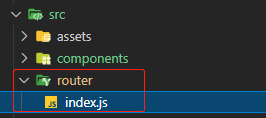

# 第四章 创建图片管理桌面应用


本章使用 `Vue` 的 `Electron` 插件来构建一个跨平台的（`cross-platform`）图片管理桌面应用。该应用可以快速实现本地图片的增删改查操作，同时基于 `JSON` 的文件数据库搭建了一个简易的后端 `API`，非常适合快速原型开发。


相关主题如下：

- `Vue` 组件的再理解
- 用 `Vue CLI` 插件 `Electron Builder` 创建项目
- 新增图片提交用户界面（UI）
- 新增图片主页
- 新增图片查询页
- 为应用新增路由功能
- 为应用添加后端 `API` 接口


---


## 1 Vue 组件的再理解

组件（`Components`）可以包含很多内容，既能通过 `props` 从父组件接收数据来自定义组件行为，也可以通过计算属性及侦听器（`watchers`）来侦听响应式数据，还能使用 `methods` 定义各种方法来完成相应操作；组件的内置指令（`directives`）还能用于 `DOM` 操作及数据绑定。总地来说，组件要设计得简洁高效，不应放入过多内容，包含少量的元素或子组件即可。

此外，组件也不是万能的。仅凭几个组件而不使用 `URL` 导航，是不可能构建任何较复杂应用的。只包含组件，就只能通过嵌套来控制复杂度；但嵌套的层级越多，内部导航也会越困难。而现在大多数应用都是有不同页面的，不引入恰当的路由机制就无法顺利导航。

`Vue` 提供了 `Vue Router` 来解决导航问题。利用 `Vue Router` 可以在跳转到一个 `URL` 时渲染指定的组件，也可以通过它提供的 `router-link` 组件来实现导航。`Vue Router` 功能强大，可以实现 `URL` 与路由（`routes`）的匹配。`URL` 可以携带查询字符串及 `URL` 参数，与 `Vue Router` 相结合还可以将路由嵌套在不同的组件中。被 `URL` 映射的组件会渲染到 `Vue Router` 的 `router-view` 组件内。对嵌套路由，需要在父级路由中添加 `router-view` 组件来显示子路由。

为了导航到不同的路由，`Vue Router` 对目前几乎所有现代浏览器都内置了的 `JavaScript History API` 进行了封装。借助这个 `API`，可以轻松地返回到不同的页面、跳转到一个历史记录或期望的 `URL` 地址。`Vue Router` 还支持 `HTML5` 模式——可以使用不带哈希符号（`#`）的 `URL` 与服务端渲染的路由作区分。

此外，`Vue Router` 还支持过渡特效（`transition effects`），可以在导航到不同路由时呈现。对导航的目标链接或激活状态的链接（`active link`）也可以设置 `CSS` 样式。


## 2 了解 Vue CLI 插件 Electron Builder

### 2.1 Electron Builder 简介

使用 `Electron` 可以将 `JS` 客户端 `Web` 应用转换成桌面应用。`Vue CLI` 提供的 `Electron Builder` 插件可以让开发者在一个桌面应用环境中构建 `Vue 3` 应用。`Electron` 应用，本质上是运行在一个基于 `Chromium` 内核的浏览器上的 `Web` 应用。因此浏览器能实现的功能它都能实现：有限硬件交互（调用麦克风、摄像头）、在主流操作系统的通知栏显示原生通知等。`Electron` 旨在提供一种简易的方式，从 `Web` 应用来构建桌面级应用，而无须考虑底层硬件的访问。

`Electron Builder` 是用 `Vue` 应用程序创建 `Electron` 应用程序最快的途径，因为它支持一些原生代码。利用 `Electron Builder` 还可以在代码中包含原生模块（`native modules`），只需要将 `Node.js` 模块位置引入目标原生代码中即可。此外，可以包含 **环境变量** 为不同的环境构建相应的项目。由于对 `Chromium` 的支持，`Electron Builder` 也支持 `Web worker`——可用于后台任务的运行——这样当要执行长时间运行或高 `CPU` 占用的任务时，就不必阻塞浏览器主线程。所有这些功能都可以通过常规的 `Vue` 应用或修改配置来实现。

另外，该插件也不是万能的。也存在一些功能是 `Electron` 支持但 `Electron Builder` 不支持的（如原生菜单功能），但跨平台创建桌面应用的特性是支持的——用于本章功能演示已经足够了。

本章演示的是一个运行在 `Windows` 系统的关于图片日常管理的桌面应用，由以下部分组成：

- 用于展示所有已添加的图片的总览页；
- 添加并保存图片的表单页；
- 专用于图片存放的存储机制；
- 用 `Vue Router` 实现导航。


### 2.2 用 Electron Builder 搭建项目

运行以下命令初始化项目：

```bash
$ mkdir vue-example-ch4-photo-manager
$ cd vue-example-ch4-photo-manager
$ npm install -g @vue/cli@next
$ vue create .
```

命令行中的初始配置项如下：


接着添加 `Electron Builder` 插件：

```bash
$ vue add electron-builder
```

中途提示要安装的 `Electron` 版本时，选择默认的 `13.0`（实操时的 `Electron Builder` 版本为 `22.14.5`）：


命令执行成功后，`src` 目录下会新增一个 `background.js` 文件，用于显示 `Electron` 窗口。其中——

- `BrowserWindow`：该构造函数用于初始化 `Electron` 窗口大小，默认为 `800 × 600 px`，可手动拖拽调整；
- `win.loadURL()` 指定应用主页，即：
  - 生产环境：为 `public/index.html` 文件；
  - 开发环境：为 `process.env.WEBPACK_DEV_SERVER_URL`；开发模式下使用的是 `webpack-dev-server` 在内存中的主页路径；

- `win.webContents.openDevTools()`：用于在 `Chromium` 内核浏览器窗口打开控制台；
- `app.quit()`：根据具体的操作系统监听关闭事件来关闭该应用窗口：
  - `Windows`：监听 `message` 事件，传参为 `'graceful-exit'` 时退出应用；
  - 非 `Windows`：监听 `SIGTERM` 事件来退出应用；


同时，`package.json` 文件也新增了一些 `Electron` 命令：

- `electron:build`：用于生产环境的构建；
- `electron:serve`：用于开发环境的调试；

这时，运行如下命令开启开发模式：

```bash
$ npm run electron:serve
```

`Windows` 桌面将自动弹出一个 `Electron` 窗口（如下图），并尝试在窗口上添加 `Vue Devtools`（安装不成功，报错：`Vue Devtools failed to install: Error: Invalid header: Does not start with Cr24`，待解决）。

此时修改 `public/index.html` 中的 `title` 标签，改为 `Photo App`，可以看到 `Electron` 窗口和浏览器中的标签标题都同时更新为 `Photo App`：


由于该窗口是对 `Chromium` 内核的封装版，因此开发模式下对页面做的更改会自动同步到浏览器和 `Electron` 窗口。注意，该 `Electron` 窗口 **不可关闭**，否则相当于退出开发模式。为便于调试，最好用 `Chrome` 浏览器（支持 `Vue Devtools`）进行调试（根据控制台的提示，访问 `http://localhost:8080/` 即可）。

最后补充安装依赖 `axios`，以便发送 `HTTP` 请求调用由 `json-server` 模拟的后端 `API`（详见 [4.7 小节](#section4_7)<a id="back"></a>）：

```bash
$ npm install axios
```


## 3 新增图片提交用户界面（UI）

首先删除默认的 `HelloWorld` 组件及其在 `App.vue` 中的所有引用。

然后创建图片提交页面和主页面（用于展示所有图片）；

在此之前，先在 `.eslintrc.js` 中加入以下自定义规则（字符串使用单引号、一行的结束符自动匹配）：

```js
'prettier/prettier': [
    'error',
    {
        singleQuote: true,
        endOfLine: 'auto',
    },
],
```

所谓图片提交页，就是供用户 **新增或修改图片** 的表单页。假设表单字段有四个：

- `name`：图片名称，字符型；
- `description`：图片描述，字符型；
- `dateTaken`：处理时间，日期型；
- `photoFile`：具体文件（`base64 URL`），字符串型；

则可以创建如下模板 `src/components/PhotoFormPage.vue`（由于涉及文件目录结构的调整，需签出指定 `tag` 标签才能看到：`ch4-demo-1.0`）：

```vue
<template>
  <div class="form">
    <h1>{{ edit ? 'Edit' : 'Add' }} Photo</h1>
    <form @submit.prevent="submit">
      <div>
        <label for="name">Name</label>
        <input
          type="text"
          name="name"
          id="name"
          class="form-field"
          v-model="form.name"
        />
      </div>
      <div>
        <label for="description">Description</label>
        <textarea
          id="description"
          name="description"
          class="form-field"
          v-model="form.description"
        ></textarea>
      </div>
      <div>
        <label for="dateTaken">Date Taken</label>
        <input
          type="datetime-local"
          id="dateTaken"
          name="dateTaken"
          class="form-field"
          v-model="form.dateTaken"
        />
      </div>
      <div>
        <label for="photoFile">Photo</label>
        <br />
        <input type="file" name="photoFile" id="photoFile" @change="onChange" />
        <br />
        
      </div>
      <div>
        <input type="submit" />
      </div>
    </form>
  </div>
</template>
```

注意，`label` 标签的 `for` 属性值为各表单字段的 `id`，这样可以把标签映射到 `input` 元素，同时也有利于提高可访问性（`accessibility`）——因为屏幕阅读器会拾取它并将其阅读给用户——这对有视力障碍的用户非常有帮助。

接着定义 `script`。由于多个组件都会调用同一个后端 `API`，因此可以将 `API` 的基础路径抽离出一个独立模块。创建模块 `src/constant.js`：

```js
export const APIURL = 'http://localhost:3000';
```

然后引入该常量模块：

```vue
<script>
import axios from 'axios';
import { APIURL } from '../constant';

export default {
  name: 'PhotoForm',
  data() {
    return {
      form: {
        name: '',
        description: '',
        dateTaken: '',
        photoFile: undefined,
      },
    };
  },
  computed: {
    edit() {
      return this.$route.params && typeof this.$route.params.id !== 'undefined';
    },
  },
  methods: {
    async submit() {
      const { name, description, dateTaken, photoFile } = this.form;
      if (!name || !description || !dateTaken || !photoFile) {
        return alert('All fields are required');
      }
      const { id } = this.$route.params;
      if (this.edit) {
        await axios.put(`${APIURL}/photos/${id}`, this.form);
      } else {
        await axios.post(`${APIURL}/photos`, this.form);
      }
      this.$router.push('/');
    },
    onChange(ev) {
      const fileReader = new FileReader();
      fileReader.readAsDataURL(ev.target.files[0]);
      fileReader.onload = () => {
        this.form.photoFile = fileReader.result;
      };
    },
  },
  async beforeMount() {
    const { id } = this.$route.params;
    if (this.edit) {
      const { data: form } = await axios.get(`${APIURL}/photos/${id}`);
      this.form = form;
    }
  },
};
</script>
```

实操时结合书中所述，补充了一个计算属性 `edit`。同时注意以下几点：

- `axis` 接口返回一个 `Promise`，获取结果可借助 `async / await` 语法；
- 修改已有图片使用 `axios.put(URL, data)`；新增使用 `axios.post(URL, data)`；
- 本例中图片是以 `base64 URL` 字符串存入后台的，适用于小型简单应用；大型应用要考虑换用文件服务器（如 `Dropbox` 或 `Amazon S3` 等），这样得到的是该文件的访问地址。两种情况下，`base64 URL` 和 `HTTP URL` 都可以作为 `src` 的值；
- `onChange` 事件回调逻辑中，`ev.target.files` 是一个 **类数组**（`array-like object`），`ev.target.files[0]` 中的 `0` 是 **属性名** 而非 **索引下标**；

然后是 `CSS` 样式设置。通过在 `style` 标签加关键字 `scoped` 来避免与其它组件相互干扰：

```vue
<style scoped>
.form {
  margin: 0 auto;
  width: 70vw;
}

.form-field {
  width: 100%;
}

#photo-preview {
  width: 200px;
}
</style>
```


## 4 新增图片主页

根据图片提交组件的 `submit` 回调逻辑，提交页会跳转到一个主页上（`this.$router.push('/')`），该主页假设会显示已经添加的所有图片。因此需要新增主页组件 `src/components/HomePage.vue`：（由于涉及文件目录结构的调整，需签出指定 `tag` 标签才能看到：`ch4-demo-1.0`）：

```vue
<template>
  <div>
    <h1>Photos</h1>
    <button @click="load">Refresh</button>
    <div class="row">
      <div>Name</div>
      <div>Photo</div>
      <div>Description</div>
      <div>Actions</div>
    </div>
    <div v-for="p of photos" :key="p.id" class="row">
      <div>
        
      </div>
      <div>{{ p.name }}</div>
      <div>{{ p.description }}</div>
      <div>
        <button @click="edit(p.id)">Edit</button>
        <button @click="deletePhoto(p.id)">Delete</button>
      </div>
    </div>
  </div>
</template>

<script>
import axios from 'axios';
import { APIURL } from '../constant';
export default {
  data() {
    return {
      photos: [],
    };
  },
  methods: {
    async load() {
      const { data: photos } = await axios.get(`${APIURL}/photos`);
      this.photos = photos;
    },
    edit(id) {
      this.$router.push({ path: `/edit-photo-form/${id}` });
    },
    async deletePhoto(id) {
      await axios.delete(`${APIURL}/photos/${id}`);
      this.load();
    },
  },
  beforeMount() {
    this.load();
  },
};
</script>

<style scoped>
.row {
  display: flex;
  flex-wrap: wrap;
  justify-content: space-between;
}
.row div {
  width: 25%;
}
.row img {
  width: 100px;
}
</style>
```

注意以下几个地方：

- 第 40 行：用到了 `this.$router.push(pathObj)` 方法来跳转到某个路由。其参数是一个包含 `path` 属性的 `JSON` 对象，`path` 的值为目标 `URL` 与携带参数 `id` 的组合形式（`REST` 风格）；
- `HTML` 标签内是不需要插值符号 `{{}}` 的，仅在需要显示在页面的位置需要使用；
- 第 44 行：该行的作用，是在删除图片后重新查询已有图片，做到实时更新；
- `CSS` 样式：采用了 `flex` 盒模型，将 `div` 以类似 `table` 表格的形式渲染出来。


有了图片列表展示区，还需要在主页顶部展示一个导航条，用来跳转到不同页面（如新增图片页、查询图片页等）。因此需要创建导航条组件 `src/components/NavBar.vue`：

```vue
<template>
  <nav>
    <ul>
      <li><router-link to="/">Home</router-link></li>
      <li><router-link to="/add-photo-form">Add Photo</router-link></li>
      <li><router-link to="/search">Search Photos</router-link></li>
    </ul>
  </nav>
</template>

<script>
export default {
  name: 'NavBar',
};
</script>

<style>
ul li {
  list-style: none;
  display: inline;
  margin-right: 10px;
}
ul {
  margin: 0 auto;
  width: 70vw;
}
a:link {
  text-decoration: none;
}
</style>
```

注意：在组件的模板部分，每个 `li` 元素内都有一个 `router-link` 组件。该组件是 `Vue Router` 提供的内部组件，之所以用 `router-link` 而非传统的 `a` 标签，是因为 `Vue Router` 会把 `router-link` 组件中的 `to` 属性值解析到正确的路由上，一旦 `URL` 匹配到定义好的路由，所映射的组件就会在 `router-view` 加载显示。

> **勘误1**
>
> （PDF 版第 101 页）
>
> Additionally, we have a **Log Out** link to log us out of the app. 
>
> 实际上示例源码根本没有提供登录与登出的相关组件和页面导航。书中给出的两个截图（一个登录页、一个包含登出的主页面）也是错的。由于 `script` 标签中的 `logOut` 方法是多余的，实操时进行了清理。


## 5 新增图片查询页

为满足主页面查询图片的导航需求，需新建查询页组件。该组件的主要功能，是提供一个图片名称检索文本框，通过输入的关键词，来模糊查询匹配到的图片，以列表形式展示在检索栏下方。

查询页组件 `src/components/SearchPage.vue` 示例代码如下：（由于涉及文件目录结构的调整，需签出指定 `tag` 标签才能看到：`ch4-demo-1.0`）：

```vue
<template>
  <div>
    <h1>Search</h1>
    <form @submit.prevent="submit">
      <div>
        <label for="keyword">Keyword</label>
        <br />
        <input
          type="text"
          name="keyword"
          id="keyword"
          class="form-field"
          v-model="keyword"
        />
      </div>
      <div>
        <input type="submit" value="Search" />
      </div>
    </form>
    <div v-for="p of photos" :key="p.id" class="row">
      <div>
        
      </div>
      <div>{{ p.name }}</div>
      <div>{{ p.description }}</div>
    </div>
  </div>
</template>

<script>
import axios from 'axios';
import { APIURL } from '../constant';

export default {
  name: 'SearchPage',
  data() {
    return {
      keyword: '',
      photos: [],
    };
  },
  methods: {
    submit() {
      this.$router.push({ path: '/search', query: { q: this.keyword } });
    },
    async search() {
      const { data: photos } = await axios.get(
        `${APIURL}/photos?name_like=${this.$route.query.q}`
      );
      this.photos = photos;
    },
  },
  watch: {
    $route: {
      immediate: true,
      handler() {
        this.keyword = this.$route.query.q;
        this.search();
      },
    },
  },
};
</script>

<style>
.form-field {
  width: 100%;
}
.row {
  display: flex;
  flex-wrap: wrap;
  justify-content: space-between;
}
.row div {
  width: 25%;
}
.row img {
  width: 100px;
}
</style>
```

重点来看 `methods` 部分：

- `this.$route`：这里的 `this.$route` 指代 **当前路由**，通过侦听 `this.$route` 可以拦截到 `URL` 的查询字符串 `query` 对象的变动情况；而 `this.$router` 指代定义各个路由的 **`router` 实例**，以避免在不同组件频繁 `import`；

- `search` 方法通过 `axios` 发起 `GET` 请求到后台，然后将查询结果赋给响应式变量 `photos`（数组）。注意这里的查询参数是从地址栏内的 `URL` 来的，通过 `this.$route.query.q` 拿到；为什么不是 `this.keyword` 呢？因为 `submit` 方法；
- `submit` 方法通过 `Vue Router` 跳转到 `/search` 路由，后期会配置成映射到当前 `SearchPage` 组件。也就是说，提交表单会将页面的查询关键词通过 `URL` 带到新页面，因此 `search` 方法的参数不能从新页面的文本框去获取（此时文本框的初始状态为空）。那么 `search` 方法是怎么触发的呢？通过侦听 `this.$route` 的变化。
- `handler()`：一旦 `URL` 发生改变（即关键词变更）就会触发 `handler` 方法的执行。`handler` 完成两件事：
  - 将 `URL` 携带的上一页的查询关键词，赋给新页面的响应式变量 `keyword` 上，使得文本框内有相同的值（已双向绑定）；
  - 调用后端 `API` 接口执行具体查询；（有了第 57 行的赋值操作，`search` 方法也能使用 `this.keyword` 来传参；既然本质上都是同一个值，又何必从 `this.keyword` 借道呢？）
- `axios.get`：执行具体查询，请求地址中的查询参数为 `name_like`，这是 `json-server` 专有的写法，表示对 `name` 字段进行模糊匹配；
- `@submit.prevent`：表示提交表单时禁用默认行为，相当于执行了 `event.preventDefault()`；
- `immediate`：设为 `true` 后才能拿到最新的查询条件。


## 6 为应用新增路由功能

没有 `Vue Router` 插件，就无法显示应用中的页面组件，跳转链接也是失效的，无法正常导航。要添加 `Vue Router` 插件需要两步：

- 注册插件
- 添加路由

对 `src/main.js` 文件改造如下：（由于涉及文件目录结构的调整，需签出指定 `tag` 标签才能看到：`ch4-demo-1.0`）：

```js
import { createApp } from 'vue';
import App from './App.vue';
import { createRouter, createWebHistory } from 'vue-router';

import HomePage from './components/HomePage';
import PhotoFormPage from './components/PhotoFormPage';
import SearchPage from './components/SearchPage';

const routes = [
  { path: '/', component: HomePage },
  { path: '/add-photo-form', component: PhotoFormPage },
  {
    path: '/edit-photo-form/:id',
    component: () => import('./components/PhotoFormPage.vue'),
  },
  { path: '/search', component: SearchPage },
];

const router = createRouter({
  history: createWebHistory(),
  routes,
});

createApp(App).use(router).mount('#app');
```

注意：

- 数组 `routes` 定义了跳转地址与要加载的组件之间的映射关系，`Vue` 实例 `app` 通过 `use` 方法将定义好的路由注册到应用中；
- `path` 属性值可以设置基于 `REST` 风格的参数占位符（`:id`），获取参数的方法是 `this.$route.params.id`；
- `createRouter()` 函数是 `Vue Router 4` 的注册路由的专用写法，与 `Vue Router 3` 不同。`Vue 3` 只支持 `createRouter()` 写法；
- `createWebHistory()` 表示使用 `HTML5` 模式，这样就可以省略基础 `URL` 与其余部分之间的 `#` 连接符，看起来更自然；


The `beforeEnter()` method is a per-route navigation guard. We need this method so that we can only access the pages that are available after login. In this method, we check whether the local storage item with the key logged in is `true`. Then, if that is `false`, we redirect to the login page by calling the `next()` function with the `path` property set to `login`. The `return` keyword is required before calling `next` since we don't want to run the rest of the function's code. Otherwise, we just call `next` to continue with the navigation to the destination route, which is the value of the `path` property. We also add the `beforeEnter()` method to the route objects that we want to apply:


> **勘误2**
>
> （PDF 版第 107 页）
>
> In our `EditPhotoFormPage` component, we retrieve the `id URL` parameter by using the `this.$route.params.id` property.
>
> 实例中编辑和新增是同一个组件，均为 `PhotoFormPage.vue`，因此应更正为：
>
> In our `PhotoFormPage` component, we retrieve the `id URL` parameter by using the `this.$route.params.id` property.

> **勘误3**
>
> （PDF 版第 108 页）
>
> The `beforeEnter()` method is a per-route navigation guard. We need this method so that we can only access the pages that are available after login. In this method, we check whether the local storage item with the key logged in is `true`. Then, if that is `false`, we redirect to the login page by calling the `next()` function with the `path` property set to `login`. The `return` keyword is required before calling `next` since we don't want to run the rest of the function's code. Otherwise, we just call `next` to continue with the navigation to the destination route, which is the value of the `path` property. We also add the `beforeEnter()` method to the route objects that we want to apply:
>
> 这一段和对应的 `beforeEnter` 代码块在示例源码中均被删除了。原因不明。


根据 `vite` 工具的默认配置，还可以将 `router` 抽成一个模块引入 `App.vue` 根组件，新建文件 `src/router/index.js`，同时将三个页面组件统一放到 `src/views/` 文件夹，分别重命名为 `HomeView.vue`、`PhotoFormView.vue`、`SearchView.vue`：（由于涉及文件目录结构的调整，需签出指定 `tag` 标签才能看到：`ch4-demo-2.0`）：

```js
import { createRouter, createWebHistory } from 'vue-router';
import PhotoFormPage from '@/views/PhotoFormView.vue';

const routes = [
  { path: '/', component: () => import('@/views/HomeView.vue') },
  { path: '/add-photo-form', component: PhotoFormPage },
  {
    path: '/edit-photo-form/:id',
    component: PhotoFormPage,
  },
  {
    path: '/search',
    component: () => import('@/views/SearchView.vue'),
  },
];

const router = createRouter({
  history: createWebHistory(),
  routes,
});

export default router;
```



注意：这里的 `import` **必须** 加括号，是一个函数值的概念。


最后是对根组件 `App.vue` 的改造。引入之前创建的 `NavBar` 组件：

```vue
<template>
  <div id="app">
    <nav-bar></nav-bar>
    <router-view></router-view>
  </div>
</template>

<script>
import NavBar from '@/components/NavBar.vue';
export default {
  name: 'App',
  components: { NavBar },
};
</script>

<style scoped>
#app {
  margin: 0 auto;
  width: 70vw;
}
</style>
```

这里的 `router-view` 是和 `NavBar` 组件中的 `router-link` 搭配使用的，一旦 `URL` 匹配到正确的路由，就会在 `router-view` 加载对应的组件。

由于登录也不需要导航条，所以使用了 `v-if` 指令，具体逻辑是判定当前 `URL` 中是否包含 `login` 字样，若包含则不显示导航条，反之亦然。

> **勘误4**
>
> （PDF 版第 109 页）随书示例代码中根本没有登录的概念，相关逻辑和组件被删除了。


## 7 为应用添加后端 `API` 接口<a id="section4_7"></a><sub>([↑↑ 返回 ↑↑](#back))</sub>

前面的演示都是对客户端的编码，要让项目正常运行，还需要一个可以返回查询结果、并支持图片基本操作（增删改查）的后端接口。由于本章示例主要演示 `Vue3` 客户端开发，这里引入一个基于 `JSON` 的简易 `API` 小工具——`json-server`。它是一个简易的扁平化文件数据库（`flat-file database`），所有数据都以 `JSON` 格式存储（包括图片），而且无需复杂的配置就能自动完成简易 `REST` 风格 `API` 的搭建。这个小工具可以说是为前端开发者量身定制的，尤其适用于需要一个模拟的后台来快速完成原型设计的场景。

首先安装 `JSON Server`（简易全局安装）：

```bash
$ npm i -g json-server
```

然后在任意位置创建一个文件夹来存放图片数据库，例如 `photo-api`，里面包含一个 `JSON` 文件，例如 `db.json`，内容如下：

```json
{
    "photo": []
}
```

然后进入文件夹，执行以下命令启动服务器：

```bash
$ json-server --watch db.json
```

运行结果如下：


该服务默认端口为 3000。之后服务器会自动建议如下所示的接口：

- `GET /photos`：查询所有图片；
- `GET /photos/1`：根据 ID 查询图片，末尾的 1 可以为任意有效 ID；
- `POST /photos`：新增图片；
- `PUT /photos/1`：根据 ID 更新图片，末尾的 1 可以为任意有效 ID；
- `PATCH /photos/1`：根据 ID 更新图片，末尾的 1 可以为任意有效 ID；
- `DELETE /photos/1`：根据 ID 更新图片，末尾的 1 可以为任意有效 ID；

`json-server` 的 `GET` 请求支持带查询字符串查询，例如 `GET /photos?name_like=foo`，会检索 `photos` 数组中所有 `name` 字段包含 `foo` 的元素；

这就是前面 `API` 调用时基础 `URL` 写成 http://localhost:3000 的原因。

如果默认 3000 端口被占用，可以通过配置项 `--port` 手动设置端口（如改成 3005）：

```bash
$ json-server --watch db.json --port 3005
```

这样 APIURL 常量也要同步更新端口为 3005。

> **勘误5**
>
> （PDF 版第 111 页）
>
> In order to search the field with a given piece of text, we can make a *GET* request to a URL such as `GET /photos?tname_like=foo`. 
>
> 应更正为：
>
> In order to search the field with a given piece of text, we can make a *GET* request to a URL such as `GET /photos?name_like=foo`. 
>
> **勘误6**
>
> （PDF 版第 111 页）
>
> So, we can write something such as `run json-server --watch db.json –port 3005` to run the JSON server in port `3005`. 
>
> 应更正为：
>
> So, we can write something such as `run json-server --watch db.json -–port 3005` to run the JSON server in port `3005`. 


最后运行的效果如下——

主页：


新增 / 修改页：


查询页：


对应的 `json-server` 后台（部分截图）：


## 8 小结

本章演示了 `Vue Router` 在 `Vue 3` 中的使用方法，将不同的 `URL` 映射到不同的组件，达到访问某个 URL 才渲染对应的组件效果。

`URL` 既可以包含查询字符串（`query string`），也可以包含 `URL` 参数（`/edit-photo-form/:id`），均通过 `Vue Router` 自动解析。这些 `URL` 将与定义路由的数组进行匹配。

路由可以嵌套，并且它们可以具有名称（`name`），以便通过名称而不是路由模式（`route pattern`）来识别；此外，可以新建一个 `catchall` 路由或 `404 route` 路由，在其他模式匹配都不生效时加载指定的内容。

要对路由访问权限进行条件控制，可在进入路由之前使用 **导航守卫** （`Navigation guards`）进行检查；导航守卫检查也可以在路由加载后执行；也支持在全局或只对单个路由生效；对同一个路由生效时，还可以应用多个守卫检查，较全局检查具有更大的灵活性。

`Vue` 的命令行工具插件 `Electron Builder`，可以将 `Vue 3` 的 `Web` 应用转换为桌面应用，实现从浏览器应用构建桌面应用（而且是跨平台的），从而完成很多之前桌面应用才能做的事情：比如像使用浏览器应用程序一样对摄像头和麦克风等硬件进行有限访问；也可以像在桌面应用程序中一样显示本机通知。

`Vue 3` 创建的基于 `Electron` 的桌面应用，本质上是在 `Chromium` 内核的浏览器中运行 `Vue 3` 的 `Web` 应用。

`json-server` 是一个基于 `JSON` 的简易文件数据库，能在最短时间内快速模拟后端 `API` 接口。

> 勘误7
>
> 由于删去了登录与登出模块，小结中提到的很多知识点在源码中都没有相应代码。

本章的实测示例项目会统一放到 `vuejs3ex/diy/ch04/` 文件夹下，除了前端 `Vue` 项目的相关代码，也包括 `json-server` 站点配置（`photo-api` 文件夹）和示例图片文件夹（`imgs`）。
