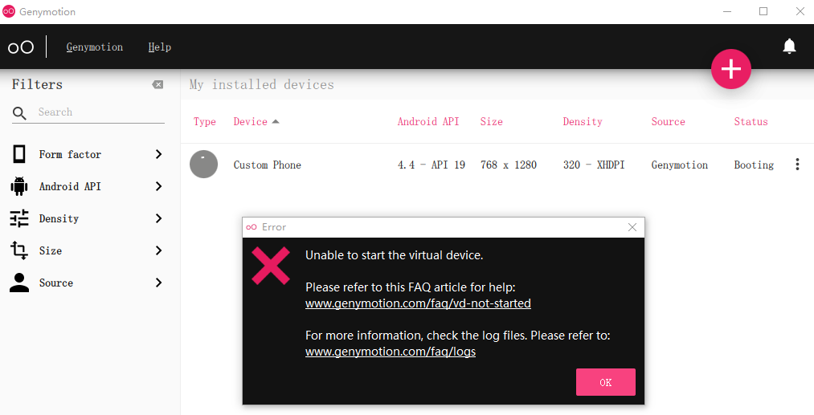
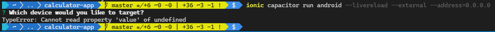
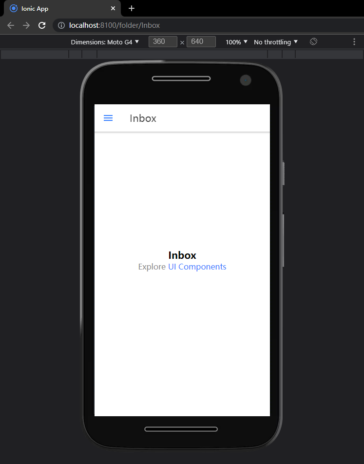
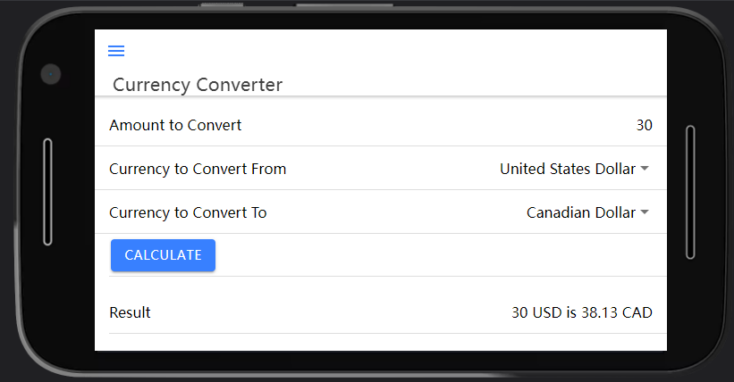
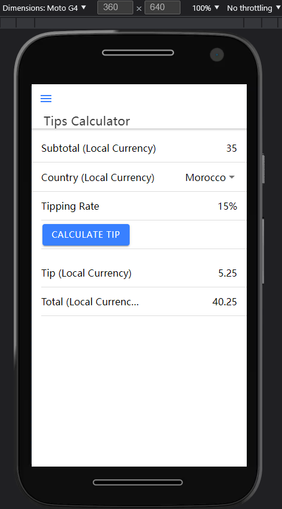
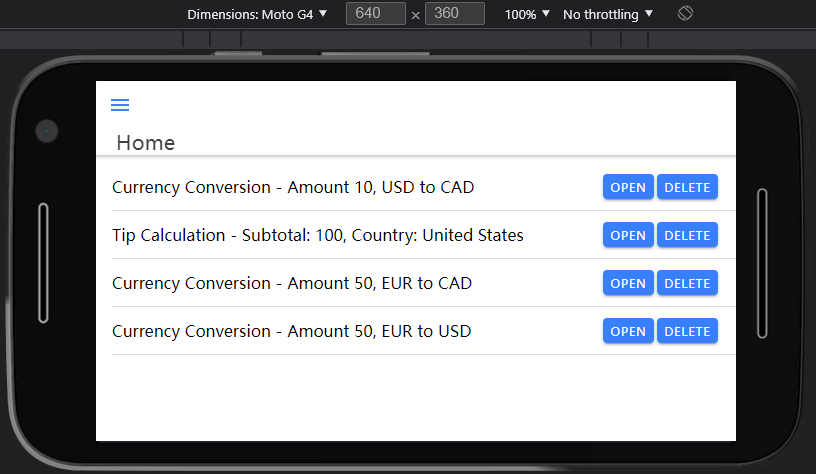
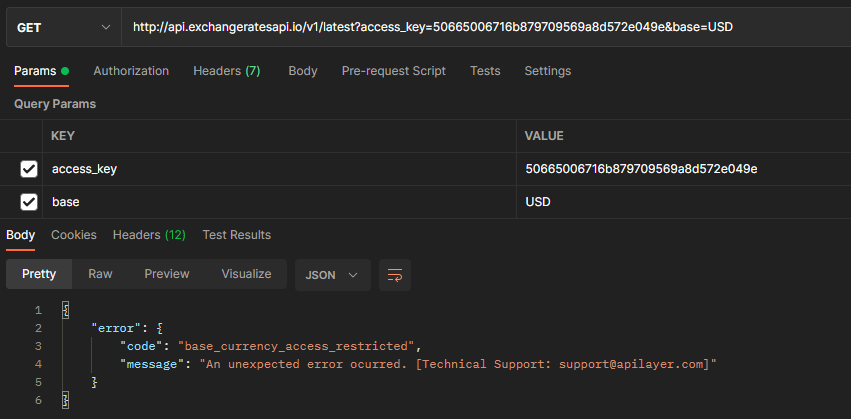
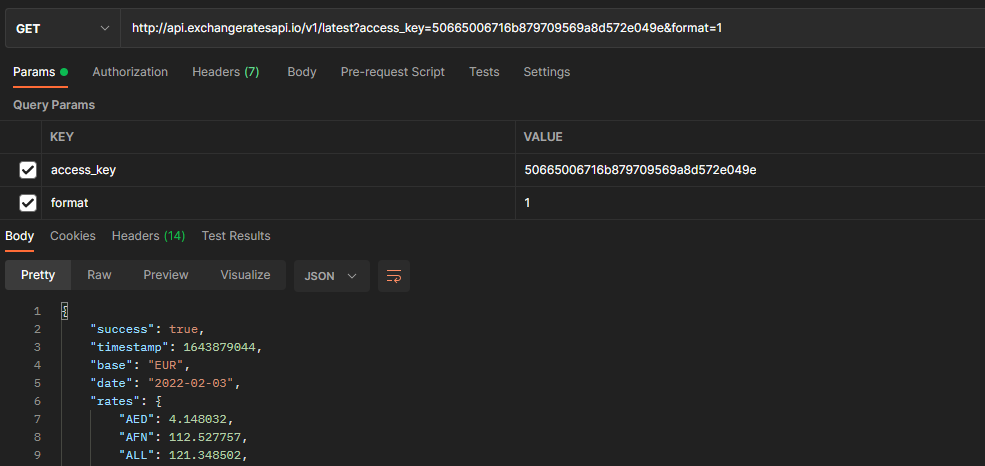
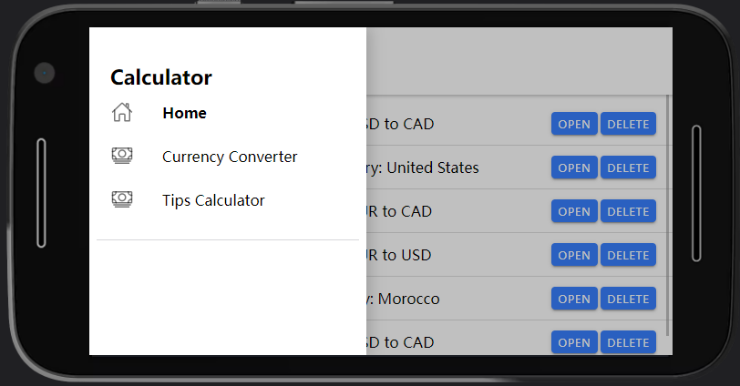

# 第五章 用 Ionic 实现一个多功能计算器移动端 APP


前四章介绍了用 `Vue3` 创建 `Web` 应用的相关知识。`Vue3` 也可以创建移动端应用，但需要在以 `Vue3` 作基础框架的移动端 `APP` 框架上进行。上一章演示了 `Vue Router` 在具有多个页面的应用中完成页面导航的相关功能，可以借此实现一些稍复杂的应用了；本章将更进一步，介绍怎样用 `Vue3` 创建移动端应用。该应用的功能是汇率计算和小费计算，并支持历史记录的重算。

本章相关主题如下：

- 介绍 `Ionic Vue`
- 创建 `Ionic Vue` 移动端应用
- 安装项目所需的包
- 在计算器 APP 中添加多种计算器

---


## 1 `Ionic Vue` 简介

**`Ionic Vue`** 是一个通过 `Typescript` 和 `Vue` 来构建移动端应用的框架。`Ionic` 同样也有基于 `React` 和 `Angular` 的版本。同其他 UI 框架一样，`Ionic Vue` 内置了许多常见的组件，如 input 框、菜单、图标、列表等等。编译好的 `Ionic` 应用会在一个 `Web` 视图（`Web view`）中运行，以便在应用中方便地调用 `localStorage` 本地缓存、`geolocation` 等在内的浏览器 `API`。该框架提供的内置工具还可以自动构建移动端应用，不必手动从头开始搭建环境。

`Ionic Vue` 默认使用 `Composition API` 规范来创建组件，使得项目的模块化程度更高，能更好地和 `Typescript` 协同。


### 1.1 理解 Composition API

由于不引用动态的关键字 `this`，`Composition API` 能更好地与 `Typescript` 进行配合。`Composition API` 中的所有内容，包括它的各种库，都是函数兼容的（`compatible`）——都具有明确的参数和返回类型，可以很方便地通过 `Typescript` 进行类型定义。由于 `Vue Router 4` 和 `Vuex 4` 才与 `Composition API` 兼容，因此演示项目中也会一并引入这两个库。

`Composition API` 中也有组件对象（`component object`）的概念，但实现方式和之前的 `Options API` 完全不同，唯一相同的是都具有 `components` 属性。在 `Composition API` 中，组件逻辑是在 `setup()` 方法中实现的——这里也是定义响应式属性、计算属性、侦听器及组件方法的地方。项目需要的第三方库是以 `hooks` 钩子的形式出现的，所谓钩子就是可以在 `setup` 函数中直接调用的第三方库函数，例如通过 `Vuex 4` 提供的 `useStore` 钩子来访问 `store`；用 `Vue Router 4` 提供的 `useRouter` 钩子来实现导航。

此外，`Composition API` 定义响应式属性和计算属性的方式也和之前的 `Options API` 大不相同——

- 响应式数据的定义：前面章节中演示的是 `options API` 的用法，响应式数据的初始化是在 `data()` 方法中进行的；而在 `Composition API` 中，基本类型的值（`primitive values`）对应的响应式数据，需要用 `ref` 函数定义；而对象型值的响应式数据需要调用 `reactive` 方法来完成；
- 计算属性的定义：通过 `computed` 函数来定义，需要传入一个回调函数。该函数引用了其他响应式数据生成对应的计算属性；
- 侦听器的定义：通过 `watch` 函数来定义，需要一个回调函数。该函数的返回值是一个期望被侦听的响应式数据。回调函数的第一个参数是最新的值，第三个参数是该侦听器的配置对象，可以像在 `Options API` 中那样设置 `deep` 属性和 `immediate` 属性等；
- 组件方法的定义：也在 `setup` 函数内进行；由于没有 `this` 的限制，用箭头函数还是普通函数定义方法均可；

这些响应式数据及方法必须以一个对象的形式从 `setup` 函数返回，这样才能让组件模板调用。


### 1.2 理解 Typescript

**`TypeScript`** 是微软发布的一个 `JavaScript` 的扩展，可以在编译阶段检查数据类型，但不提供其它运行时的类型检查，因为 `TypeScript` 在运行前会被编译为 `JavaScript` 代码。用 `Composition API` 创建的组件不引用 `this` 关键字，因此也不必担心用错 `this`。

使用 `TypeScript` 的好处在于它能确保类型安全，如基本类型、对象型、变量等，这是 `JavaScript` 不具备的。`JavaScript` 可以将任意值赋值给一个变量，这样在不希望数据类型发生改变时就会出问题；同时，函数也能接收任意值作参数，没有参数数量与传参顺序的限制，从而很可能在传入无效参数时报错；再者，参数在任意位置都可能为 `null` 或 `undefined`，而我们往往只希望在某些地方允许为空。类型不安全还可能发生在函数的返回值上，同样地，`TypeScript` 也能对其加以限制。

`TypeScript` 的另一个强大特性在于可以创建接口来限制对象型数据的结构。可以指定对象的属性与类型，确保目标对象具有这些符合要求的数据结构，从而避免传入指定类型以外的对象型参数；同时，这也为支持 `TypeScript` 特性的文本编辑器实现自动补全功能（`autocomplete functionality`）提供了可能——因为对象的结构是固定的。接口也支持非必填项和动态属性，以保留 `JavaScript` 对象的灵活性。

为了保留 `JavaScript` 的灵活性，`TypeScript` 提供了 `union` 和 `intersection` 类型：

- `Union` 型：通过逻辑或运算符实现对多种类型的支持，某变量值必须是备选类型之一，相当于对多种类型 **求并集**；
- `Intersection` 型：通过逻辑与运算符实现对多种类型的支持，某变量值必须同时满足所有备选类型，相当于对多种类型 **求交集**；

为了使类型定义简洁，`TypeScript` 提供了 `type` 关键字来创建类型别名。类型别名与常规类型一样，也能用于规范变量、属性、参数、返回值等的类型。

本章演示的移动端应用，会在小费计算页、汇率转换页、Home 主页添加历史计算列表。所有运行过的计算都会存入 `localStorage` 缓存以便后期调用。将操作历史存入本地缓存需要用到 `vuex-persistedstate` 插件，该插件兼容 `Vuex 4`，可以将 `Vuex state` 直接存入本地缓存，而不必手敲其他多余的代码。

在了解了 `Vue 3` 的 `Composition API`、`TypeScript` 和 `Ionic` 的相关知识后，来看看移动端应用的具体创建。


## 2 创建 `Ionic Vue` 移动端项目

首先全局安装 `Ionic` 命令行工具：

```bash
$ npm install -g @ionic/cli
```

然后在桌面位置执行命令：

```bash
$ ionic start calculator-app sidemenu --type vue
```

中途会询问是否创建 `ionic` 帐号，按默认设置跳过即可。命令中的 `sidemenu` 表示在页面创建一个菜单栏，`--type vue` 表示创建一个 `Ionic Vue` 项目。

可通过以下命令获取 `Ionic` 帮助：

- `ionic –help`
- `ionic <command> --help`（推荐）
- `ionic <command><subcommand> --help`


### 2.1 使用 `Capacitor` 及 `Genymotion`

`Ionic Vue` 项目是通过 `Capacitor` 构建并发布的。`Capacitor` 会在 `Android Studio` 打开项目，然后从 `AS` 启动并在一个模拟器或设备上预览创建的应用。本章示例使用的模拟器是 `Genymotion`。它运行速度快并提供插件支持从 `AS` 启动。相关下载链接：

- `Genymotion` 下载：https://www.genymotion.com/download/
- `Android Studio` 下载：https://developer.android.com/studio

实操过程中，`Genymotion` 的启动始终有问题：



由于书中没有详细安装步骤，无法知道具体原因。本例暂时从浏览器的移动端模式进行调试。

在 `package.json` 文件中新增两个命令：

```json
"scripts": {
    // ...
    "ionic:serve": "vue-cli-service serve",
    "ionic:build": "vue-cli-service build"
},
```

在执行以下命令：

```bash
# Add dependencies for an Android project
$ npx cap add android
$ npx cap sync
```

由于无法顺利启动 Genymotion，下面的命令也会报错，提示找不到虚拟设备：

```bash
$ ionic capacitor run android --livereload --external --address=0.0.0.0
```



可以通过以下命令从浏览器进行预览：

```bash
$ npm run ionic:serve
# or
$ ionic serve
```

使用浏览器的移动端模式：



然后在安装本例所需依赖：

```bash
$ npm install axios uuid vuex@next vuex-persistedstate
```


## 3 添加计算器到应用中

开发环境搭好后，下面从三个大的方面进行实操演练：

1. 创建路由：定义 URL 路径与页面组件的映射关系；
2. 创建各组件：按功能点逐一添加组件；
3. 创建 `Vuex store`：实现 `store` 数据本地缓存；


### 3.1 添加路由

将默认的 `main.ts`

```tsx
import { createRouter, createWebHistory } from '@ionic/vue-router';
import { RouteRecordRaw } from 'vue-router';
const routes: Array<RouteRecordRaw> = [
  {
    path: '/',
    component: () => import('../views/Home.vue'),
  },
  {
    path: '/currency-converter',
    component: () => import('../views/CurrencyConverter.vue'),
  },
  {
    path: '/tips-calculator',
    component: () => import('../views/TipsCalculator.vue'),
  },
];
const router = createRouter({
  history: createWebHistory(process.env.BASE_URL),
  routes,
});
export default router;
```

注意：`routes` 数组的类型为 `Array<RouteRecordRaw>` 型，表示每个路由必须包含 `path` 和 `component` 属性，其中 `path` 为字符串型，`component` 为组件型数据，或返回一个 `promise` 实例的函数、且该 `promise` 可以决议为一个 `component` 组件。如果不满足这样的类型限制，`TS` 编译器就会报错。由于设置了 `livereload` 选项，代码会在更新时实时编译，若有报错也会立刻提示，不必等到运行时再报错。类型定义会一并构建到 vue-router 模块，因此不必担心类型定义丢失。


### 3.2 添加汇率转换页

创建组件 `src/views/CurrencyConverter.vue`，先来看 `template` 的写法：

```vue
<template>
  <ion-page>
    <ion-header translucent>
      <ion-toolbar>
        <ion-buttons v-slot="start">
          <ion-menu-button></ion-menu-button>
        </ion-buttons>
        <ion-title>Currency Converter</ion-title>
      </ion-toolbar>
    </ion-header>

    <ion-content fullscreen>
      <div id="container">
        <ion-list>
          <ion-item>
            <ion-label :color="!amountValid ? 'danger' : undefined">
              Amount to Convert
            </ion-label>
            <ion-input
              class="ion-text-right"
              type="number"
              v-model="amount"
              required
              placeholder="Amount"
            ></ion-input>
          </ion-item>

          <ion-item>
            <ion-label> Currency to Convert From</ion-label>
            <ion-select
              v-model="fromCurrency"
              ok-text="Okay"
              cancel-text="Dismiss"
            >
              <ion-select-option
                v-for="c of fromCurrencies"
                :value="c.abbreviation"
                :key="c.name"
              >
                {{ c.name }}
              </ion-select-option>
            </ion-select>
          </ion-item>

          <ion-item>
            <ion-label> Currency to Convert To</ion-label>
            <ion-select
              v-model="toCurrency"
              ok-text="Okay"
              cancel-text="Dismiss"
            >
              <ion-select-option
                v-for="c of toCurrencies"
                :value="c.abbreviation"
                :key="c.name"
              >
                {{ c.name }}
              </ion-select-option>
            </ion-select>
          </ion-item>

          <ion-item>
            <ion-button size="default" @click.stop="calculate">
              Calculate
            </ion-button>
          </ion-item>
        </ion-list>

        <ion-list v-if="result">
          <ion-item>
            <ion-label>Result</ion-label>
            <ion-label class="ion-text-right">
              {{ amount }} {{ fromCurrency }} is {{ result.toFixed(2) }}
              {{ toCurrency }}
            </ion-label>
          </ion-item>
        </ion-list>
      </div>
    </ion-content>
  </ion-page>
</template>
```

其中：

- `ion-page`：页面容器组件，由 `ion-header` 和 `ion-content` 两部分构成，分别对应侧边栏和正文区；
- `ion-toolbar`：用于在页面顶部添加一个工具栏；
- `ion-buttons`：用于放置各个菜单按钮；这里还必须向 `start` 插槽添加一个 `ion-menu-button` 组件，用于在页面左上角添加一个菜单按钮，鼠标单击该按钮打开左侧边栏菜单；
- `ion-title`：包含页面标题，位于页面左上角；
- `ion-content`：外层是一个 `ion-list` 组件，相当于一个列表，与 `ion-item` 组件搭配使用，一般一个 `ion-item` 占一行。`ion-item` 又包含专属 `ion-label` 组件、`ion-select` 组件等，用于设计一行中的各个元素。
- `ion-text-right`：`Ionic` 框架定义的样式类；
- 注意页面上两个下拉框的联动：当前货币选定后，要从目标货币列表中筛除，避免两个货币是同种货币；
- `@click.stop` 的作用是阻止单击事件冒泡；
- 计算结果在一个新的 `ion-list` 组件中展示，结果保留两位小数。


### 3.3 添加 script 标签

接着添加 `CurrencyConverter` 组件的 `script` 标签，完整代码如下：

```tsx
<script lang="ts">
import {
  IonButtons,
  IonContent,
  IonHeader,
  IonMenuButton,
  IonPage,
  IonTitle,
  IonToolbar,
  IonSelect,
  IonInput,
  IonLabel,
  IonButton,
  IonList,
  IonItem,
  IonSelectOption,
} from '@ionic/vue';
import { computed, reactive, ref, watch } from 'vue';
import { currencies as currenciesArray } from '../constants';
import axios from 'axios';
import { useStore } from 'vuex';
import { CurrencyConversion } from '@/interfaces';
import { v4 as uuidv4 } from 'uuid';
import { useRoute } from 'vue-router';

export default {
  name: 'CurrencyConverter',
  components: {
    IonButtons,
    IonContent,
    IonHeader,
    IonMenuButton,
    IonPage,
    IonTitle,
    IonToolbar,
    IonSelect,
    IonInput,
    IonLabel,
    IonButton,
    IonList,
    IonItem,
    IonSelectOption,
  },
  setup() {
    const amount = ref(0);
    const fromCurrency = ref('USD');
    const toCurrency = ref('CAD');
    const result = ref(0);
    const currencies = reactive(currenciesArray);
    const store = useStore();
    const route = useRoute();
    const fromCurrencies = computed(() =>
      currencies.filter(({ abbreviation }) => abbreviation !== toCurrency.value)
    );
    const toCurrencies = computed(() =>
      currencies.filter(
        ({ abbreviation }) => abbreviation !== fromCurrency.value
      )
    );
    const amountValid = computed(() => +amount.value >= 0);
    const addToHistory = (entry: CurrencyConversion) =>
      store.commit('addToHistory', entry);

    const calculate = async () => {
      result.value = 0;
      if (!amountValid.value) {
        return;
      }
      addToHistory({
        id: uuidv4(),
        fromCurrency: fromCurrency.value,
        toCurrency: toCurrency.value,
        amount: amount.value,
      });
      const {
        data: { rates },
      } = await axios.get(`https://api.exchangeratesapi.io/latest`, {
        params: {
          base: fromCurrency.value,
        },
      });
      result.value = amount.value * rates[toCurrency.value];
    };

    watch(
      () => route.query,
      (query) => {
        const { id: queryId } = query;
        const { history } = store.state;
        const entry = history.find(
          ({ id }: CurrencyConversion) => id === queryId
        );
        if (!entry) {
          return;
        }
        const {
          fromCurrency: queryFromCurrency,
          toCurrency: queryToCurrency,
          amount: queryAmount,
        }: CurrencyConversion = entry;
        fromCurrency.value = queryFromCurrency;
        toCurrency.value = queryToCurrency;
        amount.value = queryAmount;
      },
      { immediate: true }
    );

    return {
      amount,
      fromCurrency,
      toCurrency,
      currencies,
      fromCurrencies,
      toCurrencies,
      amountValid,
      calculate,
      result,
      addToHistory,
    };
  },
};
</script>
```

其中——

- `<script lang="ts">`：这样可以使用 `TypeScript` 代码；
- `computed`：这是 `Composition API` 的计算属性写法，要求向 `computed` 函数传入一个包含计算属性表达式的回调函数；
- 响应式副本：基本类型的副本用 `ref` 函数得到，对象型的副本是 `reactive` 函数得到；
- `watch`：用于侦听指定的响应式数据，签名为：`watch(source, cb, options)`；
- `currenciesArray`：用于得到计算属性 `fromCurrencies` 与 `toCurrencies`；
- `useStore`：用于访问 `Vuex store`；通过 `useRoute` 函数可以访问路由对象 `route`，进而获取当前 `URL` 及 `URL` 其他部分；
- `CurrencyConversion`：类型接口，用于规定存入历史记录中的对象类型；
- `uuidv4`：用于前端生成 `UUID`，作为历史记录的唯一性标识；
- `components`：引入 `Ionic` 框架内置组件；


### 3.4 研究 setup 方法

本节重点考察响应式属性、计算属性及侦听器的用法。

`useStore()` 方法返回一个包含 `Vuex store` 的对象。`Vuex store` 用于提交变更，以便将运算记录添加到历史记录中。`vuex-persistsedstate` 插件则用于将历史记录自动存入本地缓存（`localStorage`）。

类似地，`useRoute()` 方法返回 `route` 对象，用于侦听查询字符串中的 `id` 参数的变化。如果能在缓存中找到匹配项，则可以通过 `Vuex store` 的值得到该次运算结果（`fromCurrency`、`toCurrency`、`amount`）。

传入 `ref` 与 `reactive` 的初值是各响应式副本的 **初始状态**。

计算属性在 `Composition API` 中的写法，最大的不同在于引用其他响应式数据进行计算时，要使用这些响应式副本的 `value` 属性才能拿到具体的原值。参与运算的是 **原值** 而不是 **响应式副本**。

汇率两边的下拉列表项，`fromCurrencies` 与 `toCurrencies` 不能重复，因此需要通过计算属性分别筛除对方选中的货币。

`amountValid` 是对输入值的简单校验，至少大于 0。

`addToHistory()` 方法通过 `store.commit()` 添加历史记录，同时限制要保存的对象必须符合 `CurrencyConversion` 接口类型。


### 3.5 研究 calculate 方法

`calculate()` 方法负责具体计算。先将最终结果置 0，然后将本次计算的条件参数（`fromCurrency`、`toCurrency`、`amount`）存入缓存并绑定一个 `UUID` 作 `id`。接着通过 `axios` 调用第三方接口查出实时汇率（需要表示当前币种编码的参数 `base`），再计算得到最终结果。注意存到本地缓存时各参数用的是响应式副本对应的原值，通过 `value` 属性获取。

最后需要侦听当前路由的查询字符串中的 `id` 参数值，该参数 **在打开主页的历史记录时** 会更新（具体原因需结合下文 `Home.vue` 组件）。一旦更新就会触发 `watch` 方法的回调逻辑（第二参数），利用最新的 `id` 值到历史记录中去匹配。如果有历史记录，则直接赋值到相应的响应式对象上。注意，`watch` 方法从 `state` 获取历史记录，而 `Vuex store` 和 `localStorage` 之间的信息同步是通过插件 `vuex-persistedstate` 自动完成的。

`immediate` 属性设为 `true`，表示组件加载后侦听器自动运行。

最后，`setup` 方法返回的对象包含要暴露给组件模板的所有数据，包括响应式属性、计算属性以及组件方法（不含侦听器）。

效果图如下：（实际上完成到这一步还不足以启动项目，原书提供的实时汇率 `API` 接口时隔近一年也有较大变动，详见 [3.10 小节](#sec3_10)<a id="sec3_10back"></a>）




### 3.6 添加消费计算页

新建组件 `src/views/TipCalculator.vue`：

```vue
<template>
  <ion-page>
    <ion-header translucent>
      <ion-toolbar>
        <ion-buttons v-slot="start">
          <ion-menu-button></ion-menu-button>
        </ion-buttons>
        <ion-title>Tips Calculator</ion-title>
      </ion-toolbar>
    </ion-header>

    <ion-content fullscreen>
      <div id="container">
        <form>
          <ion-list>
            <ion-item>
              <ion-label :color="!amountValid ? 'danger' : undefined">
                Subtotal (Local Currency)
              </ion-label>
              <ion-input
                class="ion-text-right"
                type="number"
                v-model="subtotal"
                required
                placeholder="Subtotal"
              ></ion-input>
            </ion-item>

            <ion-item>
              <ion-label> Country (Local Currency) </ion-label>
              <ion-select
                v-model="country"
                ok-text="Okay"
                cancel-text="Dismiss"
              >
                <ion-select-option
                  :value="c.name"
                  v-for="c of countries"
                  :key="c.name"
                >
                  {{ c.name }}
                </ion-select-option>
              </ion-select>
            </ion-item>

            <ion-item>
              <ion-label>Tipping Rate</ion-label>
              <ion-label class="ion-text-right"> {{ tippingRate }}% </ion-label>
            </ion-item>

            <ion-item>
              <ion-button size="default" @click="calculateTip">
                Calculate Tip
              </ion-button>
            </ion-item>
          </ion-list>

          <ion-list>
            <ion-item>
              <ion-label>Tip (Local Currency)</ion-label>
              <ion-label class="ion-text-right"> {{ result.tip }} </ion-label>
            </ion-item>

            <ion-item>
              <ion-label>Total (Local Currency)</ion-label>
              <ion-label class="ion-text-right"> {{ result.total }} </ion-label>
            </ion-item>
          </ion-list>
        </form>
      </div>
    </ion-content>
  </ion-page>
</template>

<script lang="ts">
import {
  IonButtons,
  IonContent,
  IonHeader,
  IonMenuButton,
  IonPage,
  IonTitle,
  IonToolbar,
  IonSelect,
  IonSelectOption,
  IonInput,
  IonLabel,
  IonButton,
  IonList,
  IonItem,
} from '@ionic/vue';
import { computed, reactive, ref, watch } from 'vue';
import { countries as countriesArray } from '../constants';
import { useStore } from 'vuex';
import { TipCalculation } from '@/interfaces';
import { v4 as uuidv4 } from 'uuid';
import { useRoute } from 'vue-router';

export default {
  name: 'TipsCalculator',
  components: {
    IonButtons,
    IonContent,
    IonHeader,
    IonMenuButton,
    IonPage,
    IonTitle,
    IonToolbar,
    IonSelect,
    IonSelectOption,
    IonInput,
    IonLabel,
    IonButton,
    IonList,
    IonItem,
  },
  setup() {
    const store = useStore();
    const route = useRoute();
    const subtotal = ref(0);
    const countries = reactive(countriesArray);
    const country = ref('Afghanistan');
    const tippingRate = computed(() => {
      if (['United States'].includes(country.value)) {
        return 20;
      } else if (
        ['Canada', 'Jordan', 'Morocco', 'South Africa'].includes(country.value)
      ) {
        return 15;
      } else if (['Germany', 'Ireland', 'Portugal'].includes(country.value)) {
        return 5;
      }
      return 0;
    });
    const amountValid = computed(() => {
      return +subtotal.value >= 0;
    });

    const result = reactive({
      tip: 0,
      total: 0,
    });

    const addToHistory = (entry: TipCalculation) =>
      store.commit('addToHistory', entry);

    const calculateTip = () => {
      result.tip = 0;
      result.total = 0;
      if (!amountValid.value) {
        return;
      }
      addToHistory({
        id: uuidv4(),
        subtotal: subtotal.value,
        country: country.value,
      });
      result.tip = tippingRate.value * 0.01 * subtotal.value;
      result.total = subtotal.value * (1 + tippingRate.value * 0.01);
    };

    watch(
      () => route.query,
      (query) => {
        const { id: queryId } = query;
        const { history } = store.state;
        const entry = history.find(({ id }: TipCalculation) => id === queryId);
        if (!entry) {
          return;
        }
        const {
          subtotal: querySubtotal,
          country: queryCountry,
        }: TipCalculation = entry;
        subtotal.value = querySubtotal;
        country.value = queryCountry;
      },
      { immediate: true }
    );

    return {
      subtotal,
      country,
      countries,
      tippingRate,
      amountValid,
      result,
      calculateTip,
    };
  },
};
</script>
```

逻辑梳理：组件中的 `subtotal` 是指计入小费前的总金额，选择目标国家后，单击按钮计算得到小费金额和总支付金额。小费的费率是通过计算属性得到的。

具体计算逻辑在 `calculateTip` 方法中定义：先将计算参数存入历史，然后结合计算属性得出的费率，分别计算小费和总额；

`Ionic` 框架所需组件的引入和注册同 `CurrencyConverter` 组件类似，先 `import` 导入，再集中设置到 `components` 属性中；

最后效果如下：




### 3.7 添加主页面

示例的主页面，用于分别展示两类计算工具的操作历史，并在每条记录后设置两个按钮，由用户决定是否执行或删除那条记录。选择执行时，则加载相应的计算器组件，显示计算参数与结果；选择删除，则将删除的下标存入 `store` 对象。创建组件 `src/views/Home.vue`，由于该组件的名称不符合 `ESLint` 规定的多个单词的要求，故需要将 `Home` 加入白名单：

```js
rules: {
    // ...
    'vue/multi-word-component-names': [
        'error',
        {
            ignores: ['Home'],
        },
    ],
},
```

`Home.vue` 组件完整代码如下：

```vue
<template>
  <ion-page>
    <ion-header translucent>
      <ion-toolbar>
        <ion-buttons v-slot="start">
          <ion-menu-button></ion-menu-button>
        </ion-buttons>
        <ion-title>Home</ion-title>
      </ion-toolbar>
    </ion-header>

    <ion-content fullscreen>
      <div id="container">
        <ion-list>
          <ion-item v-for="(h, index) of historyWithTypes" :key="h.id">
            <ion-label v-if="h.type === 'tip'">
              Tip Calculation - Subtotal: {{ h.subtotal }}, Country:
              {{ h.country }}
            </ion-label>
            <ion-label v-else>
              Currency Conversion - Amount {{ h.amount }},
              {{ h.fromCurrency }} to {{ h.toCurrency }}
            </ion-label>
            <ion-button @click="go(h)">Open</ion-button>
            <ion-button @click="deleteEntry(index)">Delete</ion-button>
          </ion-item>
        </ion-list>
      </div>
    </ion-content>
  </ion-page>
</template>

<script lang="ts">
import {
  IonButtons,
  IonContent,
  IonHeader,
  IonMenuButton,
  IonPage,
  IonTitle,
  IonToolbar,
  IonLabel,
  IonButton,
  IonList,
  IonItem,
} from '@ionic/vue';
import { useStore } from 'vuex';
import { computed } from 'vue';
import { CurrencyConversion, TipCalculation } from '@/interfaces';
import { useRouter } from 'vue-router';
type HistoryEntry = CurrencyConversion | TipCalculation;

export default {
  name: 'Home',
  components: {
    IonButtons,
    IonContent,
    IonHeader,
    IonMenuButton,
    IonPage,
    IonTitle,
    IonToolbar,
    IonLabel,
    IonButton,
    IonList,
    IonItem,
  },
  setup() {
    const store = useStore();
    const router = useRouter();
    const history = computed(() => store.state.history);
    const historyWithTypes = computed(() =>
      history.value.map(
        (history: HistoryEntry): HistoryEntry & { type: string } => ({
          ...history,
          type: 'subtotal' in history ? 'tip' : 'conversion',
        })
      )
    );

    const go = (history: HistoryEntry & { type: string }) => {
      const { type, id } = history;
      const path = type === 'tip' ? '/tips-calculator' : '/currency-converter';
      router.push({ path, query: { id } });
    };

    const deleteEntry = (index: number) => {
      store.commit('removeHistoryEntry', index);
    };

    return {
      history,
      historyWithTypes,
      go,
      deleteEntry,
    };
  },
};
</script>
```

其中——

- `historyWithTypes`：用于模板历史记录的遍历和渲染，是一个计算属性。`type` 属性是用于临时分组的，取决于遍历的历史记录中是否含有 `subtotal` 属性。
- `Array.map`：这是 `TypeScript` 版本的 `map` 函数的写法：括号内的 `HistoryEntry` 为参数的类型，外面的 `HistoryEntry & { type: string }` 是对映射结果的类型约束，返回的是一个新 `JSON` 对象；实操时用到了三目运算符减少 `if` 语句的冗余；
-  `HistoryEntry & { type: string }` 等效于 `CurrencyConversion & { type: string } | TipCalculation & { type: string }`；
- `go(history)`：这是页面上选择执行历史记录绑定的方法，核心逻辑是根据 **计算的类型** 导航到对应的路由（`path`），进而加载相应的计算器组件；特别需要注意的是第 84 行代码：这与目标组件的 `watch` 函数息息相关，会把该条记录的 `id` 以 **查询字符串参数** 的形式带到目标组件，从而触发 `watch` 逻辑；
- `type HistoryEntry = CurrencyConversion | TipCalculation;`：这里用到了 `TypeScript` 的 `type` 别名，其取值为 `CurrencyConversion` 和 `TipCalculation` 的并集（`union`）；

最终的效果如下：




### 3.8 创建 Vuex store

Vuex 究竟是什么？官方文档给出的定义是：

> `Vuex` 是一个专为 `Vue.js` 应用程序开发的 **状态管理模式 + 库**
>
> Vuex is a **state management pattern + library** for Vue.js applications. 

要想正常显示创建的三个页面，需要创建 `Vuex store`，否则实操报错：


`Vuex store` 通过一个 `TS` 文件创建（详见 `src/vuex/index.ts`）：

```typescript
import { createStore } from 'vuex';
import createPersistedState from 'vuex-persistedstate';
import { CurrencyConversion, TipCalculation } from '../interfaces';

type HistoryEntry = CurrencyConversion | TipCalculation;

const store = createStore({
  plugins: [createPersistedState()],
  state() {
    return {
      history: [],
    };
  },
  mutations: {
    addToHistory(state: { history: HistoryEntry[] }, entry: HistoryEntry) {
      state.history.push(entry);
    },
    removeHistoryEntry(state: { history: HistoryEntry[] }, index: number) {
      state.history.splice(index, 1);
    },
  },
});

export default store;
```

与 `Vue Router` 类似，`Vuex store` 也有自己的注册方法，即通过 `createStore` 实现。其中——

- `state`：用于定义状态的方法，例如这里的 `history` 状态；

- `mutations`：定义了两个变更状态值的方法（`addToHistory` 与 `removeHistoryEntry`）。`Vue` 不允许直接访问或设置 `store` 中的状态，以免破坏其响应性。提交 **mutation** 是更改状态的 **唯一方法**，并且这个过程是 **同步的**（以便收集到状态前后的快照，若为异步方法则无法实现此目的）。

- `plugins` 属性值为一个数组，值为第三方插件提供的注册方法（`createPersistedState()`）；

  ```js
  // Plugin declaration
  const myPlugin = (store) => {
    // 当 store 初始化后调用
    store.subscribe((mutation, state) => {
      // 每次 mutation 之后调用
      // mutation 的格式为 { type, payload }
    })
  }
  
  // Plugin application
  const store = createStore({
    // ...
    plugins: [myPlugin]
  })
  ```

  

`Vuex store` 定义好后，还要注册到 Vue 实例中，修改 `src/main.ts` 如下：

```typescript
import { createApp } from 'vue';
import App from './App.vue';
import router from './router';
import store from './vuex';

import { IonicVue } from '@ionic/vue';

/* Core CSS required for Ionic components to work properly */
import '@ionic/vue/css/core.css';

/* Basic CSS for apps built with Ionic */
import '@ionic/vue/css/normalize.css';
import '@ionic/vue/css/structure.css';
import '@ionic/vue/css/typography.css';

/* Optional CSS utils that can be commented out */
import '@ionic/vue/css/padding.css';
import '@ionic/vue/css/float-elements.css';
import '@ionic/vue/css/text-alignment.css';
import '@ionic/vue/css/text-transformation.css';
import '@ionic/vue/css/flex-utils.css';
import '@ionic/vue/css/display.css';

/* Theme variables */
import './theme/variables.css';

const app = createApp(App).use(IonicVue).use(router).use(store);

router.isReady().then(() => {
  app.mount('#app');
});
```

注意第 4 行与第 27 行 `store` 的引入与注册的写法。

> **勘误1**
>
> （PDF 版第 150 页）笔误
>
> To do this, we will create the `src/vue/index.ts` file and write the following code:
>
> 更正：
>
> To do this, we will create the `src/vuex/index.ts` file and write the following code:


### 3.9 补充其它依赖模块

首先是数据源 `constants` 模块及 `TS` 接口类型模块：

- `src/constants.ts`：这是定义计算器页面组件的国家下拉框所用到的数据源模块（详见 `ch05/src/constants.ts`）；
- `src/interfaces.ts`：这是定义各个接口类型的通用模块（详见 `ch05/src/interfaces.ts`）；

注意 TS 接口模块的写法：

```typescript
export interface Choice {
  name: string;
  abbreviation: string;
}

export interface CurrencyConversion {
  id: string;
  amount: number;
  fromCurrency: string;
  toCurrency: string;
}

export interface TipCalculation {
  id: string;
  subtotal: number;
  country: string;
}
```


紧接着更新 `App.vue` 组件：

```vue
<template>
  <IonApp>
    <IonSplitPane content-id="main-content">
      <ion-menu content-id="main-content" type="overlay">
        <ion-content>
          <ion-list id="unit-list">
            <ion-list-header>Calculator</ion-list-header>

            <ion-menu-toggle
              auto-hide="false"
              v-for="(p, i) in appPages"
              :key="i"
            >
              <ion-item
                @click="selectedIndex = i"
                router-direction="root"
                :router-link="p.url"
                lines="none"
                detail="false"
                class="hydrated"
                :class="{ selected: p.url === route.path }"
              >
                <ion-icon
                  slot="start"
                  :ios="p.iosIcon"
                  :md="p.mdIcon"
                ></ion-icon>
                <ion-label>{{ p.title }}</ion-label>
              </ion-item>
            </ion-menu-toggle>
          </ion-list>
        </ion-content>
      </ion-menu>
      <ion-router-outlet id="main-content"></ion-router-outlet>
    </IonSplitPane>
  </IonApp>
</template>

<script lang="ts">
import {
  IonApp,
  IonContent,
  IonIcon,
  IonItem,
  IonLabel,
  IonList,
  IonListHeader,
  IonMenu,
  IonMenuToggle,
  IonRouterOutlet,
  IonSplitPane,
} from '@ionic/vue';
import { defineComponent, ref } from 'vue';
import { useRoute } from 'vue-router';
import { cashOutline, homeOutline } from 'ionicons/icons';

export default defineComponent({
  name: 'App',
  components: {
    IonApp,
    IonContent,
    IonIcon,
    IonItem,
    IonLabel,
    IonList,
    IonListHeader,
    IonMenu,
    IonMenuToggle,
    IonRouterOutlet,
    IonSplitPane,
  },
  setup() {
    const selectedIndex = ref(0);
    const appPages = [
      {
        title: 'Home',
        url: '/',
        iosIcon: homeOutline,
        mdIcon: homeOutline,
      },
      {
        title: 'Currency Converter',
        url: '/currency-converter',
        iosIcon: cashOutline,
        mdIcon: cashOutline,
      },
      {
        title: 'Tips Calculator',
        url: '/tips-calculator',
        iosIcon: cashOutline,
        mdIcon: cashOutline,
      },
    ];
    const route = useRoute();

    return {
      selectedIndex,
      appPages,
      cashOutline,
      route,
    };
  },
});
</script>

<style scoped>
ion-menu ion-content {
  --background: var(--ion-item-background, var(--ion-background-color, #fff));
}

ion-menu.md ion-content {
  --padding-start: 8px;
  --padding-end: 8px;
  --padding-top: 20px;
  --padding-bottom: 20px;
}

ion-menu.md ion-list {
  padding: 20px 0;
}

ion-menu.md ion-note {
  margin-bottom: 30px;
}

ion-menu.md ion-list-header,
ion-menu.md ion-note {
  padding-left: 15px;
}

ion-menu.md ion-list#unit-list {
  border-bottom: 1px solid var(--ion-color-step-150, #d7d8da);
}

ion-menu.md ion-list#unit-list ion-list-header {
  font-size: 22px;
  font-weight: 600;
  min-height: 20px;
}

.selected {
  font-weight: bold;
}
</style>

<style>
ion-menu-button {
  color: var(--ion-color-primary);
}

#container {
  text-align: center;
  position: absolute;
  left: 0;
  right: 0;
}

#container strong {
  font-size: 20px;
  line-height: 26px;
}

#container p {
  font-size: 16px;
  line-height: 22px;
  color: #8c8c8c;
  margin: 0;
}

#container a {
  text-decoration: none;
}
</style>
```

其中，`ion-menu-toggle` 组件包含了弹出菜单项组件 `ion-item`，菜单项组件内置了 `router-link` 组件（暴露 `router-link` 属性）。`ion-router-outlet` 组件则是路由对应的组件加载渲染的地方。Ionic 框架还可以为各菜单项设置图标，通过 `ion-icon` 插件实现。


### 3.10 最终效果图<a id="sec3_10"></a><sub>([↑↑ 返回 ↑↑](#sec3_10back))</sub>

实测代码时发现，原书提供的汇率 `API` 接口（`https://api.exchangeratesapi.io/latest`）已收费（先提示缺少 `access_token` 参数；免费注册帐号可获得访问令牌，再试，提示当前的订阅计划不支持 `HTTPS` 加密，且接口地址已变更为 `http://api.exchangeratesapi.io/v1/`）：

缺少 `access_token` 参数：


再次调用失败：



只有示例页可以调用成功，但无法指定来源货币：



因此 `CurrencyConverter.vue` 需作如下修改：

```js
const calculate = async () => {
    result.value = 0;
    if (!amountValid.value) {
        return;
    }
    addToHistory({
        id: uuidv4(),
        fromCurrency: fromCurrency.value,
        toCurrency: toCurrency.value,
        amount: amount.value,
    });
    const {
        data: { rates },
    } = await axios.get(`http://api.exchangeratesapi.io/v1/latest`, {
        params: {
            format: 1,
            access_key: 'REGISTERED_ACCESS_KEY',
        },
    });
    result.value =
        (amount.value * (rates[toCurrency.value] * 1000000)) /
        (rates[fromCurrency.value] * 1000000);
};
```

最终效果如下：

首页：


小费页：


汇率页：


侧边栏菜单：




## 4 小结

- 用 `Vue 3` 创建基于 `Ionic` 框架的桌面应用；
- `Composition API` 的使用——`setup`、`ref`、`reactive`、`computed`、`watch`；
- `TypeScript` 接口类型的定义、接口的并集、交集；
- `Vuex store` 的使用；
- 通过侦听查询字符串的参数（主页与跳转页的交互）读取本地缓存中的历史记录；
- 使用 `vuex-persistedstate` 插件实现 `localStorage` 与 `Vuex store` 的数据同步；
- 含有 `TypeScript` 类型限制的 `Array.map` 的写法；


下一章介绍 `PrimeVue` 和 `Express` 构建旅行预订应用。
