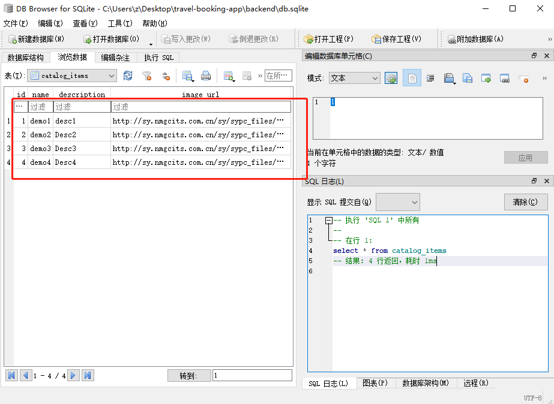

# 第六章 用 PrimeVue UI 框架构建一个假期预订 APP


上一章演示了 `Vue` 在 `Ionic` 框架上构建移动端应用的具体方法，但一直还没有用过基于 `Vue` 的 `UI` 库或框架来构建 `Web` 应用；也没有建立过拥有独立后端的项目，这里的后端，就是对大多数业务系统而言都是必需的、用来专门存放数据、做用户验证、执行后台任务等等的场所。本章就将利用 `PrimeVue` 这个 `UI` 框架建立一个假期预订 `APP`：使用 `Vue3` 前端做管理后台，并用另一个前端站点供用户添加订单；还将建立一个简单的后端来校验管理员用户，然后再执行具有管理员访问权限的任务。简单起见，面向公众的前端不作身份验证。

相关主题如下：

- 用 `PrimeVue` UI 框架构建一个前端站点；
- 用 `Express` 构建一个简单的后端站点来验证用户；
- 后端用 `SQLite` 实现数据持久化；
- 前端使用 `Vue Router` 做身份验证（`authentication`）；
- 用 `Vee-Validate` 和 `Yup` 做表单校验；

---


## 1 PrimeVue 简介

**PrimeVue** 是一款基于 `Vue3` 的前端 `UI` 框架，适用于 `Vue3` 应用。由于相关的 `API` 接口已经发生了重大调整，其它基于 `Vue2` 的框架是运行不了 `Vue3` 应用的，更何况 `Vue3` 的底层代码也和 `Vue2` 相去甚远。`PrimeVue` 拥有大量构建 `Web` 应用的通用组件，如文本框、按钮、菜单栏、表格等，还以主题的形式预设了不少样式，可以直接使用其内置组件进行开发。由于是为 `Vue3` 量身打造的，代码中可以很方便地注册并使用组建、导入 `CSS` 样式等等；还能根据某个组件需要哪些组件来决定是要局部注册组件还是全局注册，功能十分强大。

`PrimeVue` 为 `input` 元素和各种文本提供了现成的样式，例如验证错误（`validation errors`）和按钮。还自带非常实用的 `flexbox` 小工具，支持使用预设的 `CSS` 样式类来轻松设置组件的位置和间距。


## 2 Vee-Validate 与 Yup 简介

从开篇到现在，我们还没有用过任何第三方库来提高表单校验的工作效率。表单验证也是绝大多数 `Web` 应用必需投入精力去考虑的方面。

`Vee-Validate 4` 就是这样一款兼容 `Vue3` 的表单验证第三方库。有了它，就能在前端创建带表单验证功能的组件。 `Vee-Validate` 校验所需的校验模式（`schema`）由另一个数据校验库 `Yup` 提供。`Vee-Validate 4` 通过 `Form` 组件和 `Field` 组件进行表单校验，具体原理是对组件进行封装并传入 `Field` 组件自带的 `slot` 属性，来作为 `props` 的值，进而实现各种 `input` 组件的校验。两者结合使用效率更高，不必手动造轮子。


## 3 Express 简介

`Express` 框架用于创建一个简易后端站点来存储数据。它是一款十分简单的 `Node.js` 后端框架，可以快速搭建一个后端站点。为演示起见，选用 `SQLite` 数据库存储数据。`Express` 创建一组 `API` 接口供前端调用。前端定义相应的路由，并在其处理函数（`handlers`）中获取到请求的数据，并按业务需要做进一步处理。


## 4 前后端通信

要让前后端正常通信，需要在后端允许前端的跨域访问，这通常由 `CORS`（`Cross-Origin Resource Sharing`，跨域资源共享）中间件实现。示例将在 `Express` 应用中引入。

在 `Node.js` 环境下操作 `SQLite` 数据库是通过 `sqlite3` 库实现的，利用它可以执行 `SQL` 语句新增或删除数据库记录。

另外，`admin` 前端也要实现简单的身份验证。对管理员登录的用户名和密码进行验证，验证通过后才能发放访问令牌并发送至前端。然后，前端将使用存储在 `header` 头中的访问令牌来判定是否可以从前端发送请求。示例只对具有管理员访问权限的路由添加身份验证逻辑，因此只需要在加载它们之前进行校验即可。

令牌的创建和验证是由 `jsonwebtoken` 库实现的。利用它可以创建一个令牌并用一个 `secret` 字符串签名；同时也可以带一个 `secret` 来验证令牌的有效性。本示例会把 `jsonwebtoken` 库放到一个中间件，并令其先于路由处理函数完成相关验证工作。如果验证通过则放行，否则响应一个 `401` 状态给客户端。


## 5 创建假期预订项目

该项目由三个子项目构成：

- 前端：用 Vue CLI 工具创建
- 前端管理：同上
- 后端：用 Express Generator 创建

运行以下命令初始化项目：

```bash
# init folders
$ mkdir travel-booking-app
$ cd travel-booking-app
$ mkdir admin-frontend, frontend, backend
# init 2 vue projects, choose Vue 3 when asked
$ cd admin-frontend; vue create .
$ cd ../frontend; vue create .
# init backend with express-generator
$ npm i -g express-generator
$ npx express-generator
```


### 5.1 创建 backend 后端应用

#### 5.1.1 添加后端项目依赖

先创建后端应用，只因其余两个前端应用都会依赖它。

先安装依赖：（当前路径为 `travel-booking-app/backend`）

```bash
# current path: travel-booking-app/backend
$ npm i cors jsonwebtoken sqlite3
```

其中 `cors` 用于解决跨域问题，`jsonwebtoken` 用于身份验证，`sqlite3` 用于访问数据库。


#### 5.1.2 添加 `verify-token.js` 中间件

先来看看如何新增身份验证中间件。

创建 `middlewares/verify-token.js`：

```js
const jwt = require('jsonwebtoken');

module.exports = (req, res, next) => {
  const token = req.get('x-token');
  try {
    jwt.verify(token, 'secret');
    next();
  } catch (err) {
    req.status(401);
  }
};
```


#### 5.1.3 添加 `bookings.js`

然后添加路由处理前端请求。创建文件 `routes/bookings.js`：

```js
const express = require('express');
const sqlite3 = require('sqlite3').verbose();
const router = express.Router();
const verifyToken = require('../middlewares/verify-token');

router.get('/', (req, res, next) => {
  const db = new sqlite3.Database('./db.sqlite');
  db.serialize(() => {
    db.all(
      `SELECT
        bookings.*,
        catalog_items.name AS catalog_item_name,
        catalog_items.description AS catalog_item_description
      FROM bookings
      INNER JOIN catalog_items ON catalog_items.id = bookings.catalog_item_id
      `,
      [],
      (err, rows = []) => res.json(rows)
    );
  });
  db.close();
});

router.post('/', (req, res) => {
  const db = new sqlite3.Database('./db.sqlite');
  const { catalogItemId, name, address, startDate, endDate } = req.body;
  db.serialize(() => {
    const stmt = db.prepare(`
      INSERT INTO bookings (
        catalog_item_id,
        name,
        address,
        start_date,
        end_date
      ) VALUES (?, ?, ?, ?, ?)
    `);
    stmt.run(catalogItemId, name, address, startDate, endDate);
    stmt.finalize();
    res.json({ catalogItemId, name, address, startDate, endDate });
  });
  db.close();
});

router.delete('/:id', verifyToken, (req, res) => {
  const db = new sqlite3.Database('./db.sqlite');
  const { id } = req.params;
  db.serialize(() => {
    const stmt = db.prepare('DELETE FROM bookings WHERE id = (?)');
    stmt.run(id);
    stmt.finalize();
    res.json({ status: 'success' });
  });
  db.close();
});

module.exports = router;
```

注意——

- `router.get()` 方法中的第一参数为路由的 `path` 路径。它是相对于 `router` 的路径而言的。完整的路由路径为 `router` 路径 + `router.get` 路径；第二参数为路由处理函数（`route handler`）；
- 运行 `db.serialize` 函数可以依次运行回调函数中的语句；
- `db.all`：完整签名为 `Database#all(sql, [param, ...], [callback])`，用于获取所有查询结果，查出结果后传入回调函数的第二参数（`callback(err, rows)`）；该方法的第二参数为参数数组，无参时要传入空数组 `[]`；
- `(err, rows = []) => res.json(rows)` 回调：这是典型的 Node.js 风格回调，一参为 err，二参为查询结果；`res.json` 用于响应 `JSON` 结果到客户端；
- `router.post` 用于向 `bookings` 表插入一条记录，`POST` 请求的参数通过 `req.body` 解构得到；
- `db.prepare` 生成一条预编译型 `SQL` 语句，所需参数用 `?` 占位，并在随后的 `run` 方法中传入具体参数，可有效避免 `SQL` 注入等安全问题；
- `db.delete`：执行数据库删除记录的操作。其中 `/:id` 是 `REST` 风格的写法，是一个参数名为 `id` 的占位符（类似 `Vue Router` 中的 `URL` 传参）；
- `Statement#finalize([callback])`：通常用于查询遇到很长延迟的情况下，尤其是运行独占查询时需要该方法中断查询，后续的调用会统一以抛出错误的形式处理；
- `Statement#run([param, ...], [callback])`：用于绑定参数执行 `SQL`，返回一个 `Statement` 对象用于链式调用；`Statement#run` 类似 `Database#run` 方法，区别在于前者执行后不会结束（`be finalized`），因此可以多次使用；
- `db.close`：用于关闭数据库连接；
- `verifyToken`：引入这个模块并用在 `router.delete` 方法的第二个参数中，表示在运行位于第三参数的回调逻辑前，先验证访问令牌的有效性；

最后将 `router` 导出，以便在其他模块导入并注册 `router`。


#### 5.1.4 添加 `catalog.js` 路由

该路由用于添加假期套餐（`vacation packages`）。创建文件 `routes/catalog.js`：

```js
const express = require('express');
const router = express.Router();
const sqlite3 = require('sqlite3').verbose();
const verifyToken = require('../middlewares/verify-token');

router.get('/', (req, res) => {
  const db = new sqlite3.Database('./db.sqlite');
  db.serialize(() => {
    db.all('SELECT * FROM catalog_items', [], (err, rows = []) => {
      res.json(rows);
    });
  });
  db.close();
});

router.post('/', verifyToken, (req, res) => {
  const { name, description, imageUrl } = req.body;
  const db = new sqlite3.Database('./db.sqlite');
  db.serialize(() => {
    const stmt = db.prepare(`
    INSERT INTO catalog_items (
      name,
      description,
      image_url
    ) VALUES (?, ?, ?)
  `);
    stmt.run(name, description, imageUrl);
    stmt.finalize();
    res.json({ status: 'success' });
  });
  db.close();
});

router.delete('/:id', verifyToken, (req, res) => {
  const { id } = req.params;
  const db = new sqlite3.Database('./db.sqlite');
  db.serialize(() => {
    const stmt = db.prepare('DELETE FROM catalog_items WHERE id = (?)');
    stmt.run(id);
    stmt.finalize();
    res.json({ status: 'success' });
  });
  db.close();
});

module.exports = router;
```

该文件与 `bookings` 路由类似，但查询的是 `catalog_items` 表中的记录。


#### 5.1.5 添加 `users.js` 路由

该路由控制用户登录。新增或替换 `routes/users.js` 文件如下：

```js
const express = require('express');
const jwt = require('jsonwebtoken');
const router = express.Router();

router.post('/login', (req, res) => {
  const { username, password } = req.body;
  if (username === 'admin' && password === 'password') {
    res.json({ token: jwt.sign({ username }, 'secret') });
  }
  res.status(401);
});

module.exports = router;
```

为简便起见，登录名和密码的验证做了简化，仅包含一个用户信息（用户名 `admin`，密码 `password`），通过后调用 `jwt.sign` 方法拿到签名，一参为加密数据（`{username}`），二参为密钥（`secret`），然后以 JSON 格式响应给客户端；否则返回一个 `401` 状态，表示用户名或密码验证失败。


#### 5.1.6 注册 `router` 模块及全局中间件

修改 `app.js` 如下：

```js
const createError = require('http-errors');
const express = require('express');
const path = require('path');
const cookieParser = require('cookie-parser');
const logger = require('morgan');

const indexRouter = require('./routes/index');
const usersRouter = require('./routes/users');
const catalogRouter = require('./routes/catalog');
const bookingsRouter = require('./routes/bookings');

const app = express();
const cors = require('cors')

// view engine setup
app.set('views', path.join(__dirname, 'views'));
app.set('view engine', 'jade');

app.use(logger('dev'));
app.use(express.json());
app.use(express.urlencoded({ extended: false }));
app.use(cookieParser());
app.use(express.static(path.join(__dirname, 'public')));
app.use(cors())

app.use('/', indexRouter);
app.use('/users', usersRouter);
app.use('/catalog', catalogRouter);
app.use('/bookings', bookingsRouter);

// catch 404 and forward to error handler
app.use(function (req, res, next) {
  next(createError(404));
});

// error handler
app.use(function (err, req, res, next) {
  // set locals, only providing error in development
  res.locals.message = err.message;
  res.locals.error = req.app.get('env') === 'development' ? err : {};

  // render the error page
  res.status(err.status || 500);
  res.render('error');
});

module.exports = app;
```

注意，`app.use` 方法先调用 `cors` 中间件，再添加 `router` 模块，然后再定义访问路径和具体路由。

`app.use(cors());` 表示该后端站点允许跨域访问；


#### 5.1.7 添加 `db.sql` 脚本文件

为了快速初始化数据库，创建 `SQL` 脚本文件 `db.sql` 如下：

```sqlite
DROP TABLE IF EXISTS bookings;
DROP TABLE IF EXISTS catalog_items;

CREATE TABLE catalog_items (
  id INTEGER NOT NULL PRIMARY KEY,
  name TEXT NOT NULL,
  description TEXT NOT NULL,
  image_url TEXT NOT NULL
);

CREATE TABLE bookings (
  id INTEGER NOT NULL PRIMARY KEY,
  catalog_item_id INTEGER NOT NULL,
  name TEXT NOT NULL,
  address TEXT NOT NULL,
  start_date TEXT NOT NULL,
  end_date TEXT NOT NULL,
  FOREIGN KEY (catalog_item_id) REFERENCES catalog_items(id)
);
```

执行 `SQLite` 的 `SQL` 语句可在 `DB browser` 浏览器完成。实操时的最新版为 `v3.12.2`，下载地址：https://sqlitebrowser.org/blog/version-3-12-2-released/。

> 初始化 **SQLite** 数据库步骤：
>
> 1. 在 `backend` 文件夹下创建空文件 `db.sqlite`；
> 2. 安装并打开 `DB Browser`，单击【打开数据库】按钮，双击 1 中创建的文件；
> 3. 选中【执行 `SQL`】选项卡，新建一个 `SQL` 标签页，将 `db.sql` 的内容复制到 `SQL` 标签页的文本框中，并按 `F5` 执行建表语句；
> 4. 单击【写入更改】按钮或【Ctrl+S】保存更改；

查看数据库结构如下：


然后全局安装 `nodemon`，以便代码变动后自动重启后端站点：

```bash
$ npm i -g nodemon
```

将通过 `nodemon` 启动项目的命令写入 `npm` 命令。修改 `package.json`：

```json
{
  // ...
  "scripts": {
    "start": "nodemon ./bin/www"
  },
  // ...
}
```

启动后端项目：

```bash
$ npm start
```

效果如下：


### 5.2 创建 admin frontend 管理员前端应用

首先安装前端依赖：

```bash
$ npm i axios primeflex primeicons primevue@^3.1.1 vee-validate@next vue-router@4 yup
```


#### 5.2.1 创建前端管理页

创建页面组件 `src/components/CatalogForm.vue`：

```vue
<template>
  <Form @submit="onSubmit" :validation-schema="schema">
    <Field v-slot="{ field, errors }" v-model="name" name="name">
      <div class="p-col-12">
        <div class="p-inputgroup">
          <InputText
            placeholder="Name"
            :class="{ 'p-invalid': errors.length > 0 }"
            v-bind="field"
          />
        </div>
        <small class="p-error" v-if="errors.length > 0">
          Name is invalid.
        </small>
      </div>
    </Field>

    <Field v-slot="{ field, errors }" v-model="description" name="description">
      <div class="p-col-12">
        <div class="p-inputgroup">
          <Textarea
            placeholder="Description"
            :class="{ 'p-invalid': errors.length > 0 }"
            v-bind="field"
          />
        </div>
        <small class="p-error" v-if="errors.length > 0">
          Description is invalid
        </small>
      </div>
    </Field>

    <Field v-slot="{ field, errors }" v-model="imageUrl" name="imageUrl">
      <div class="p-col-12">
        <div class="p-inputgroup">
          <InputText
            placeholder="Image URL"
            :class="{ 'p-invalid': errors.length > 0 }"
            v-bind="field"
          />
        </div>
        <small class="p-error" v-if="errors.length > 0">
          Image URL is invalid.
        </small>
      </div>
    </Field>

    <div class="p-col-12">
      <Button label="Add" type="submit" />
    </div>
  </Form>
</template>
<script>
import * as yup from 'yup';
import axios from 'axios';
import { APIURL } from '@/constants';

const schema = yup.object().shape({
  name: yup.string().required(),
  description: yup.string().required(),
  imageUrl: yup.string().url().required(),
});

export default {
  name: 'BookingForm',
  data() {
    return {
      name: '',
      description: '',
      imageUrl: '',
      schema,
    };
  },
  methods: {
    async onSubmit(value) {
      const { name, description, imageUrl } = value;
      await axios.post(`${APIURL}/catalog`, {
        name,
        description,
        imageUrl,
      });
      this.$emit('catalog-form-close');
    },
  },
};
</script>
```

其中，`Form`、`Field`、`InputText` 等组件都是 `Vee-Validate` 中的内置表单组件，`Form` 中的 `validation-schema` 属性值为具体的校验模式，由 `Yup` 创建后传入。

要开启 `InputText` 组件的表单验证功能，需要向 `slot` 这个 `props` 传入 `field` 对象，并将其放入 `v-bind` 指令中（第 3/9 行、第 18/24 行、第 33/39 行）。

`v-bind` 指令可以让 `Vee-Validate` 处理表单值并对表单字段添加校验规则。 `errors` 是一个数组，包含可能出现的所有校验问题。

样式类方面：

- `p-col-12` 类似 `Bootstrap` 中的栅格系统，表示整行；
- `p-inputgroup` 表示创建一个 `input` 组；
- `p-error` 表示将报错文字变为红色以便提醒用户；
- `p-invalid` 会将 `input` 框的边缘变红。

表单字段通过 `v-model` 实现双向绑定；表单提交的 `value` 对象包含所有表单字段（第 75 行），例如 `name` 字段对应假期套餐的名称，以此类推。

`Button` 组件来自 `PrimeVue` 框架，稍后会注册为全局组件。该按钮提交表单，发送 `POST` 请求到后台，同时发送 `catalog-form-close` 事件给对话框，通知该表单将被放置在其中然后关闭。


#### 5.2.2 顶部导航与菜单栏的创建

创建顶部导航组件 `src/components/TopBar.vue`：

```vue
<template>
  <Menubar :model="items">
    <template #start>
      <b>Admin Frontend</b>
    </template>
  </Menubar>
</template>

<script>
export default {
  name: 'TopBar',
  props: {
    title: String,
  },
  data() {
    return {
      items: [
        {
          label: 'Manage Bookings',
          command: () => this.$router.push('/bookings'),
        },
        {
          label: 'Manage Vacation Packages',
          command: () => this.$router.push('/catalog'),
        },
        {
          label: 'Log Out',
          command: () => this.logOut(),
        },
      ],
    };
  },
  methods: {
    logOut() {
      localStorage.clear();
      this.$router.push('/');
    },
  },
  beforeMount() {
    document.title = this.title;
  },
};
</script>
```

`MenuBar` 组件也来自 `PrimeVue`，可用于添加菜单栏，通过单击菜单项导航到不同的页面。每一个菜单项包含 `label` 和 `command` 两个属性，分别表示菜单名称和路由导航。

代码中的 `start` 插槽表示在 MenuBar 组件的左边新增菜单项。

`logout` 方法控制用户登出，清空本地缓存（访问令牌）后，跳转到首页（即稍后即将添加的 **登录页**）。


#### 5.2.3 新增处理 HTTP 请求的通用代码

创建模块 `src/plugins/axios.js`：

```js
import axios from 'axios';
import { APIURL } from '@/constants';

axios.interceptors.request.use(
  (config) => {
    if (config.url.includes(APIURL) && !config.url.includes('login')) {
      config.headers['x-token'] = localStorage.getItem('token');
    }
    return config;
  },
  (error) => Promise.reject(error)
);
```

这段代码通过读取 `config.url` 的值检查请求的 `URL`，如果不包含 `/login`，则在 `header` 头添加 `x-token`：

```js
config.headers['x-token'] = localStorage.getItem('token')
```

如果有报错则在 `use` 方法的第二参数处理，这里用到了 `Promise.reject` 方法。

接着创建路由模块 `src/plugins/vue-router.js`：

```js
import { createRouter, createWebHistory } from 'vue-router';

import Login from '../views/Login.vue';
import Bookings from '../views/Bookings.vue';
import Catalog from '../views/Catelog.vue';

const beforeEnter = (to, from, next) => {
  try {
    const token = localStorage.getItem('token');
    if (to.fullPath !== '/' && !token) {
      return next({ fullPath: '/' });
    }
    return next();
  } catch (error) {
    return next({ fullPath: '/' });
  }
};

const routes = [
  { path: '/', component: Login },
  { path: '/bookings', component: Bookings, beforeEnter },
  { path: '/catalog', component: Catalog, beforeEnter },
];

const router = createRouter({
  history: createWebHashHistory(),
  routes,
});

export default router;
```

其中——

- `beforeEnter`：对非登录页验证访问令牌，若失效则重定向到登录页（第 11 行）；如果报错，也跳转到登录页；最后注意 `beforeEnter` 的写法，需要加到 `routes` 数组元素中；
- `routes`：添加了 `beforeEnter` 的路由必须先登录；
- `createWebHashHistory`：表示在域名和 `URL` 的其余部分之间有一个哈希符号 `#`


#### 5.2.4 创建页面组件

本例包含三个页面组件：假期预订页、套餐管理页、用户登录页。三者相互关系梳理如下：

- 用户登录后，会自动跳转到预订页；
- 预订记录中套餐 `id` 作外键，因此预订页依赖套餐页；
- 套餐页设计了一个对话框组件 `Dialog`，其内容是一个用于新增套餐的表单 `Form` 组件，因此套餐对话框组件依赖新增表单组件；

按照 `Vue` 的惯例，页面组件通常放在 `src/views` 文件夹，表示用户可以跳转的页面组件（同时也是放置顶部导航的地方），比如允许用户管理已预订假期的页面组件 `src/views/Bookings.vue`：

```vue
<template>
  <TopBar title="Manage Bookings" />
  <div class="p-col-12">
    <h1>Manage Bookings</h1>
  </div>
  <div class="p-col-12">
    <Card v-for="b of bookings" :key="b.id">
      <template #title>{{ b.name }} </template>
      <template #content>
        <p>Address: {{ b.address }}</p>
        <p>Description: {{ b.catalog_item_description }}</p>
        <p>Start Date: {{ b.start_date }}</p>
        <p>End Date: {{ b.end_date }}</p>
      </template>
      <template #footer>
        <Button
          icon="pi pi-times"
          label="Cancel"
          class="p-button-secondary"
          @click="deleteBooking(b.id)"
        />
      </template>
    </Card>
  </div>
</template>

<script>
import axios from 'axios';
import { APIURL } from '@/constants';
import TopBar from '@/components/TopBar';

export default {
  name: 'Bookings',
  components: { TopBar },
  data() {
    return {
      bookings: [],
    };
  },
  methods: {
    async getBookings() {
      const { data } = await axios.get(`${APIURL}/bookings`);
      this.bookings = data;
    },
    async deleteBooking(bookingId) {
      await axios.delete(`${APIURL}/bookings/${bookingId}`);
      this.getBookings();
    },
  },
  beforeMount() {
    this.getBookings();
  },
};
</script>
```

其中——

- `Card`：来自 `PrimeVue`，稍后注册；通过遍历 `Card` 组件得到所有 `Bookings` 组件列表；
- `template`：这里出现了三个具名插槽，名称分别是 `title`、`content`、`footer`，分别加载不同的内容：
  - `title`：假期套餐名称；
  - `content`：假期套餐详情；
  - `footer`：删除按钮，单击绑定 `deleteBooking(id)` 方法；
- `p-button-secondary`：预置样式类，设置按钮颜色；
- `bookings`：假期预定列表，通过查询后台数据库获得，并通过删除按钮删除一条记录；

> **勘误1**
>
> （PDF 版第 182 页）
>
> （代码块中）：`<p>Description: {{ b.description }}</p>`
>
> 此处应该是套餐描述，根据后端 SQL 脚本提供的表结构，这里应写为：`<p>Description: {{ b.catalog_item_description }}</p>`


接着创建下一个页面组件 `src/views/Catalog.vue`：

```vue
<template>
  <TopBar title="Manage Vacation Packages" />
  <div class="p-col-12">
    <h1>Manage Vacation Packages</h1>
  </div>
  <div class="p-col-12">
    <Button label="Add Vacation Package" @click="displayCatalog = true" />
    <Dialog header="Add Vacation Package" v-model:visible="displayCatalog">
      <CatalogForm
        @catalog-form-close="
          displayCatalog = false;
          getCatalog();
        "
      />
    </Dialog>
  </div>
  <div class="p-col-12">
    <Card v-for="c of catalog" :key="c.id">
      <template #header>
        
      </template>
      <template #title> {{ c.name }} </template>
      <template #content>
        {{ c.description }}
      </template>
      <template #footer>
        <Button
          icon="pi pi-times"
          label="Delete"
          class="p-button-secondary"
          @click="deleteCatalogItem(c.id)"
        />
      </template>
    </Card>
  </div>
</template>

<script>
import axios from 'axios';
import { APIURL } from '@/constants';
import TopBar from '@/components/TopBar';
import CatalogForm from '@/components/CatalogForm';

export default {
  name: 'Catalog',
  components: {
    TopBar,
    CatalogForm,
  },
  data() {
    return {
      catalog: [],
      displayCatalog: false,
    };
  },
  methods: {
    async getCatalog() {
      const { data } = await axios.get(`${APIURL}/catalog`);
      this.catalog = data;
    },
    async deleteCatalogItem(id) {
      await axios.delete(`${APIURL}/catalog/${id}`);
      this.getCatalog();
    },
  },
  beforeMount() {
    this.getCatalog();
  },
};
</script>
```

其中——

- `Dialog` 组件也来自 `PrimeVue`，通过页面的新增套餐按钮弹出对话框，添加完毕后提交表单、关闭对话框、更新假期套餐列表；
- `catalog-form-close`：该事件即 `CatalogForm` 组件中提交表单所发送的事件，用来控制外层对话框的隐藏；
- `v-model:visible="displayCatalog"`：这里的 `visible` 是 `v-model` 指令的修饰符（`modifier`）；


最后是用户登录页组件 `src/views/Login.vue`：

```vue
<template>
  <Form @submit="onSubmit" :validation-schema="schema">
    <div class="p-col-12">
      <h1>Admin Log In</h1>
    </div>

    <Field v-slot="{ field, errors }" v-model="username" name="username">
      <div class="p-col-12">
        <div class="p-inputgroup">
          <InputText
            placeholder="Username"
            :class="{ 'p-invalid': errors.length > 0 }"
            v-bind="field"
          />
        </div>
        <small class="p-error" v-if="errors.length > 0">
          Username is invalid.
        </small>
      </div>
    </Field>

    <Field v-slot="{ field, errors }" v-model="password" name="password">
      <div class="p-col-12">
        <div class="p-inputgroup">
          <InputText
            placeholder="Password"
            type="password"
            :class="{ 'p-invalid': errors.length > 0 }"
            v-bind="field"
          />
        </div>
        <small class="p-error" v-if="errors.length > 0">
          Password is invalid
        </small>
      </div>
    </Field>

    <div class="p-col-12">
      <Button label="Log In" type="submit" />
    </div>
  </Form>
</template>

<script>
import * as yup from 'yup';
import axios from 'axios';
import { APIURL } from '@/constants';

const schema = yup.object().shape({
  username: yup.string().required(),
  password: yup.string().required(),
});

export default {
  name: 'Login',
  data() {
    return {
      username: '',
      password: '',
      schema,
    };
  },
  methods: {
    async onSubmit(values) {
      const { username, password } = values;
      try {
        const {
          data: { token },
        } = await axios.post(`${APIURL}/users/login`, {
          username,
          password,
        });
        localStorage.setItem('token', token);
        this.$router.push('/bookings');
      } catch (error) {
        alert('Login failed');
      }
    },
  },
};
</script>
```

登录页逻辑相对简单，登录成功则将后台返回的令牌存入 `localStorage`，然后跳转到假期预订页；否则提示登录失败。用户名和密码字段与预订表单格式类似，校验规则 `schema` 也是由 `Yup` 定义。


#### 5.2.5 收尾工作

首先是调整 `App.vue` 根组件，添加路由插件 `router-view` 标签：

```vue
<template>
  <router-view></router-view>
</template>

<script>
export default {
  name: 'App',
};
</script>

<style>
body {
  background-color: #ffffff;
  font-family: -apple-system, BlinkMacSystemFont, Segoe UI, Roboto, Helvetica,
    Arial, sans-serif, Apple Color Emoji, Segoe UI Emoji, Segoe UI Symbol;
  font-weight: normal;
  color: #495057;
  -webkit-font-smoothing: antialiased;
  -moz-osx-font-smoothing: grayscale;
  margin: 0px;
}
</style>
```

然后添加 `APIURL` 常量模块 `src/constants.js`：

```js
export const APIURL = 'http://localhost:3000';
```

然后在 `main.js` 引入用到的各组件、中间件：

```js
import { createApp } from 'vue';
import App from './App.vue';

import PrimeVue from 'primevue/config';
import InputText from 'primevue/inputtext';
import Button from 'primevue/button';
import Card from 'primevue/card';
import Toolbar from 'primevue/toolbar';
import router from './plugins/vue-router';
import Textarea from 'primevue/textarea';
import Dialog from 'primevue/dialog';
import Menubar from 'primevue/menubar';
import { Form, Field } from 'vee-validate';
import 'primeflex/primeflex.css';
import 'primevue/resources/themes/bootstrap4-light-blue/theme.css';
import 'primevue/resources/primevue.min.css';
import 'primeicons/primeicons.css';
import './plugins/axios';

const app = createApp(App);
app.component('InputText', InputText);
app.component('Button', Button);
app.component('Card', Card);
app.component('Toolbar', Toolbar);
app.component('Textarea', Textarea);
app.component('Dialog', Dialog);
app.component('Menubar', Menubar);
app.component('Form', Form);
app.component('Field', Field);
app.use(PrimeVue);
app.use(router);
app.mount('#app');
```

注意，这里通过 `app.component` 方法注册组件（同第一章）。

由于多个组件名称不符合多单词规则，需要在 package.json 文件的语法规则检查中，将这些组件添加到白名单中：

```json
"rules": {
    "vue/multi-word-component-names": ["error", {
        "ignores": ["Bookings", "Catalog", "Login", "Button", "Card", "Toolbar", "Textarea", "Dialog", "Menubar", "Form", "Field"]
    }]
}
```

然后将管理员前端站点的端口指定为 `8082`，并通过 `npm` 命令执行：

```json
{
    ...
    "scripts": {
        "serve": "vue-cli-service serve --port 8082",
        "build": "vue-cli-service build",
        "lint": "vue-cli-service lint"
    },
    ...
}
```

最后，执行以下命令启动管理员前端站点：

```bash
$ npm run serve
```

登录页效果：


添加假期套餐效果：


假期套餐页菜单栏效果：


后端控制台：


`SQLite` 数据库情况：



预订信息列表（需实现用户前端相关功能模块才能正常显示）：


### 5.3 创建 user frontend 用户前端应用

用户前端站点与管理员前端类似，只是省去了访问权限的校验环节。

首先安装站点依赖：

```bash
$ npm i axios primeflex primeicons primevue@^3.1.1 vee-validate@next vue-router@4 yup
```

然后删除 `HelloWorld` 组件及其在 `App.vue` 中的所有引用。


#### 5.3.1 新增假期预订组件

首先要新增的是 `BookingForm` 组件。该组件用于新增一个预订记录（在已知一个假期套餐的基础上，相关逻辑将在后期补充）。创建组件 `src/components/BookingForm.vue`：

```vue
<template>
  <Form @submit="onSubmit" :validation-schema="schema">
    <Field v-slot="{ field, errors }" v-model="name" name="name">
      <div class="p-col-12">
        <div class="p-inputgroup">
          <InputText
            placeholder="Name"
            :class="{ 'p-invalid': errors.length > 0 }"
            v-bind="field"
          />
        </div>
        <small class="p-error" v-if="errors.length > 0">Name is invalid </small>
      </div>
    </Field>

    <Field v-slot="{ field, errors }" v-model="address" name="address">
      <div class="p-col-12">
        <div class="p-inputgroup">
          <InputText
            placeholder="Address"
            :class="{ 'p-invalid': errors.length > 0 }"
            v-bind="field"
          />
        </div>
        <small class="p-error" v-if="errors.length > 0"
          >Address is invalid</small
        >
      </div>
    </Field>

    <Field v-slot="{ field, errors }" v-model="startDate" name="startDate">
      <div class="p-col-12">
        <label>Start Date</label>
        <div class="p-inputgroup">
          <Calendar
            inline
            placeholder="Start Date"
            :class="{ 'p-invalid': errors.length > 0 }"
            :minDate="new Date()"
            v-bind="field"
            v-model="startDate"
          />
        </div>
        <small class="p-error" v-if="errors.length > 0">
          Start date is invalid
        </small>
      </div>
    </Field>

    <Field v-slot="{ field, errors }" v-model="endDate" name="endDate">
      <div class="p-col-12">
        <label>End Date</label>
        <div class="p-inputgroup">
          <Calendar
            inline
            placeholder="End Date"
            :class="{ 'p-invalid': errors.length > 0 }"
            v-bind="field"
            v-model="endDate"
            :minDate="new Date(+startDate + 24 * 3600 * 1000)"
          />
        </div>
        <small class="p-error" v-if="errors.length > 0"
          >End date is invalid</small
        >
      </div>
    </Field>

    <div class="p-col-12">
      <Button label="Book" type="submit" />
    </div>
  </Form>
</template>

<script>
import { Form, Field } from 'vee-validate';
import * as yup from 'yup';
import axios from 'axios';
import { APIURL } from '@/constants';

const schema = yup.object().shape({
  name: yup.string().required(),
  address: yup.string().required(),
  startDate: yup.date().required().min(new Date()),
  endDate: yup
    .date()
    .required()
    .when(
      'startDate',
      (startDate, schema) => startDate && schema.min(startDate)
    ),
});

export default {
  name: 'BookingForm',
  components: {
    Form,
    Field,
  },
  props: {
    selectedCatalogId: Number,
  },
  data() {
    return {
      name: '',
      address: '',
      startDate: undefined,
      endDate: undefined,
      schema,
    };
  },
  methods: {
    async onSubmit(values) {
      const { name, address, startDate, endDate } = values;
      await axios.post(`${APIURL}/bookings`, {
        name,
        address,
        startDate,
        endDate,
        catalogItemId: this.selectedCatalogId,
      });
      this.$emit('booking-form-close');
    },
  },
};
</script>
```

预订名称和地址同新增套餐页类似，这里最大的不同是两个日期字段对 `Calender` 组件的使用。`Calender` 组件来自 `PrimeVue` 框架，用于快速指定日期。

其中——

- `inline`：表示不以弹窗形式显示日期窗口，而是直接加载到组件模板上；
- `minDate`：用于指定日期的起始位置，时间段默认起始日期从今天开始，结束日期从明天开始；
- `schema`：带日期的校验规则明显较之前的套餐预订页复杂些。`when` 方法的第一个参数是当前字段要比较的目标字段；第二参数是一个回调函数，用 `schema.min(startDate)` 确保结束日期晚于起始日期；
- `selectedCatalogId`：从父组件选中的假期套餐 `ID`（稍后实现）；尤其值得注意的是，提交表单时要将该外键 `ID` 一并提交（必填项）；
- `onSubmit`：表单提交绑定的处理函数。注意，在 `Vee-Validate` 提供的 `Form` 组件中，绑定 `submit` 属性无需像普通表单那样注明 `prevent` 修饰符；
- `booking-form-close`：提交表单后发送的关闭事件，用于控制外层组件的关闭（隐藏）；


#### 5.3.2 新增选定套餐组件

这是新增假期预订表单组件的父组件，用于在指定的套餐上补充预订详情信息（名称、地址、时间段等）。该组件初始加载时展示所有假期套餐，并且在每个套餐的下方设计了一个预订按钮，单击该按钮弹出预订详情表单页，提交表单后隐藏弹框。组件结构大致与管理员前端类似。

创建组件 `src/components/Catalog.vue`：

```vue
<template>
  <Card v-for="c of catalog" :key="c.id">
    <template #header>
      
    </template>
    <template #title> {{ c.name }} </template>
    <template #content>
      {{ c.description }}
    </template>
    <template #footer>
      <Button
        icon="pi pi-check"
        label="Book"
        class="p-button-secondary"
        @click="book(c.id)"
      />
      <Dialog header="Create Booking" v-model:visible="displayBookingForm">
        <BookingForm
          @booking-form-close="
            displayBookingForm = false;
            displayMessage();
          "
          :selectedCatalogId="selectedCatalogId"
        />
      </Dialog>
    </template>
  </Card>
</template>

<script>
import axios from 'axios';
import { APIURL } from '@/constants';
import BookingForm from '../components/BookingForm.vue';

export default {
  name: 'Catalog',
  components: {
    BookingForm,
  },
  data() {
    return {
      selectedCatalogId: undefined,
      displayBookingForm: false,
      catalog: [],
    };
  },
  methods: {
    async getCatalog() {
      const { data } = await axios.get(`${APIURL}/catalog`);
      this.catalog = data;
    },
    book(catalogId) {
      this.selectedCatalogId = catalogId;
      this.displayBookingForm = true;
    },
    displayMessage() {
      alert('Booking successful');
    },
  },
  beforeMount() {
    this.getCatalog();
  },
};
</script>
```

可以看到，`Dialog` 组件引用了 `BookingForm` 组件，并通过侦听 `booking-form-close` 事件来隐藏对话框，同时弹出提示框以示预订成功。页面渲染套餐列表的数据源从后端 `API` 接口查询得到，使用了两表联查。

另外，该组件名称不符合多单词规则，需要在 `package.json` 的自定义规则中加入白名单：

```json
"rules": {
    "vue/multi-word-component-names": ["error", {
        "ignores": ["Catalog"]
    }]
}
```


#### 5.3.3 添加路由

新增 `Vue Router` 路由模块 `plugins/vue-router.js`：

```js
import { createWebHashHistory, createRouter } from 'vue-router';
import Catalog from '../views/Catalog.vue';

const routes = [{ path: '/', component: Catalog }];

const router = createRouter({
  history: createWebHashHistory(),
  routes,
});

export default router;
```

注意，这里同样使用了 `createWebHashHistory`，因此 URL 地址中基础地址和其余部分之间通过哈希符号 `#` 隔开。


#### 5.3.4 其他收尾工作

首先是修改 `App.vue`，添加 `router-view` 标签：

```vue
<template>
  <router-view></router-view>
</template>

<script>
export default {
  name: 'App',
};
</script>

<style>
body {
  background-color: #ffffff;
  font-family: -apple-system, BlinkMacSystemFont, Segoe UI, Roboto, Helvetica,
    Arial, sans-serif, Apple Color Emoji, Segoe UI Emoji, Segoe UI Symbol;
  font-weight: normal;
  color: #495057;
  -webkit-font-smoothing: antialiased;
  -moz-osx-font-smoothing: grayscale;
  margin: 0px;
}
</style>
```

然后是在 `src/main.js` 中注册并使用相关组件（`PrimeVue` 组件、自定义组件等）、中间件（路由模块）：

```js
import { createApp } from 'vue';
import App from './App.vue';
import PrimeVue from 'primevue/config';
import InputText from 'primevue/inputtext';
import Button from 'primevue/button';
import Card from 'primevue/card';
import Toolbar from 'primevue/toolbar';
import Calendar from 'primevue/calendar';
import Dialog from 'primevue/dialog';
import router from './plugins/vue-router';
import 'primeflex/primeflex.css';
import 'primevue/resources/themes/bootstrap4-light-blue/theme.css';
import 'primevue/resources/primevue.min.css';
import 'primeicons/primeicons.css';

const app = createApp(App);
app.component('InputText', InputText);
app.component('Button', Button);
app.component('Card', Card);
app.component('Toolbar', Toolbar);
app.component('Calendar', Calendar);
app.component('Dialog', Dialog);
app.use(PrimeVue);
app.use(router);
app.mount('#app');
```

将引入的单个单词的组件名称增补到 `package.json` 的 `rules` 白名单：

```json
"rules": {
    "vue/multi-word-component-names": ["error", {
        "ignores": ["Catalog", "Button", "Card", "Toolbar", "Calendar", "Dialog"]
    }]
}
```

接着补充 `APIURL` 模块 `src/constants.js`：

```js
export const APIURL = 'http://localhost:3000';
```

最后，指定该前端站点运行在 `8081` 端口，修改 `package.json` 如下：

```json
{
    ...
    "scripts": {
        "serve": "vue-cli-service serve --port 8081",
        "build": "vue-cli-service build",
        "lint": "vue-cli-service lint"
    },
    ...
}
```

> **勘误2**
>
> 端口冲突。管理员前端和用户前端都设置端口 8082，同时启动会出现端口冲突。
>
> 更正：建议将用户前端端口改为 8081，管理员前端端口保持 8082 不变。

启动用户前端项目命令：

```bash
$ npm run serve
```

运行效果图如下：

用户前端首页效果：


预订对话框效果：


## 6 小结

- `PrimeVue` 内置组件的使用方法；
- `Vee-Validate` 表单组件与 `Yup` 创建的 `schema` 结合，实现表单验证功能；
- `Dialog` 组件与自定义组件的传参通信；
- `Yup` 对各类字段的校验规则（`schema`）的设置；
- `PrimeFlex` 是 `PrimeVue` 的工具包，通过 `flexbox` 样式能够快速设置元素和组件的间距和位置；
- 利用 `Express` 创建简易后端 `API`；
- 利用 `sqlite3` 模块实现 `SQLite` 数据库基础操作；
- 使用 `jsonwebtoken` 模块进行身份验证；
- 使用 `cors` 工具实现前端跨域访问后端接口；

示例项目 `travel-booking-app` 端口配置情况：

|       站点       |    名称    |      域名端口配置      |
| :--------------: | :--------: | :--------------------: |
|    `backend`     | 后端 `API` | http://loclahost:3000/ |
| `admin frontend` |  管理前端  | http://localhost:8082/ |
| `user frontend`  |  用户前端  | http://localhost:8081/ |


示例项目业务逻辑梳理——

- 用户前端根据管理员前端设置的假期套餐，从套餐列表中新增假期预订记录；
- 管理员前端通过预订管理页查看所有预订信息列表，并可以删除预订记录；
- 后端 `API` 创建了两个 `SQLite` 数据库表：`bookings` 和 `catalog_items`，用于处理两个前端站点发起的接口调用；
- 登录校验逻辑也是后端站点完成的。利用 `jsonwebtoken` 工具得到签名后的访问令牌，响应给前端；
- 前端站点拿到对应的令牌后，先存入 `localStorage` 本地缓存；登录成功后的每一次 HTTP 请求，都需要通过 `jwt` 中间件的拦截器，达到实际请求前，先从 `localStorage` 读取该令牌、放入 `Header` 头的 `x-token` 以通过身份验证的目的。


下一章将演示 `GraphQL` 和 `Vue3` 共同构建应用。
