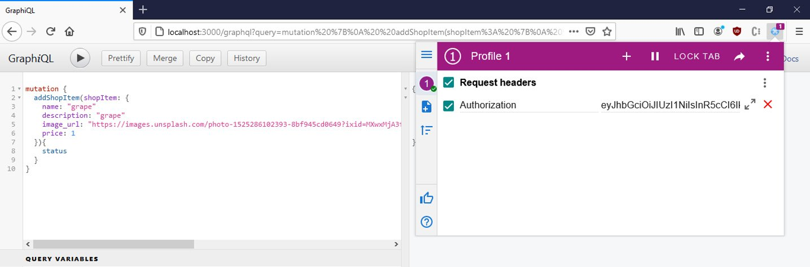
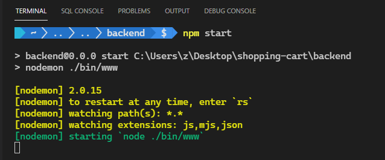

# 第七章 用 GraphQL 构建购物车系统


上一章我们用 `Vue3` 和 `Express` 构建了一个假期旅游套餐预订系统，首次从零开始搭建后端站点供前端站点请求相关数据接口。独立的后端站点较之前有更强大的功能，可以实现数据存储、身份验证等功能。在管理员前端，我们还演示了路由守卫 `beforeEnter` 的使用来设置访问权限（详见 `admin-frontend` 站点 `src/plugins/vue-router.js`），在用户登录前检查访问令牌是否存在（暂未使用 `jwt` 的 `verify` 方法）。

本章将演示如何用 GraphQL 构建一个购物车系统，相关主题如下：

- 介绍 `GraphQL` 应用程序接口（API）；
- 用 `Express` 创建 `GraphQL` API；
- 创建管理员前端站点；
- 创建消费者前端站点；

本章随书源码详见：https://github.com/PacktPublishing/-Vue.js-3-By-Example/tree/master/Chapter07，或本地仓库 `demos/Chapter07/` 文件夹，实操代码详见 `diy/ch07/` 文件夹。

---


## 1 GraphQL API 简介

上一章用 `Express` 创建的后端站点，接收的请求数据和响应的结果都是 `JSON` 格式的。这样的站点存在两个问题：

- 请求参数可能是后端接口不希望的 `JSON` 格式；
- 在没有前端参与的情况下测试后端 API 接口比较困难；

上述两个问题都能通过 `GraphQL` API 接口解决。`GraphQL` 是一种能让客户端与服务器通信更加便利的特殊的查询语言，内置了对数据结构的校验。每一个属性（`property`）都对应一种数据类型，或简单或复杂。所谓复杂的数据结构，也无非是一系列具有简单数据类型的属性构成。

测试 `GraphQL` API 接口也可以使用 `GraphiQL`——一个便于发送 `GraphQL` 接口请求的网页。由于每一个请求都对应一个数据类型校验，只要遵循 `GraphQL` 的模式（`schema`）的定义，也可以实现请求接口的自动补全功能。`schema` 模式包含了查询和变更所涉及的所有数据类型的定义。这里的查询，是指利用 `GraphQL` 接口查询数据；而变更（`mutations`）是指以某种方式改变数据的 `GraphQL` 请求。

查询及变更通过一个 `schema` 字符串显式定义。这样，入参和出参的数据类型就都是明确的。

GraphQL 接口请求大多为普通的超文本传输协议（`HTTP`）请求，只是结构比较特殊。所有请求默认访问 `/graphql` 端点，而要发送的查询或变更请求，是通过 `JSON` 中的 `query` 属性传入的，其属性值是一个字符串。相关参数的值则通过 `variable` 参数传入。

这些查询或变更请求，通过代码中指定的名称映射到对应的同名解析函数（`resolver functions`）上，而不是 `Vue Router` 映射的路由处理函数（`route handlers`）上。解析函数按照 `schema` 接收相关参数并执行查询，然后在函数的方法体内对获取到的请求结果做进一步处理。

`Vue3` 环境下可以利用基于 `GraphQL` 接口规范的客户端来简化 `GraphQL` 请求的创建，通过传入一个查询或变更的字符串，以及对应的请求参数来完成接口调用。


### 1.1 初始化购物车系统项目

本章将创建一个购物车系统，由三个子项目构成：

- `admin frontend`：基于 `Vue3` 创建的管理员前端站点（使用 `Vue CLI`）；
- `customer frontend`：基于 `Vue3` 的消费者前端站点（使用 `Vue CLI`）；
- `backend`：基于 `Express` 和 `express-graphql` 库创建的后端站点（使用 `express-generator` 工具）；

`express-graphql` 库是 `GraphQL` 接口规范的 `Express` 实现，用于处理 `GraphQL` 请求，并将数据存入 `SQLite` 数据库。

运行以下命令初始化项目：

```bash
# create folders
$ mkdir shopping-cart
$ cd shopping-cart
$ mkdir admin-frontend, frontend, backend
# init admin-frontend, choosing Default Vue 3 when asked
$ cd admin-frontend; vue create .
# init frontend the same way
$ cd ../frontend; vue create .
# init backend with express-generator, or with admin privilege in case failure occurred
$ npm i -g express-generator
$ cd ../backend; npx express-generator
```

实操时的工具版本为：

- `Vue CLI v5.0.0-rc.2`
- `express-generator@4.16.1`


## 2 用 Express 创建 GraphQL API 接口

与上一章类似，先构建后端站点。相关依赖包括：

- `sqlite3`：用于操作 `SQLite` 数据库；
- `jsonwebtoken`：用于后端鉴权、签名、发放访问令牌；
- `cors`：用于开启跨域资源共享（即 **Cross-Origin Resource Sharing**，简称 `CORS`，用于解除浏览器的同源安全策略限制，让浏览器可以从一个站点请求另一个站点的接口等资源，出于安全因素考虑，浏览器默认是禁止跨域请求的）；
- `graphql` 及 `express-graphql`：用于处理 `GraphQL` 请求。

安装依赖项：

```bash
$ npm i sqlite3 jsonwebtoken cors graphql express-graphql
```


### 2.1 创建解析函数（`resolver functions`）

#### 2.1.1 身份认证解析函数

创建身份验证解析函数 `resolvers/auth.js`：

```js
const jwt = require('jsonwebtoken');

module.exports = {
  login: ({ user: { username, password } }) => {
    if (username === 'admin' && password === 'password') {
      return { token: jwt.sign({ username }, 'secret') };
    }
    throw new Error('authentication failed');
  },
};
```

可以看到，这里的 `login` 方法就是一个解析函数，接收一个 `user` 对象，包含 `username` 和 `password` 属性。如果鉴权通过（用户名 `admin`，密码 `password`），则响应给客户端一个 `token`，否则将由 `/graphql` 端点抛出一个 `error` 错误。


#### 2.1.2 下订单相关解析函数

后台数据库设计了三张表：

- `orders`：订单表
- `shop_items`：商品表
- `order_shop_items`：订单与已购商品关联表，作中间表；

该模块包含三个解析函数：

- `getOrders`：用于查询订单。不仅要查询订单本身的信息（订单ID、买家姓名、地址、电话等），还要包含订单关联的已购商品清单；
- `addOrder`：用于添加订单。类似地，不仅要添加订单本身的信息，还要将订单与已购商品的关联关联存入中间表；
- `removeOrder`：用于删除订单。要同时删除订单表的记录，还要删除中间表内与该订单关联的已购商品的关联记录；

创建下订单相关逻辑解析函数 `resolvers/orders.js`：

```js
const sqlite3 = require('sqlite3').verbose();

module.exports = {
  getOrders: () => {
    const db = new sqlite3.Database('./db.sqlite');
    return new Promise((resolve, reject) => {
      db.serialize(() => {
        db.all(
          `SELECT *,
            orders.name AS purchaser_name,
            shop_items.name AS shop_item_name
          FROM orders
          INNER JOIN order_shop_items ON orders.order_id = order_shop_items.order_id
          INNER JOIN shop_items ON order_shop_items.shop_item_id = shop_items.shop_item_id`,
          [],
          (err, rows = []) => {
            if (err) {
              reject(err);
            }
            const orders = {};
            for (const row of rows) {
              const { order_id, purchaser_name: name, address, phone } = row;
              orders[order_id] = {
                order_id,
                name,
                address,
                phone,
              };
            }
            const orderArr = Object.values(orders);
            for (const order of orderArr) {
              order.ordered_items = rows
                .filter(({ order_id }) => order_id === order.order_id)
                .map(
                  ({
                    shop_item_id,
                    shop_item_name: name,
                    price,
                    description,
                  }) => ({
                    shop_item_id,
                    name,
                    price,
                    description,
                  })
                );
            }
            resolve(orderArr);
          }
        );
      });
      db.close();
    });
  },
  addOrder: ({
    order: { name, address, phone, ordered_items: orderedItems },
  }) => {
    const db = new sqlite3.Database('./db.sqlite');
    return new Promise((resolve) => {
      db.serialize(() => {
        const orderStmt = db.prepare(`
          INSERT INTO orders (
            name,
            address,
            phone
          ) VALUES (?, ?, ?)
        `);
        orderStmt.run(name, address, phone);
        orderStmt.finalize();

        db.all(
          `SELECT last_insert_rowid() AS order_id`,
          [],
          (err, rows = []) => {
            const [{ order_id: orderId }] = rows;
            db.serialize(() => {
              const orderShopItemStmt = db.prepare(`
                INSERT INTO order_shop_items (
                  order_id,
                  shop_item_id
                ) VALUES (?, ?)`);
              for (const orderItem of orderedItems) {
                const { shop_item_id: shopItemId } = orderItem;
                orderShopItemStmt.run(orderId, shopItemId);
              }
              orderShopItemStmt.finalize();
            });
            resolve({ status: 'success' });
            db.close();
          }
        );
      });
    });
  },
  removeOrder: ({ orderId }) => {
    const db = new sqlite3.Database('./db.sqlite');
    return new Promise((resolve) => {
      db.serialize(() => {
        const delOrderShopItemsStmt = db.prepare(
          'DELETE FROM order_shop_items WHERE order_id = (?)'
        );
        delOrderShopItemsStmt.run(orderId);
        delOrderShopItemsStmt.finalize();

        const delOrderStmt = db.prepare(
          'DELETE FROM orders WHERE order_id = (?)'
        );
        delOrderStmt.run(orderId);
        delOrderStmt.finalize();

        resolve({ status: 'success' });
      });
      db.close();
    });
  },
};
```

注意——

- `getOrders` 涉及三表联查，表的关联用的都是 `INNER JOIN`；
- `getOrders` 将最终结果传给 `resolve` 函数，即响应给 `/graphql` 端点；
- `reject(err)`：如果查询出错，直接将错误通过 `reject` 函数抛给用户；
- `db.close` 与 `db.serialize`：注意二者在代码中出现的位置，尤其是 `db.close()` 方法；
  - `db.close` 在 `SQL` 语句执行完毕后执行，用于关闭数据库连接；
  - `db.serialize` 表示顺次执行 `SQL` 语句；
  - 像 `addOrder` 这样存在嵌套回调函数的方法，`db.close` 的执行必须与最里层的 `db.serialize` 平行，否则报错；
- `last_insert_rowid()`：用于获取最新插入的记录主键；
- `db.prepare`：执行带参的 SQL 语句时（即查询与变更中的“变更”），最好使用预编译的 `db.prepare` 方法，可防止 SQL 注入攻击；
- `Statement.finalize`：用于提交事务，让变更生效；在添加中间表的过程中，`orderShopItemStmt.run` 方法执行了多次，最后 `orderShopItemStmt.finalize` 才执行了一次，也是为了避免频繁提交事务，减轻数据库访问压力；
- `resolve({ status: 'success' })`：如果执行成功，则在最后通过 resolve 函数响应给前端一个 `success` 状态。
- `removeOrder`：删除方法中，一定要 **先删除从表** `order_shop_items`，再删除主表 `orders`；因为从表还引用了主表的主键；


#### 2.1.3 商品信息相关解析函数

该模块包含三个解析函数，由于都是单表操作，较订单逻辑相对简单：

- getShopItems：获取所有商品；
- addShopItem：新增商品记录；
- removeShopItem：删除商品记录；

创建商品信息维护相关模块 `resolvers/shopItems.js`：

```js
const sqlite3 = require('sqlite3').verbose();
const getConn = () => new sqlite3.Database('./db.sqlite');

module.exports = {
  getShopItems: () => {
    const db = getConn();
    return new Promise((resolve, reject) => {
      db.serialize(() => {
        db.all('SELECT * FROM shop_items', [], (err, rows = []) => {
          if (err) {
            reject(err);
          }
          resolve(rows);
        });
      });
      db.close();
    });
  },
  addShopItem: ({
    shopItem: { name, description, image_url: imageUrl, price },
  }) => {
    const db = getConn();
    return new Promise((resolve) => {
      db.serialize(() => {
        const stmt = db.prepare(`
          INSERT INTO shop_items (
            name,
            description,
            image_url,
            price
          ) VALUES (?, ?, ?, ?)`);
        stmt.run(name, description, imageUrl, price);
        stmt.finalize();
        resolve({ status: 'success' });
      });
      db.close();
    });
  },
  removeShopItem: ({ shopItemId }) => {
    const db = getConn();
    return new Promise((resolve) => {
      db.serialize(() => {
        const stmt = db.prepare(
          `DELETE FROM shop_items WHERE shop_item_id = (?)`
        );
        stmt.run(shopItemId);
        stmt.finalize();
        resolve({ status: 'success' });
      });
      db.close();
    });
  },
};
```


### 2.2 将解析函数映射到查询（`queries`）或变更（`mutations`）

具体映射在 `app.js` 中完成，先引入需要的模块、中间件：

```js
const createError = require('http-errors');
const express = require('express');
const path = require('path');
const cookieParser = require('cookie-parser');
const logger = require('morgan');
// Customized imports
const { buildSchema } = require('graphql');
const { graphqlHTTP } = require('express-graphql');
const cors = require('cors');
const shopItemResolvers = require('./resolvers/shopItems');
const orderResolvers = require('./resolvers/orders');
const authResolvers = require('./resolvers/auth');
const jwt = require('jsonwebtoken');

const schema = buildSchema(`
  type Response {
    status: String
  }

  type Token {
    token: String
  }

  input User {
    username: String
    password: String
    token: String
  }

  input ShopItem {
    shop_item_id: Int
    name: String
    description: String
    image_url: String
    price: Float
  }

  type ShopItemOutput {
    shop_item_id: Int
    name: String
    description: String
    image_url: String
    price: Float
  }

  type OrderOutput {
    order_id: Int
    name: String
    address: String
    phone: String
    ordered_items: [ShopItemOutput]
  }

  input Order {
    order_id: Int
    name: String
    address: String
    phone: String
    ordered_items: [ShopItem]
  }

  type Query {
    getShopItems: [ShopItemOutput],
    getOrders: [OrderOutput]
  }

  type Mutation {
    addShopItem(shopItem: ShopItem): Response
    removeShopItem(shopItemId: Int): Response
    addOrder(order: Order): Response
    removeOrder(orderId: Int): Response
    login(user: User): Token
  }
`);

const root = {
  ...shopItemResolvers,
  ...orderResolvers,
  ...authResolvers,
};

const authMiddleware = (req, res, next) => {
  const { query = '' } = req.body;
  const requiresAuth = ['removeOrder', 'removeShopItem', 'addShopItem'].some(
    (name) => query.includes(name)
  );
  if (requiresAuth) {
    try {
      const token = req.get('authorization');
      jwt.verify(token, 'secret');
      next();
      return;
    } catch (error) {
      res.status(401).json({});
      return;
    }
  }
  next();
};

const app = express();
app.use(cors());
app.use(logger('dev'));
app.use(express.json());
app.use(express.urlencoded({ extended: false }));
app.use(cookieParser());
app.use(authMiddleware);
app.use(
  '/graphql',
  graphqlHTTP({
    schema,
    rootValue: root,
    graphiql: true,
  })
);
// End for customized setup

// view engine setup
app.set('views', path.join(__dirname, 'views'));
app.set('view engine', 'jade');

app.use(express.static(path.join(__dirname, 'public')));

// catch 404 and forward to error handler
app.use(function (req, res, next) {
  next(createError(404));
});

// error handler
app.use(function (err, req, res, next) {
  // set locals, only providing error in development
  res.locals.message = err.message;
  res.locals.error = req.app.get('env') === 'development' ? err : {};

  // render the error page
  res.status(err.status || 500);
  res.render('error');
});

module.exports = app;
```

关键词 `type` 用于定义 **出参** 的数据类型，比如 `Response`，这表示无论是 `queries` 还是 `mutations`，只要响应的数据类型是 `Response` 型，都会由 `express-graphql` 库进行检测，看看里面是否有一个字符型的 `status` 属性。由于 `String` 后面没跟感叹号，表示这个属性是非必检项。

关键词 `input` 用于定义请求的 **入参** 的数据类型。与出参类型的定义相同，其内部规定了各个属性应该具有的类型。

数据类型可以嵌套，如 `ordered_items: [ShopItemOutput]`、`ordered_items: [ShopItem]`，中括号表示数组。

`Query` 型和 `Mutation` 型是两个特殊的数据类型，这里是解析函数映射的实际场所：冒号的左边是解析函数的名称；右边则是出参的类型；`Query` 指代查询，`Mutation` 指代变更，同时各参数的类型也需要明确指定。

然后通过 `ES6` 的展开符汇总所有的解析函数，然后注册到 `app` 实例中：

```js
// collect resolvers
const root = {
  ...shopItemResolvers,
  ...orderResolvers,
  ...authResolvers
}
// register resolvers into app
app.use(
  '/graphql',
  graphqlHTTP({
    schema,
    rootValue: root,
    graphiql: true,
  })
);
```

注意：`graphqlHTTP` 方法返回一个中间件函数。`graphqlHTTP` 接收一个配置对象——

- `schema`：即构造的 `GraphQL` 的 `schema`；
- `rootValue`：即所有已命名的解析函数所构成的对象；它们的名称应该与 `schema` 中定义的 `Query` 或 `Mutation` 类型一一对应；
- `graphiql`：接收一个布尔值，设为 `true` 表示在浏览器访问 `/graphql` 时可以使用现成的 `GraphQL` Web 应用。
- 测试带身份校验的端点（`endpoint`），可以使用浏览器插件 `ModHeader`；它可以把带有令牌的校验 `Header` 头添加到请求的 `Header` 头：
  - `Chrome` 扩展：https://chrome.google.com/webstore/detail/modheader/idgpnmonknjnojddfkpgkljpfnnfcklj?hl=en
  - `Firefox` 扩展：https://addons.mozilla.org/en-CA/firefox/addon/modheader-firefox/?utm_source=addons.mozilla.org&utm_medium=referral&utm_content=search

以下为 `GraphQL` 接口及 `ModHeader` 插件的截图：




### 2.3 实现用户鉴权

本例的鉴权需求为：对三类特定的请求名称做权限验证：`removeOrder`、`removeShopItem`、`addShopItem`。实际请求名称可以通过 `req.body.query` 的值进行判定。如果在这三个请求当中，则校验访问令牌的有效性：通过校验则放行，否则抛出错误状态（编码为 401），并中止请求。在 `app.js` 中定义相应的中间件函数 `authMiddleware`：

```js
// Declaration
const authMiddleware = (req, res, next) => {
  const { query = '' } = req.body;
  const requiresAuth = ['removeOrder', 'removeShopItem', 'addShopItem'].some(
    (name) => query.includes(name)
  );
  if (requiresAuth) {
    try {
      const token = req.get('authorization');
      jwt.verify(token, 'secret');
      next();
      return;
    } catch (error) {
      res.status(401).json({});
      return;
    }
  }
  next();
};
// Registry
app.use(authMiddleware);
```

注意，由于 `next` 方法指代的是访问 `/graphql` 端点，因此注册用户鉴权中间件时，`GraphQL` 的注册最好紧随其后。


### 2.4 解决跨域问题

利用 `cors` 模块，直接注册到 `app` 实例：

```js
// imports
const cors = require('cors');
// registry
app.use(cors());
```


### 2.5 接收 JSON 格式请求

```js
// import
const express = require('express');
// registry
app.use(express.json());
```

值得强调的是这里多个中间件之间的添加顺序：

1. 跨域问题：`app.use(cors());`；

2. `JSON` 格式请求：`app.use(express.json());`；

3. `JWT` 鉴权中间件：`app.use(authMiddleware);`

4. 注册 `GraphQL`：

   ```js
   app.use(
     '/graphql',
     graphqlHTTP({
       schema,
       rootValue: root,
       graphiql: true,
     })
   );
   ```


### 2.6 创建 `SQLite` 数据库

首先创建 `SQL` 脚本文件 `db.sql`：

```sqlite
DROP TABLE IF EXISTS order_shop_items;
DROP TABLE IF EXISTS orders;
DROP TABLE IF EXISTS shop_items;
CREATE TABLE shop_items (
    shop_item_id INTEGER NOT NULL PRIMARY KEY,
    name TEXT NOT NULL,
    description TEXT NOT NULL,
    price NUMBER NOT NULL,
    image_url TEXT NOT NULL
);
CREATE TABLE orders (
    order_id INTEGER NOT NULL PRIMARY KEY,
    name TEXT NOT NULL,
    address TEXT NOT NULL,
    phone TEXT NOT NULL
);
CREATE TABLE order_shop_items (
    order_id INTEGER NOT NULL,
    shop_item_id INTEGER NOT NULL,
    FOREIGN KEY (order_id) REFERENCES orders(order_id) FOREIGN KEY (shop_item_id) REFERENCES shop_items(shop_item_id)
);
```

与第六章类似，`SQLite` 数据库的初始化按如下步骤执行：

1. 在 `backend` 文件夹下创建空文件 `db.sqlite`；
2. 安装并打开 `DB Browser`，单击【打开数据库】按钮，双击 1 中创建的文件；
3. 选中【执行 `SQL`】选项卡，新建一个 `SQL` 标签页，将 `db.sql` 的内容复制到 `SQL` 标签页的文本框中，并按 `F5` 执行建表语句；
4. 单击【写入更改】按钮或【Ctrl+S】保存更改；

接着设置 `nodemon` 来启动后端站点：

```bash
$ npm i nodemon
```

修改 `package.json` 中的 `start` 启动命令：

```json
{
    // ...
    "scripts": {
        "start": "nodemon ./bin/www"
    },
    // ...
}
```

最后，执行以下命令启动后端站点：

```bash
$ npm start
```

效果如下：




## 3 创建管理员前端站点

首先安装所需依赖：

```bash
$ npm i vee-validate@next vue-router@4 yup graphql graphql-request
```

### 3.1 处理组件

首先创建顶部导航组件 `src/components/TopBar.vue`：

```vue
<template>
  <p>
    <router-link to="/orders">Orders</router-link>
    <router-link to="/shop-items">Shop Items</router-link>
    <button @click="logOut">Log Out</button>
  </p>
</template>

<script>
export default {
  name: 'TopBar',
  methods: {
    logOut() {
      localStorage.clear();
      this.$router.push('/');
    },
  },
};
</script>

<style scoped>
a {
  margin-right: 5px;
}
</style>
```

接着创建路由模块 `src/plugins/router.js`：

```js
import { createRouter, createWebHashHistory } from 'vue-router';

import Login from '@/views/Login';
import Orders from '@/views/Orders';
import ShopItems from '@/views/ShopItems';

const beforeEnter = (to, from, next) => {
  try {
    const token = localStorage.getItem('token');
    if (to.fullPath !== '' && !token) {
      return next({ fullPath: '/' });
    }
    return next();
  } catch (error) {
    return next({ fullPath: '/' });
  }
};

const routes = [
  { path: '/', component: Login },
  { path: '/orders', component: Orders, beforeEnter },
  { path: '/shop-items', component: ShopItems, beforeEnter },
];

const router = createRouter({
  history: createWebHashHistory(),
  routes,
});

export default router;
```

其中——

- `beforeEnter`：路由守卫（`route guard`），用于检验 `localStorage` 中是否存有身份认证令牌：是则放行，否则重定向到登录页，通过 `next({fullPath: '/'})` 实现；
- `routes`：用于定义路由映射，并对订单页和商品页添加 **路由守卫**（表示该路由需要身份认证）；
- `router`：这里用到了 `createWebHashHistory`，即哈希模式，表示 `URL` 中的主机名和其余部分用 `#` 隔开；
- 最后一定记得导出 `router`，以供其他模块导入；


### 3.2 添加登录模块并发起首个 GraphQL 请求

创建登录组件 `src/views/Login.vue`：

```vue
<template>
  <h1>Admin Login</h1>
  <Form :validationSchema="schema" @submit="submitForm">
    <div>
      <label for="name">Username</label>
      <br />
      <Field name="username" type="text" placeholder="Username" />
      <ErrorMessage name="username" />
    </div>
    <br />
    <div>
      <label for="password">Password</label>
      <br />
      <Field name="password" type="password" placeholder="Password" />
      <ErrorMessage name="password" />
    </div>
    <input type="submit" />
  </Form>
</template>

<script>
import { GraphQLClient, gql } from 'graphql-request';
import * as yup from 'yup';
import { Form, Field, ErrorMessage } from 'vee-validate';
import { APIURL } from '@/constants';

const graphQLClient = new GraphQLClient(APIURL, {
  headers: {
    authorization: '',
  },
});
const schema = yup.object({
  name: yup.string().required(),
  password: yup.string().required(),
});

export default {
  name: 'Login',
  components: {
    Form,
    Field,
    ErrorMessage,
  },
  data() {
    return {
      schema,
    };
  },
  methods: {
    async submitForm({ username, password }) {
      const mutation = gql`
        mutation login($username: String, $password: String) {
          login(user: { username: $username, password: $password }) {
            token
          }
        }
      `;
      const variables = {
        username,
        password,
      };
      try {
        const {
          login: { token },
        } = await graphQLClient.request(mutation, variables);
        localStorage.setItem('token', token);
        this.$router.push('/orders');
      } catch (error) {
        alert('Login failed');
      }
    },
  },
};
</script>
```

其中——

- `ErrorMessage`：来自 `Vee-Validate`，如果其 `name` 属性值与 `Field` 字段组件的 `name` 值相等，则自动显示对应字段组件的校验报错信息；
- `APIURL`：由于后端根路径会被多次用到，实操时与原书不同，将 `APIURL` 以一个独立模块导入；
- `GraphQLClient`：这是 `GraphQL` 客户端的构造函数，返回一个 `GraphQL` 客户端实例。该构造函数接收两个参数：
  - `URL`：即 `GraphQL` 端点，作第一参数；
  - `options`：配置对象，作第二参数；在需要身份认证的组件中传入必要的 `headers` 请求头，这里是登录组件，无需初始认证身份，因此 `headers` 中的 `authorization` 的值为空字符串；注意：放入 `header` 的名称可以自定义，前面章节用过 `x-token`，本章示例中则用的是 `authorization`，写法上 **并不固定**；
- `schema`：由 `Yup` 定义，对两个必填字段作出限制；
- `submitForm`：与上一章的表单数据类似，各表单字段（`username`、`password`）可以从该函数的第一参数对象中直接获取；
- `GraphQL` 查询：与之前的 `axios` 调用不同，这里是通过调用 `GraphQL` 客户端的 `request` 方法实现查询；该方法接收两个参数：
  - `mutation`：经 `gql` 函数转换后的 `JSON` 对象；查询字符串中的两个占位符变量（`$username` 和 `$password`）均来自 `request` 方法中的第二个参数 `variables` 对象；
  - `variables`：由所有请求参数构成的参数对象；
- `gql`：这是一个函数，用于将字符串转换成一个服务器需要的 **查询 `JSON` 对象**；如果登录认证成功，则可以将获取到的登录令牌存入 `localStorage`，并跳转到 `/orders` 路由；否则弹框提示登录失败；

登录页效果图：

（图1）


### 3.3 创建订单页

创建路由 `/orders` 对应的订单页组件 `src/views/Orders.vue`：

```vue
<template>
  <top-bar />
  <h1>Orders</h1>
  <div v-for="order of orders" :key="order.order_id">
    <h2>Order ID: {{ order.order_id }}</h2>
    <p>Name: {{ order.name }}</p>
    <p>Address: {{ order.address }}</p>
    <p>Phone: {{ order.phone }}</p>
    <div>
      <h3>Ordered Items</h3>
      <div
        v-for="orderedItems of order.ordered_items"
        :key="orderedItems.shop_item_id"
      >
        <h4>Name: {{ orderedItems.name }}</h4>
        <p>Description: {{ orderedItems.description }}</p>
        <p>Price: ${{ orderedItems.price }}</p>
      </div>
    </div>
    <p>
      <b>Total: ${{ calcTotal(order.ordered_items) }}</b>
    </p>
    <button type="button" @click="deleteOrder(order)">Delete Order</button>
  </div>
</template>

<script>
import { GraphQLClient, gql } from 'graphql-request';
import TopBar from '@/components/TopBar';
import { APIURL } from '@/constants';

const graphQLClient = new GraphQLClient(APIURL, {
  headers: {
    authorization: localStorage.getItem('token'),
  },
});

export default {
  name: 'Orders',
  components: {
    TopBar,
  },
  data() {
    return {
      orders: [],
    };
  },
  beforeMount() {
    this.getOrders();
  },
  methods: {
    calcTotal: (orderedItems) => orderedItems.reduce((a, b) => a + b.price, 0),
    async getOrders() {
      const query = gql`
        {
          getOrders {
            order_id
            name
            address
            phone
            ordered_items {
              shop_item_id
              name
              description
              image_url
              price
            }
          }
        }
      `;
      const { getOrders: data } = await graphQLClient.request(query);
      this.orders = data;
    },
    async deleteOrder({ order_id: orderId }) {
      const mutation = gql`
        mutation removeOrder($orderId: Int) {
          removeOrder(orderId: $orderId) {
            status
          }
        }
      `;
      const variables = {
        orderId,
      };
      await graphQLClient.request(mutation, variables);
      await this.getOrders();
    },
  },
};
</script>
```

由于订单信息包含已购商品列表，因此模板中使用了双重 `v-for` 指令；对每一个订单还提供了删除订单按钮。与登录页不同的是，初始化 `GraphQL` 客户端时传入 `headers` 中的值是具体的、来自本地缓存的 `token`。

重点来看两个 `GraphQL` 请求（一个查询、一个变更）的建立过程：

- `getOrders`：`GraphQL` 查询请求，对于无参的多表连接查询，直接将需要返回的字段一一列出即可，嵌套字段也需一并列出需要返回的子字段；
- `deleteOrder`：`GraphQL` 变更请求，从绑定的 `deleteOrder` 方法中获取 `orderId`，放入 `variables` 变量，然后以 `$orderId` 的形式传入查询字符串 `mutation`；最后通过客户端方法 `graphQLClient.request` 执行删除操作，正常情况下返回一个含 status 属性的 `JSON` 对象；删除成功后需刷新页面结果、再次查询订单列表；

实际效果图：

（图2）


### 3.4 添加或删除在售商品


## 4 创建消费者前端站点


### 4.1 创建插件文件夹


### 4.2 创建订单表单页


## 5 小结

