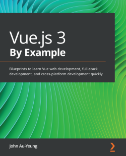

# Learning Notes for Vue.js 3 By Example

This is the learning branch of code repository for [Vue.js 3 By Example](https://www.packtpub.com/product/vue-js-3-by-example/9781838826345), by ***John Au-Yeung***, published by ***Packt***.

### Requirements

| Chapter  | Software required                   | OS required                        |
| :------: | :----------------------------------:| :---------------------------------:|
| 1 to 8       | Vue.js 3                  | Windows, Mac OS X, and Linux (Any) |
| 1 to 8        | Typescript             | Windows, Mac OS X, and Linux (Any) |
| 1 to 8       | Vue CLI           | Windows, Mac OS X, and Linux (Any) |
| 1 to 8        | Ecmascript 2015 to 2020            | Windows, Mac OS X, and Linux (Any) |

## Learning Notes Outline

The notes would be listed chapter by chapter as follows. Necessary images or screenshots would be saved into `./assets/` folder. If the content is too long to put into a single file, then a series of sub notes would listed as well, just like this:

1. [Ch01.md (done)](./Ch01.md)
   1. [Ch01.S3-Vue-3-core-features (done)](./Ch01.S3-Vue-3-core-features.md)
2. [Ch02.md (done)](./Ch02.md)
3. [Ch03.md (learning)](./Ch03.md)
4. Ch04.md
5. Ch05.md
   1. Ch05.S01.md
6. Ch06.md
7. Ch07.md
8. Ch08.md

